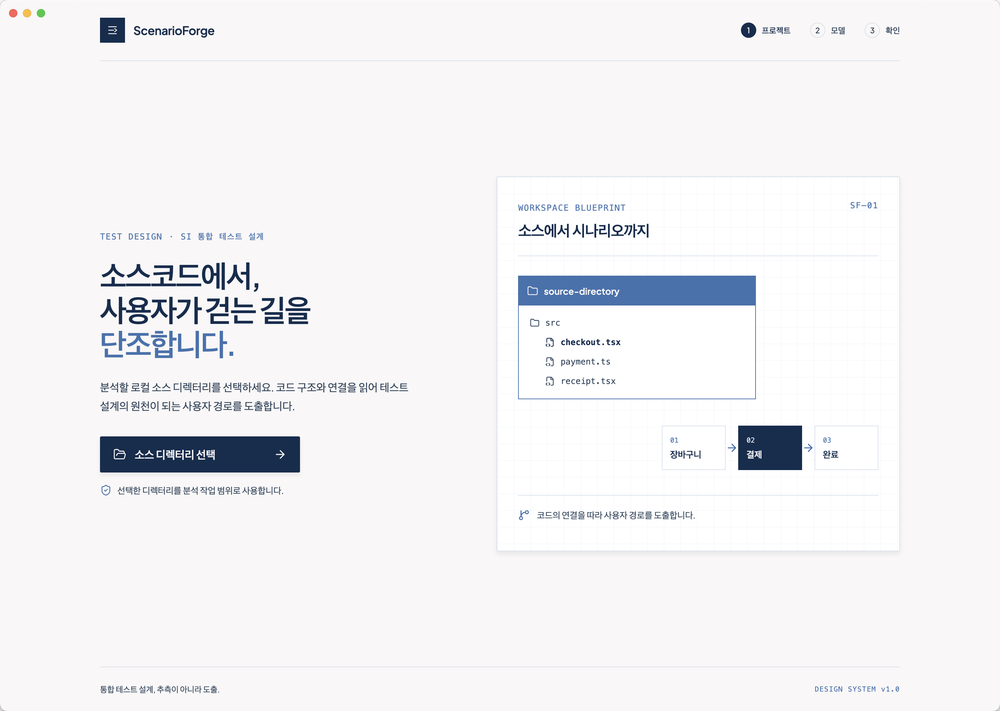
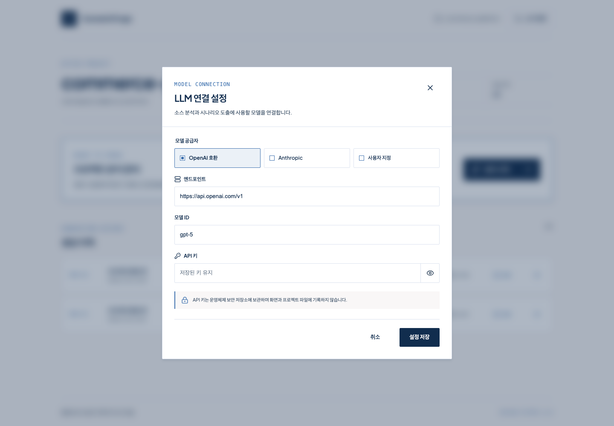
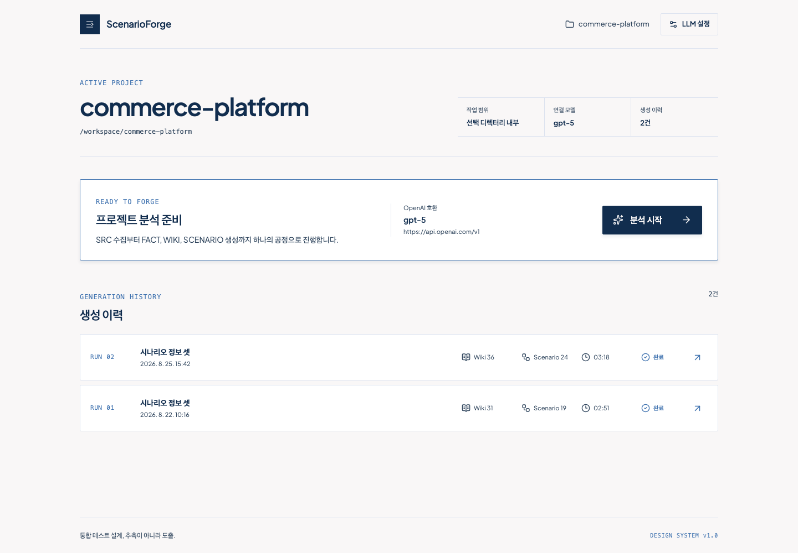
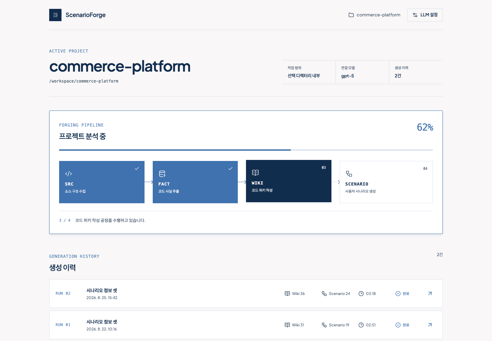
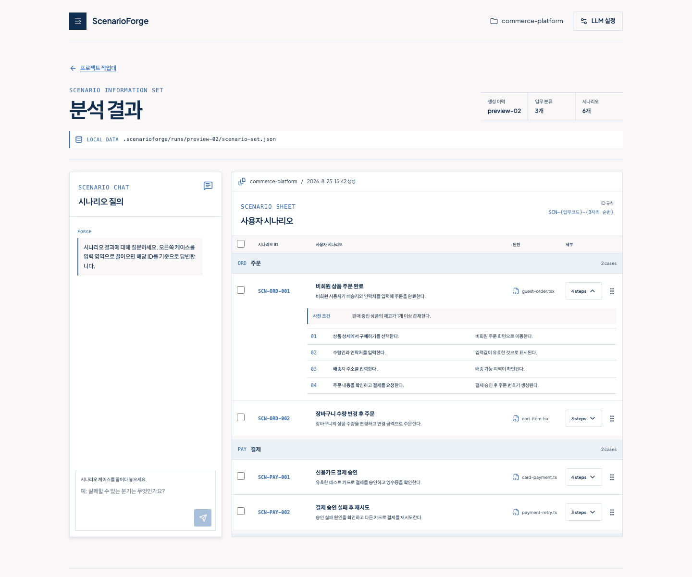
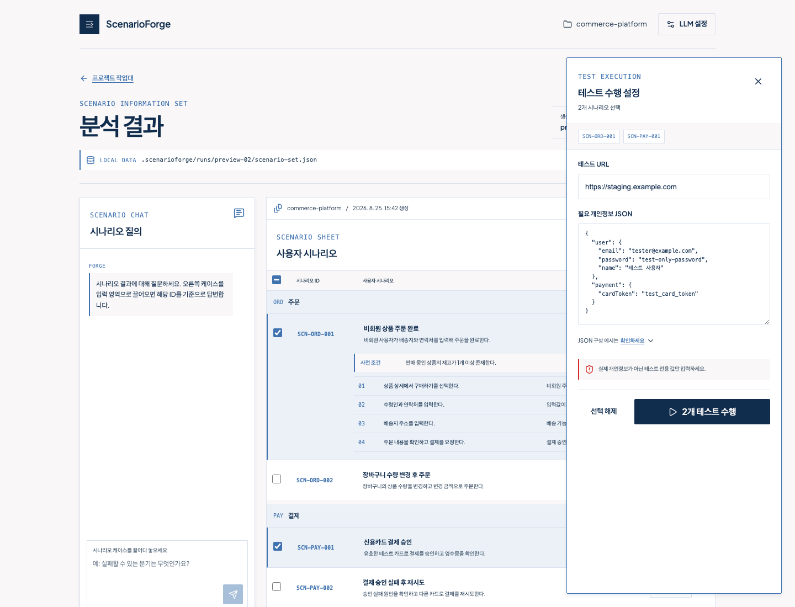

# ScenarioForge

로컬 소스 디렉터리를 분석해 `SRC → FACT → WIKI → SCENARIO` 정보 셋을 만들고, 선택한 사용자 시나리오를 실제 테스트와 증적으로 연결하는 설치형 애플리케이션입니다.

현재 `dev` 브랜치는 디자인 시스템을 적용한 전체 화면 목업과 Electron 실행 셸까지 포함합니다. `pi-coding-agent`, ScenarioForge 전용 하네스·스킬·서브에이전트, 실제 테스트 실행기는 다음 백엔드 작업에서 연결합니다.

## 현재 상태

- Electron main / preload / renderer 프로세스 분리
- 로컬 프로젝트 디렉터리 선택용 native dialog 연결
- LLM 모델·엔드포인트·API 키 설정 화면
- `SRC → FACT → WIKI → SCENARIO` 분석 진행 목업
- 프로젝트별 생성 이력과 저장 결과 재접근 흐름
- 업무 분류별 시나리오 시트, 세부 스텝, 전체·개별 선택
- 시나리오 ID drag & drop 기반 질의
- 테스트 URL·개인정보 JSON 입력용 실행 패널 목업
- 실제 macOS Electron 창 구동 확인

## 시스템 구성

```text
Electron Renderer (React)
        │
        │ typed window.scenarioForge API
        ▼
Electron Preload (contextBridge)
        │
        │ allowlisted IPC channels
        ▼
Electron Main
        ├── native directory dialog
        ├── model setting session
        ├── local result loader
        └── Agent Runtime / TestVista Runner  ← 다음 작업
                 │
                 ▼
       선택한 프로젝트/.scenarioforge/
```

Renderer에는 Node.js와 파일 시스템 권한을 노출하지 않습니다. 현재 API 키는 목업 단계에서 디스크에 기록하지 않고 Electron 세션 메모리에만 유지합니다.

## 디렉터리 구성

```text
.
├── artifacts/                         # README 및 검수용 화면 캡처
├── docs/
│   ├── architecture/
│   │   └── ui-stack-research.md       # termcn/OpenGUI/OpenUI 및 UI 스택 조사
│   └── screens/                       # 화면별 기획 의도와 상태 정의
├── packages/
│   └── agent-runtime/                 # pi-coding-agent 런타임 경계(구현 예정)
├── src/
│   ├── main/
│   │   └── index.ts                   # BrowserWindow, native dialog, IPC handlers
│   ├── preload/
│   │   └── index.ts                   # 제한된 contextBridge API
│   ├── renderer/
│   │   ├── index.html
│   │   └── src/                       # React 화면, 컴포넌트, 디자인 토큰
│   └── shared/                        # main/preload/renderer 공용 IPC·시나리오 타입
├── electron.vite.config.ts
├── vite.config.ts                     # 브라우저 화면 검수용 보조 설정
└── package.json
```

설치형 UI 스택 비교와 적용 결정은 [설치형 UI 스택 조사](docs/architecture/ui-stack-research.md)를 참고하세요.

## 실행 방법 (업데이트 예정)

> 현재는 개발 실행과 production build까지만 제공됩니다. 운영체제별 installer, code signing, 자동 업데이트 명령은 추후 추가합니다.

사전 요구 사항:

- Node.js 22.12 이상
- npm 10 이상
- macOS, Windows 또는 Linux 데스크톱 환경

```bash
npm ci
npm run dev
```

Electron production bundle 확인:

```bash
npm run build
npm run preview
```

타입과 로컬 결과 스키마 검증:

```bash
npm run typecheck
npm test
```

브라우저에서 화면 목업만 검수할 때:

```bash
npm run dev:web
```

다음 preview query를 사용할 수 있습니다.

```text
?preview=modal
?preview=workspace
?preview=progress
?preview=result
?preview=result-selected
```

## 화면별 시스템 설명

### 1. 분석 프로젝트 선택

사용자가 분석할 로컬 소스 디렉터리를 선택하는 도입 화면입니다. Electron에서는 native directory dialog가 열리고, 선택한 디렉터리만 분석 작업 범위로 전달합니다.



### 2. LLM 연결 설정

LLM provider, endpoint, model, API key를 설정합니다. 모달이 열리면 뒤 화면을 흐림 처리해 현재 설정 작업에 집중하도록 구성했습니다.



### 3. 프로젝트 작업대와 생성 이력

선택 프로젝트, 연결 모델, 생성 이력을 한 화면에서 확인합니다. 기존 완료 이력을 열면 분석 생성 단계를 다시 실행하지 않고 프로젝트의 `.scenarioforge/runs/{runId}/scenario-set.json`을 읽어 결과 화면으로 이동합니다.



### 4. 분석 파이프라인

분석 중에는 `SRC → FACT → WIKI → SCENARIO` 단계와 전체 진행률을 함께 표시합니다. 현재 진행 데이터는 Renderer 목업이며, 후속 Agent Runtime이 동일 IPC 계약으로 실제 진행 이벤트를 발행합니다.



### 5. 시나리오 결과와 채팅

왼쪽 채팅과 오른쪽 시나리오 시트의 높이를 맞췄습니다. 시나리오는 업무 분류와 `SCN-{업무코드}-{3자리 순번}` 규칙으로 구분되고, 각 케이스의 사전 조건·실행 스텝·기대 결과를 펼쳐 확인할 수 있습니다. 시나리오를 채팅으로 끌면 ID만 백틱 블록으로 입력됩니다.



### 6. 테스트 실행 입력

시나리오 전체 또는 개별 선택 시 우측 실행 패널이 열립니다. 테스트 대상 URL과 필요한 테스트용 개인정보를 JSON으로 입력하며, `확인하세요`를 통해 예시 구조를 볼 수 있습니다.



## 로컬 결과 저장 컨셉

분석 결과는 대상 프로젝트 안에 함께 보관해 같은 프로젝트를 다시 열었을 때 바로 접근할 수 있도록 설계합니다.

```text
분석 대상 프로젝트/
└── .scenarioforge/
    ├── project.json
    ├── runtime/                       # 하네스·스킬·서브에이전트 구성 예정
    └── runs/
        └── {runId}/
            ├── facts/
            ├── wiki/
            ├── scenario-set.json
            └── tests/                 # 다음 TestVista 실행 작업
```

`.scenarioforge/`는 분석 대상 프로젝트가 소유하는 로컬 데이터이며, 이 애플리케이션 저장소의 `.gitignore`에도 제외되어 있습니다. 대상 프로젝트에서의 커밋 여부와 보존 정책은 후속 설정 화면에서 선택할 수 있도록 할 예정입니다.

## 다음 작업: TestVista 테스트 실행과 증적

다음 구현 범위는 시나리오 설계 결과를 실제 테스트 실행으로 연결하는 영역입니다.

1. 선택 시나리오, 대상 URL, 테스트용 JSON을 typed IPC 요청으로 전달
2. Electron main이 별도 Runner/Utility Process를 시작해 UI 프로세스와 격리
3. 시나리오 스텝별 실행 상태, 로그, 재시도·중단 이벤트 스트리밍
4. 스텝별 스크린샷, trace, 요청·응답 요약, 최종 판정 저장
5. 민감정보 원문이 로그와 증적에 남지 않도록 field masking 적용
6. `.scenarioforge/runs/{runId}/tests/{executionId}/`에 manifest와 증적 기록
7. 완료 이력에서 실행 결과와 증적을 재조회하고 실패 스텝만 다시 실행

실제 테스트 실행은 ScenarioForge의 설계 영역과 구분해 TestVista 실행 영역으로 표시할 예정입니다.
