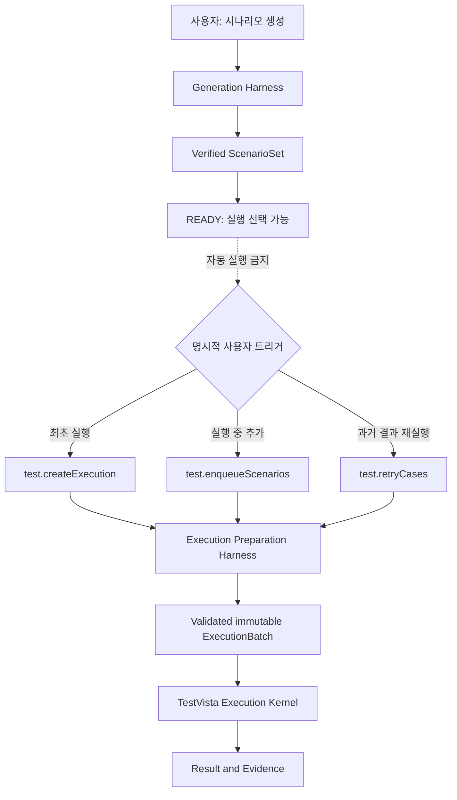
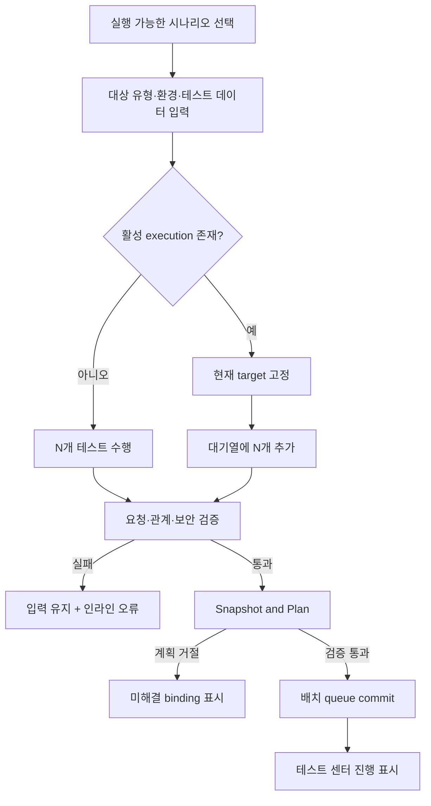
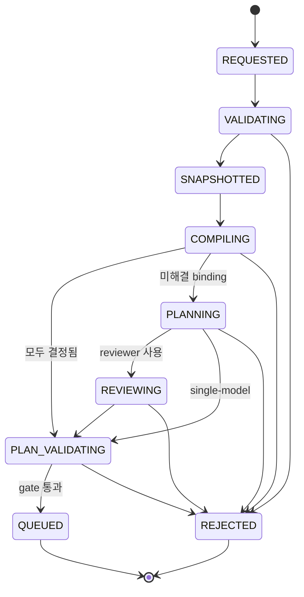
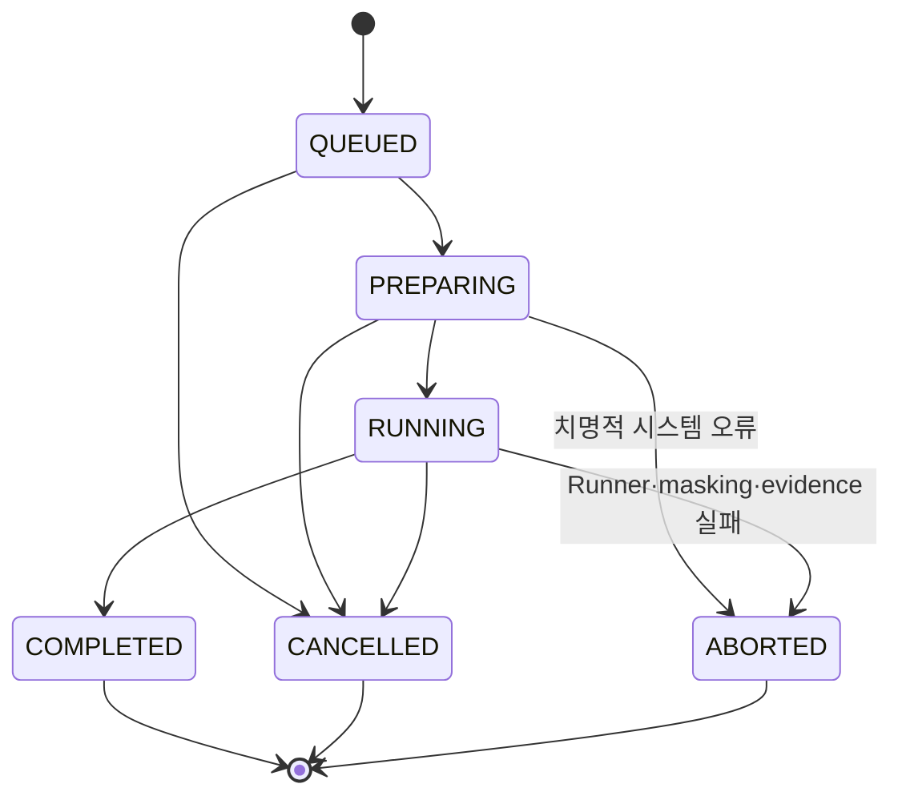
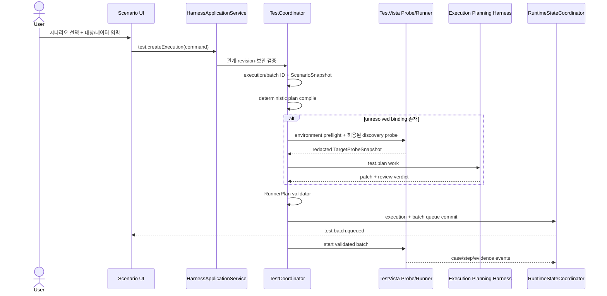
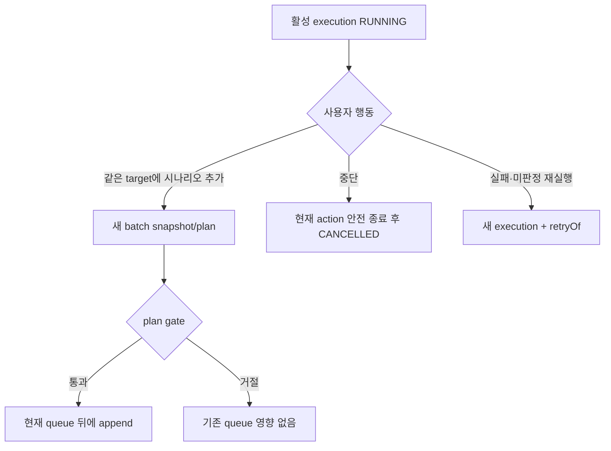

# ScenarioForge 테스트 수행 하네스 상세 설계

- 작성일: 2026-08-26
- 상태: 설계 확정, 구현 전
- 적용 범위: 사용자 실행 요청, 실행 계획, 순차 테스트, 증적
- 생성 영역: [`../pi-coding-agent 하네스 설계.md`](../pi-coding-agent%20하네스%20설계.md)
- 통합 경계: [`03-integrated-harness-server-design.md`](03-integrated-harness-server-design.md)
- 수행 어댑터: [`05-multi-target-execution-adapter-design.md`](05-multi-target-execution-adapter-design.md)

> **고도화 판정(2026-09-07):** 이 문서의 명령, batch 불변성, plan gate, 상태 머신, 이벤트, 보안 정책은 계속 유효하다. 실제 수행 방식은 [`07-vision-first-execution-design.md`](07-vision-first-execution-design.md)의 비전 기반 루프를 따르며, 그 문서가 05의 adapter 우선순위를 대체한다.

## 1. 현재 구성 여부

기존 설계에는 `ScenarioSnapshot → RunnerPlan → TestVista` handoff, 순차 실행, 판정, 증적 원칙이 이미 있다. 그러나 다음 항목은 생성 하네스와 같은 깊이로 정의되어 있지 않았다.

- 사용자의 최초 실행, 실행 중 추가, 중단, 재실행이 각각 무엇을 트리거하는지
- 최초 요청과 실행 중 추가 요청이 불변 snapshot/plan을 어떻게 보존하는지
- 수행 전용 Pi 하네스가 언제 시작되고 무엇을 금지하는지
- 수행 전용 skill과 agent의 입력·출력·도구·완료 권한
- TestCoordinator, Pi planning agent, TestVista Runner 사이의 책임 경계
- 계획 실패, 환경 실패, assertion 실패를 어떤 상태로 구분하는지

따라서 기존 상태는 **경계와 실행 원칙은 구성됨, 수행 하네스·skill·agent 계약은 부분 구성됨**으로 판단한다. 이 문서는 누락된 수행 영역만 완성하며 생성 하네스의 책임을 확장하지 않는다. TestVista의 대상·기술 선택·adapter routing은 05 문서를 따르며, 이 문서에서 브라우저나 URL로 표현한 기존 계약보다 05의 다중 대상 계약이 우선한다.

---

## 2. 생성과 수행의 강제 경계

| 구분 | 시나리오 생성 | 테스트 수행 준비 | 테스트 실행 |
| --- | --- | --- | --- |
| 시작 트리거 | 사용자의 `analysis.start` 또는 `analysis.resume` | 사용자의 `test.createExecution`, `test.enqueueScenarios`, `test.retryCases` | 검증된 batch의 queue commit |
| 소유 coordinator | `AnalysisCoordinator` | `TestCoordinator` | `TestCoordinator` |
| Pi 사용 | FACT/WIKI/SCENARIO author·reviewer | 미해결 binding에 한한 planner·reviewer | 사용하지 않음 |
| 입력 | 선택 프로젝트의 `SourceSnapshot` | 검증 완료된 `ScenarioSet`의 선택 ID | immutable `ExecutionBatch` |
| 출력 | `ScenarioSet`, coverage, assurance | `ScenarioSnapshot`, `RunnerPlan`, batch manifest | case/step result와 evidence |
| canonical 쓰기 | analysis run artifact | execution/batch planning artifact | execution result/evidence |
| 금지 | execution, queue, evidence 쓰기 | source/fact/wiki/scenario 수정, Runner 제어 | 시나리오·계획 변경, LLM 자유 판정 |
| 완료 권한 | analysis completion gate | runner plan completion gate | deterministic verdict/evidence gate |

생성 완료는 수행 시작 이벤트가 아니다. `SCENARIO → READY`가 되더라도 사용자가 실행 가능한 시나리오를 선택하고 CTA를 누르기 전에는 snapshot, planning session, Runner process를 만들지 않는다.



---

## 3. 사용자 흐름과 명령 트리거

### 3.1 실행 가능 상태

시나리오 화면은 각 케이스를 다음 네 상태 중 하나로 표시한다.

| 상태 | 선택 | 실행 요청 결과 |
| --- | --- | --- |
| `READY` | 가능 | 바로 검증 단계로 이동 |
| `DATA_REQUIRED` | 가능 | 필요한 `dataBindingKeys` 입력 전 CTA 비활성화 |
| `NON_AUTOMATABLE` | 불가 | 수동 확인 이유와 미해결 ref 표시 |
| `UNVERIFIED` | 불가 | 생성 영역의 근거 또는 reviewer gate로 복귀 |

이 상태는 target 선택 전의 **생성 자산 준비 상태**다. `READY`는 특정 환경에서 자동 실행이 보장됐다는 뜻이 아니라 실행 계획 후보가 있다는 뜻이다. target을 선택한 뒤 preflight가 case별로 `TARGET_READY | TARGET_UNSUPPORTED | ENVIRONMENT_BLOCKED | CUA_REQUIRED`를 별도로 계산한다. `NON_AUTOMATABLE`은 지원 mapper와 semantic/visual 후보가 모두 없다고 생성 gate가 확인한 경우에만 사용한다.

헤더 전체 선택은 `READY`와 입력 완료된 `DATA_REQUIRED`만 선택한다. UI가 선택 가능하게 보였더라도 Main process는 최신 run revision, scenario 관계, 선택 target capability를 다시 검증한다.

### 3.2 명령별 의미

| 명령 | UI 트리거 | 전제 | 결과 |
| --- | --- | --- | --- |
| `test.createExecution` | 활성 실행이 없을 때 `N개 테스트 수행` | 검증된 run, 선택 시나리오, ExecutionTargetProfile, 필요한 data binding | 새 `executionId`와 첫 `batchId` 생성 |
| `test.enqueueScenarios` | 활성 실행이 있을 때 `대기열에 N개 추가` | 같은 project·run 호환성, 같은 target hash, 중복되지 않은 선택 | 새 immutable batch를 현재 execution 뒤에 append |
| `test.cancelExecution` | 테스트 센터의 `실행 중단` 확인 | 현재 execution이 `QUEUED/PREPARING/RUNNING` | 현재 tool을 안전 중단하고 미실행 항목을 `CANCELLED` 처리 |
| `test.retryCases` | 실패·미판정·미실행 케이스의 `다시 수행` | source execution과 scenario 관계 존재 | 새 `executionId`와 새 snapshot/plan, `retryOfExecutionId` 연결 |

`test.createExecution`과 `test.retryCases`는 항상 새 execution을 만든다. `test.enqueueScenarios`만 현재 execution에 새 batch를 추가한다. 완료된 execution에는 enqueue할 수 없다.

### 3.3 화면 진행 방식

1. 사용자가 시나리오를 선택한다.
2. 패널이 선택 시나리오의 `dataBindingKeys`로 입력 폼을 만든다.
3. 활성 execution이 없으면 대상 유형과 유형별 entry 정보·실행 환경을 입력하고 `환경 확인` 후 `N개 테스트 수행`을 누른다.
4. 활성 execution이 있으면 target을 현재 execution 값으로 잠그고 `대기열에 N개 추가`를 누른다.
5. Main process가 요청을 접수하면 UI는 즉시 `요청 검증 중`을 표시하되 실행 성공으로 간주하지 않는다.
6. snapshot, compiler, 선택적 planning, validator가 끝나 `batch.queued`가 발생하면 테스트 센터로 이동하거나 비차단 알림을 표시한다.
7. planning이 거절되면 시나리오 화면에 케이스별 미해결 target binding/assertion을 표시하고 선택과 입력을 유지한다.
8. 사용자는 실행 중 다른 상위 화면으로 이동할 수 있다. Runner lifecycle은 route와 독립적이다.



---

## 4. 명령 계약과 멱등성

```ts
type ExecutionCommandMeta = {
  projectId: string;
  operationId: string;
  expectedRevision: number;
};

type CreateExecution = ExecutionCommandMeta & {
  analysisRunId: string;
  scenarioIds: string[];
  target: ExecutionTargetProfileInput;
  dataBindings: DataBindingInput;
};

type EnqueueScenarios = ExecutionCommandMeta & {
  executionId: string;
  scenarioIds: string[];
  targetProfileHash: string;
  dataBindings: DataBindingInput;
};

type RetryCases = ExecutionCommandMeta & {
  sourceExecutionId: string;
  scenarioIds: string[];
  target: ExecutionTargetProfileInput;
  dataBindings: DataBindingInput;
};
```

- `{projectId, operationId}`는 명령의 멱등 키다. 같은 payload의 재전송은 기존 결과를 반환하고, 다른 payload 재사용은 거절한다.
- `expectedRevision`이 stale이면 최신 snapshot을 반환하고 자동 merge하지 않는다.
- Renderer가 보낸 `analysisRunId`, `scenarioIds`, `executionId` 관계를 신뢰하지 않는다.
- target은 종류별 schema와 실행 환경 policy를 통과해야 한다. 웹은 scheme·origin·redirect, Windows는 executable·process·window, mobile은 device·app·context allowlist를 검증한다.
- 테스트 데이터 원문은 command 처리와 Runner 메모리에만 존재한다. journal, event, plan, evidence에는 binding key와 secret reference만 저장한다.

---

## 5. ExecutionBatch와 불변 계획

실행 중 시나리오 추가를 지원하면서 기존 snapshot과 plan을 바꾸지 않기 위해 execution을 immutable batch의 append-only 목록으로 구성한다.

```ts
type ExecutionBatch = {
  schemaVersion: 1;
  batchId: string;
  executionId: string;
  ordinal: number;
  requestKind: "initial" | "enqueue" | "retry";
  scenarioSnapshotHash: string;
  targetProfileHash: string;
  runnerPlanHash: string;
  scenarioIds: string[];
  planningStatus:
    | "REQUESTED"
    | "VALIDATING"
    | "SNAPSHOTTED"
    | "COMPILING"
    | "PLANNING"
    | "REVIEWING"
    | "PLAN_VALIDATING"
    | "QUEUED"
    | "REJECTED";
  runtimeStatus?: "QUEUED" | "PREPARING" | "RUNNING" | "COMPLETED" | "CANCELLED" | "ABORTED";
};
```

핵심 규칙은 다음과 같다.

- 최초 실행은 `batch-001`을 만든다.
- enqueue는 별도 `ScenarioSnapshot`과 `RunnerPlan`을 만든 뒤 하나의 state commit으로 batch를 append한다.
- planning 중인 batch는 Runner queue에 보이지 않는다.
- queue에 들어간 batch의 snapshot/plan 파일은 수정하지 않는다.
- 같은 execution의 모든 batch는 같은 `targetProfileHash`를 사용한다.
- 동일 scenario를 다시 넣는 것은 기본적으로 거절한다. 의도적 재실행은 `test.retryCases`로 새 execution을 만든다.
- cancel은 planning 중 batch를 abort하고 queued/running batch를 취소하지만 이미 생성된 artifact와 evidence를 지우지 않는다.

```text
tests/{executionId}/
├── manifest.json
├── batches/
│   └── {batchId}/
│       ├── scenario-snapshot.json
│       ├── execution-target-profile.json
│       ├── data-binding-manifest.json    # key와 secret ref만 저장
│       ├── target-probe.json             # 생성된 경우, redacted
│       ├── runner-plan.json
│       └── batch-manifest.json
├── cases/
├── execution-result.json
├── execution.log
└── trace.zip
```

---

## 6. Pi 최상위 하네스와 수행 하네스

Pi 최상위 하네스는 세부 테스트 시나리오나 대상 동작을 직접 계획하지 않는다. 다음 공통 규칙과 라우팅만 정의한다.

1. `HarnessDomain = generation | scenario-query | execution-planning` 판별
2. 모든 work의 `getContext → begin → submitArtifacts → requestCompletion` lifecycle
3. canonical state 직접 수정 금지와 staging-only write
4. 모델 역할 binding, resource version, tool allowlist
5. domain별 child harness 선택과 금지된 교차 호출

수행 관련 세부 계획은 backend compiler가 먼저 만들고, 해결되지 않은 의미 binding만 `execution-planning` child harness가 맡는다. 실제 웹·desktop·mobile 동작은 하위 agent가 아니라 TestVista의 검증된 수행 어댑터가 실행한다.

```text
runtime-template/
├── SYSTEM.md                         # 공통 lifecycle·보안·domain router
├── AGENTS.md                         # 공통 역할 등록만
├── WORK_PROTOCOL.md
├── harnesses/
│   ├── scenario-generation.md        # 생성 전용
│   └── test-execution-planning.md    # 수행 준비 전용
├── skills/
│   ├── generation/
│   │   ├── fact-extraction-react/SKILL.md
│   │   ├── edge-linking/SKILL.md
│   │   ├── wiki-compose/SKILL.md
│   │   ├── scenario-compose/SKILL.md
│   │   └── gate-review/SKILL.md
│   └── execution/
│       ├── test-plan-binding/SKILL.md
│       └── test-plan-review/SKILL.md
└── agents/
    ├── generation/
    │   ├── fact-analyst.md
    │   ├── edge-linker.md
    │   ├── wiki-writer.md
    │   ├── scenario-designer.md
    │   └── stage-reviewer.md
    └── execution/
        ├── test-planner.md
        └── test-plan-reviewer.md
```

생성 resource는 `analysis.*` work에서만, 수행 resource는 `test.plan` work에서만 로드한다. 한 Pi session에 두 domain의 skill·agent 목록을 동시에 노출하지 않는다.

---

## 7. 수행 전용 Skills

### 7.1 `test-plan-binding`

목적은 compiler가 남긴 `UnresolvedPlanBinding[]`을 허용된 Runner action과 matcher로 제한적으로 보완하는 것이다.

- 필수 입력: `batchId`, `ScenarioSnapshot` hash, unresolved binding ID, `ExecutionTargetProfile` hash, 선택적 `TargetProbeSnapshot` ID
- 허용 작업: 제공된 target candidate 우선순위 결정, 허용 semantic action binding, assertion shape를 허용 matcher로 변환, timeout 제안
- 허용 출력: `RunnerPlanPatchDraft`
- 금지: 새 시나리오 step 생성, path·expected·assertion ID 변경, 근거 없는 selector·automation ID·좌표 발명, 실제 target 조작, queue·execution·evidence 쓰기
- 완료: draft 제출일 뿐이며 backend validator가 승인해야 한다.

### 7.2 `test-plan-review`

목적은 author가 만든 patch가 시나리오 의미와 probe 근거를 보존하는지 독립적으로 검토하는 것이다.

- 필수 입력: immutable snapshot, compiler base plan, author patch, 사용된 candidate/probe slice
- 허용 출력: `PlanReviewVerdict { decision, findings[], bindingIds[] }`
- 금지: plan 수정, 대체 target reference 생성, canonical status 변경, Runner 제어
- reviewer가 없으면 동일 validator를 거치되 assurance를 `single-model`로 표시한다.
- reviewer의 `pass`만으로 batch를 queue에 넣지 않는다.

결정론적으로 전부 컴파일된 경우 두 skill 모두 호출하지 않는다. schema validation, relation validation, queue commit, verdict 분류, evidence hash는 skill이 아니라 backend 코드다.

---

## 8. 수행 전용 Agents

| 역할 | 모델 역할 | 시작 조건 | 산출물 | 완료·실행 권한 |
| --- | --- | --- | --- | --- |
| `test-planner` | `author` | compiler가 unresolved binding을 반환 | `RunnerPlanPatchDraft` | 없음 |
| `test-plan-reviewer` | `reviewer` | author patch가 있고 reviewer binding이 활성 | `PlanReviewVerdict` | 없음 |
| `TestCoordinator` | LLM 아님 | 사용자 command 수락 | snapshot, plan gate, queue, 상태 | batch queue commit |
| `TestVista Execution Kernel` | LLM 아님 | 검증된 queued batch | 정규화 observation, step result, capture, trace | plan에 고정된 adapter action 실행 |
| `AssertionEngine` | LLM 아님 | assertion reference와 observation | deterministic verdict | case/step 판정 |

### 8.1 `test-planner` 계약

```yaml
function_id: test.plan
role: author
required_inputs:
  - batch_id
  - scenario_snapshot_hash
  - unresolved_binding_ids
  - target_profile_hash
allowed_tools:
  - work.getContext
  - work.begin
  - test.snapshot.read
  - test.plan.base.read
  - test.probe.read
  - work.recordActivity
  - work.submitArtifacts
  - work.requestCompletion
write_scope: staging/{workId}/runner-plan-patch.json
prohibited_tools:
  - source.read
  - analysis.artifact.write
  - runner.start
  - runner.action
  - runner.cancel
  - evidence.write
```

### 8.2 `test-plan-reviewer` 계약

```yaml
function_id: test.plan
role: reviewer
required_inputs:
  - scenario_snapshot_hash
  - base_plan_hash
  - author_patch_hash
allowed_tools:
  - work.getContext
  - work.begin
  - test.snapshot.read
  - test.plan.draft.read
  - test.probe.read
  - work.submitArtifacts
  - work.requestCompletion
write_scope: staging/{workId}/plan-review.json
prohibited_tools:
  - source.read
  - test.plan.patch
  - runner.start
  - runner.action
  - evidence.write
```

child work가 필요하면 scenario 단위로만 나누고 각 child는 독립 `workId`와 배정된 binding ID만 받는다. child 결과는 root planner가 통합하고 backend가 전체 case 순서와 중복을 검증한다.

---

## 9. Target Preflight·Probe와 도구 경계

TestCoordinator는 먼저 업무 상태를 건드리지 않는 **Environment Preflight**로 driver·device·sidecar·resource lease·semantic tree 사용 가능 여부를 확인한다. 정적 target 후보만으로 계획을 확정할 수 없을 때에는 target profile이 허용한 경우에만 **Discovery Probe**를 요청할 수 있다.

```ts
type TargetProbeSnapshot = {
  probeId: string;
  batchId: string;
  targetProfileHash: string;
  capturedAt: string;
  targetId: string;
  adapter: AdapterKind;
  surfaceFingerprint: string;
  candidates: Array<{
    bindingId: string;
    candidateId: string;
    strategy:
      | "test-id"
      | "role-name"
      | "label"
      | "automation-id"
      | "android-resource-id"
      | "ios-predicate"
      | "visual-description";
    matchCount: number;
    normalizedRole?: string;
    normalizedName?: string;
  }>;
  contentHash: string;
};
```

- preflight는 target 업무 상태를 변경하지 않으며 adapter health와 capability만 반환한다.
- probe는 `disabled | attach-only | resettable-navigation` policy를 따른다. entry 접근이나 앱 실행이 상태를 바꿀 수 있으면 읽기 전용이라고 부르지 않는다.
- click, fill, upload, credential 입력과 업무 mutation은 probe에서 금지한다.
- DOM·UIA·page source 원문 전체 대신 필요한 후보와 redacted normalized 정보만 planning session에 전달한다.
- probe 자체가 상태를 바꾸거나 reset을 보장할 수 없으면 계획을 거절하고 사용자에게 precondition을 요구한다.
- desktop CUA와 visual adapter의 상세 안전 조건은 05 문서를 따른다.

| 도구 범주 | Coordinator | planner | reviewer | Runner |
| --- | --- | --- | --- | --- |
| snapshot 생성·hash | 실행 | 읽기 | 읽기 | 읽기 |
| source/fact/wiki 수정 | 금지 | 금지 | 금지 | 금지 |
| target probe 요청 | 실행 | 금지 | 금지 | 제한 실행 |
| probe 결과 읽기 | 제공 | 배정 slice | 배정 slice | 생성 |
| plan draft 쓰기 | compiler base | staging patch | 금지 | 금지 |
| plan verdict 쓰기 | backend gate | 금지 | staging verdict | 금지 |
| queue commit | 실행 | 금지 | 금지 | 읽기 |
| target adapter action | 금지 | 금지 | 금지 | plan에 고정된 action만 |
| evidence 쓰기 | 금지 | 금지 | 금지 | EvidenceStore 경유 |

---

## 10. 계획과 실행 상태 머신

계획 상태와 실행 상태를 한 enum으로 섞지 않는다. 실행 요청이 계획에 실패해도 아직 Runner 실패가 아니다.





`PASSED`, `FAILED`, `INCONCLUSIVE`, `SKIPPED`, `CANCELLED`는 case/step verdict다. execution은 모든 case가 끝나면 `COMPLETED`이고 결과 요약에 verdict 수를 가진다. Runner 사망과 보안 fail-closed는 `ABORTED`로 구분한다.

---

## 11. 핵심 시퀀스

### 11.1 최초 실행



### 11.2 실행 중 추가와 재실행



---

## 12. RunnerPlan 완료 Gate

batch는 다음 조건을 모두 만족해야 queue에 들어간다.

1. scenario IDs가 하나의 검증 완료 analysis run에 속한다.
2. snapshot의 scenario artifact hash와 source snapshot ID가 존재한다.
3. 모든 실행 step이 실존 `actionRef`와 하나 이상의 `assertionRef`를 보존한다.
4. action intent는 schema allowlist 안에 있고 선택 adapter가 필요한 capability를 제공한다.
5. target reference는 source 후보 또는 TargetProbe candidate ID에서 유래하며 좌표를 canonical locator로 저장하지 않는다.
6. assertion matcher는 원본 `ObservableAssertion` kind와 호환된다.
7. 필요한 data binding key가 모두 제공되었고 plan에는 원문 값이 없다.
8. target profile hash가 execution의 기존 hash와 일치하고 모든 surface transition이 allowlist에 있다.
9. author/reviewer 산출물과 child work가 모두 settled 상태다.
10. plan schema, case 순서, step 순서, timeout 상한, 중복 ID 검증을 통과한다.
11. fallback은 허용 원인·adapter·target·budget이 고정되고 uncertain side effect 뒤 재실행하지 않는다.
12. visual binding이 있으면 검증된 `guiGrounder` binding과 데이터 경계가 존재한다.
13. desktop CUA binding이 있으면 전용 desktop lease와 focus·DPI policy가 존재한다.
14. `RunnerPlan.scenarioSnapshotHash`가 저장 직전 다시 계산한 값과 일치한다.
15. batch artifact durable commit과 domain event 저장이 성공한다.

어느 하나라도 실패하면 `REJECTED`이며 TestVista를 시작하지 않는다. reviewer의 pass, Pi의 `agent_end`, 자연어 완료 응답은 위 조건을 대체하지 않는다.

---

## 13. 이벤트와 복구

### 13.1 계획 이벤트

- `test.execution.requested`
- `test.batch.requested`
- `test.batch.snapshot.created`
- `test.plan.started`
- `test.plan.completed`
- `test.plan.rejected`
- `test.batch.queued`

### 13.2 실행 이벤트

- `test.execution.created`
- `test.execution.preparing`
- `test.execution.started`
- `test.case.started`
- `test.step.started`
- `test.step.completed`
- `test.step.failed`
- `test.evidence.saved`
- `test.case.completed`
- `test.batch.completed`
- `test.execution.completed`
- `test.execution.cancelled`
- `test.execution.aborted`

모든 이벤트는 project revision과 `executionId`, 해당하는 경우 `batchId`를 가진다. data binding 원문, credential, DOM 원문, chain-of-thought, raw tool output은 포함하지 않는다.

복구 시 journal과 execution manifest를 대조한다.

- `PLANNING`에서 종료된 batch는 제출·settle 상태를 확인해 재개하거나 `REJECTED`로 닫는다.
- `QUEUED`는 hash 검증 뒤 다시 queue에 넣는다.
- `RUNNING` 중 process가 사망하면 현재 case를 `INCONCLUSIVE` 또는 execution `ABORTED`로 확정한 뒤 정책에 따라 다음 case를 재개한다.
- final manifest가 있는 execution은 다시 실행하지 않는다. retry 명령만 새 execution을 만든다.

---

## 14. 실패와 보안 정책

| 실패 | 상태 | 사용자 조치 | 기존 실행 영향 |
| --- | --- | --- | --- |
| target·JSON·관계 오류 | request rejected | 입력 수정 | 없음 |
| target binding·matcher 미해결 | batch `REJECTED` | 시나리오 근거 보완 또는 target 확인 | 기존 queue 유지 |
| expected와 실제 불일치 | case `FAILED` | 실패 케이스 retry | 다음 case 계속 |
| browser/device/desktop/network 환경 문제 | case `INCONCLUSIVE` | 환경 확인 후 retry | 복구 후 다음 case |
| 사용자 중단 | execution `CANCELLED` | 새 실행 가능 | 수집 증적 보존 |
| masking/evidence/Runner 치명 오류 | execution `ABORTED` | 원인 해결 후 retry | 즉시 중단, 증적 보존 |

테스트 대상 화면의 텍스트와 DOM·접근성/UIA tree도 untrusted data다. planner와 Runner에게 노출된 화면 문구가 system instruction, tool policy, target profile, data binding, assertion을 바꿀 수 없다. 외부 navigation, download, upload, popup, 새 origin·process·window·device context 이동은 `ExecutionTargetProfile`의 명시적 policy가 없으면 차단한다.

---

## 15. 현재 디렉터리와의 정합성

현재 `src/renderer`의 실행 화면은 fixture와 local state로 동작하며 수행 backend가 없다. 따라서 이 설계와 정면으로 반대되는 구현은 아직 없다. 다만 다음 PoC 동작은 backend 연결 시 교체해야 한다.

- Renderer가 `executionId`를 만드는 동작 → Main/TestCoordinator가 생성
- 기존 실행이 있을 때 새 execution으로 덮어 보이는 동작 → 동일 target이면 `enqueueScenarios`, 재실행이면 `retryCases`
- Renderer timer로 step 상태를 바꾸는 동작 → domain event 기반 store
- 현재 `TestExecution.status`가 lifecycle과 최종 result를 합친 구조 → canonical `lifecycleStatus`와 `result`로 분리하고 UI projection에서 기존 라벨로 변환
- URL·JSON만 받는 입력 → target type별 schema-driven form, environment preflight, scenario의 `dataBindingKeys` 기반 필드와 redacted binding manifest
- execution당 단일 snapshot/plan 경로 → `batches/{batchId}` 단위 경로

신규 backend는 목표 workspace의 `packages/test-runtime`, `packages/evidence-store`, `packages/pi-runtime`, `apps/desktop/src/main`에 구현한다. 대상별 TypeScript adapter는 `packages/test-runtime/src/adapters`, Windows UIA .NET sidecar는 `native/testvista-windows-uia`에 둔다. 현재 평면 `src/main`에는 얇은 IPC 호환 adapter 외에 수행 도메인 로직을 추가하지 않는다.

---

## 16. 완료 기준

1. 생성 완료만으로 planning session이나 Runner가 시작되지 않는다.
2. 생성 resource와 수행 resource가 별도 디렉터리·manifest entry·tool policy로 로드된다.
3. planner와 reviewer는 Runner·queue·evidence 도구를 호출할 수 없다.
4. deterministic compiler로 계획 가능한 요청은 LLM 없이 queue에 들어간다.
5. 미해결 binding만 bounded `test.plan` work로 전달된다.
6. enqueue는 기존 snapshot/plan을 수정하지 않고 새 immutable batch를 append한다.
7. cancel과 retry가 기존 result/evidence를 덮어쓰지 않는다.
8. Runner는 검증된 plan에 고정된 target·adapter·allowlisted action만 순차 실행한다.
9. 모든 verdict가 assertion 결과 또는 구조화 환경 오류에 연결된다.
10. Renderer 재시작과 route 이동 후에도 journal/event replay로 같은 실행 상태를 복구한다.
11. semantic adapter가 가능한 step은 CUA로 라우팅되지 않으며, GUI 모델은 최종 verdict를 확정하지 않는다.
