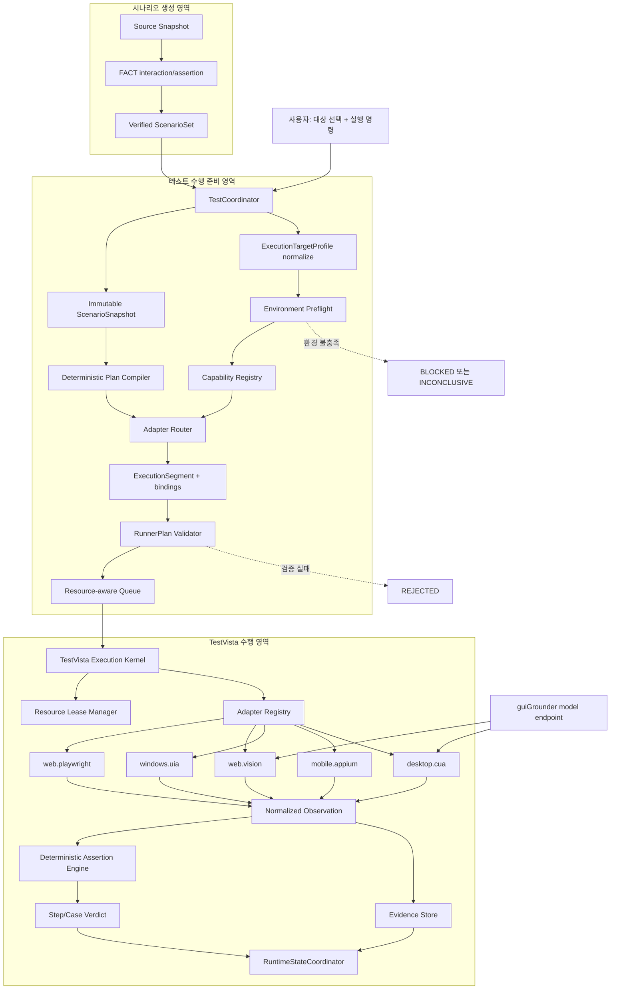

# TestVista 다중 대상 수행 계층 설계

- 작성일: 2026-08-26
- 상태: 적용 결정, 구현 전
- 적용 범위: 웹·Windows 데스크톱·Android·iOS·불투명 원격 화면의 테스트 수행
- 상위 수행 계약: [`04-test-execution-harness-design.md`](04-test-execution-harness-design.md)
- 검토 입력: [`../CUA_방식_검토_및_수행계층_설계_v1.0.md`](../CUA_방식_검토_및_수행계층_설계_v1.0.md)

> **고도화 판정(2026-09-07):** 이 문서의 semantic-first adapter 우선순위는 [`07-vision-first-execution-design.md`](07-vision-first-execution-design.md)의 vision-first 결정으로 대체됐다. 실행 IR, `ExecutionSegment`, fallback 사전 고정, 좌표 canonical 저장 금지, GUI 모델의 최종 판정 금지는 계속 유효하다.

## 1. 결정

TestVista를 브라우저 Runner가 아니라 **플랫폼 중립 실행 커널과 수행 어댑터 호스트**로 정의한다. 기본 선택 원칙은 다음과 같다.

1. DOM, 접근성 트리, 네이티브 automation tree처럼 구조화된 제어면이 있으면 이를 먼저 사용한다.
2. 구조화 제어면이 없거나 불완전한 surface에만 화면 비전 또는 OS CUA를 사용한다.
3. 하나의 실행도 웹, 네이티브 대화상자, 보안 모듈처럼 여러 surface를 지날 수 있으므로 라우팅 단위는 execution 전체가 아니라 검증된 `ExecutionSegment`다.
4. fallback은 실행 중 agent가 즉흥적으로 선택하지 않는다. immutable `RunnerPlan`에 미리 허용된 binding만 사용할 수 있다.
5. 어댑터와 GUI 모델은 관측·조작 결과만 반환한다. 최종 `PASSED/FAILED`는 구조화 assertion engine이 결정한다.

즉, 검토 문서의 “CUA는 기본이 아니라 탈출 경로”라는 결론은 채택하지만, 브라우저 중심 Tier A/B/C를 그대로 채택하지는 않는다. 대상과 capability를 기준으로 한 **semantic-first adapter routing**으로 일반화한다.

## 2. 검토 문서 적용 판정

### 2.1 유지하는 결정

- 순수 CUA를 기본 수행 방식으로 사용하지 않는다.
- 비전/CUA는 구조화 selector가 없는 canvas, 레거시 C/S, 원격 화면, OS 대화상자의 fallback이다.
- OS CUA의 병렬 단위는 브라우저 context가 아니라 격리된 desktop session이다.
- CUA의 화면 해석 비용, 좌표 취약성, 장기 작업 누적 오류를 별도 budget과 assurance로 관리한다.
- 폐쇄망에서 사용할 GUI 모델은 로컬 endpoint로 분리하고 실제 한국어·사내 UI로 평가한 뒤 pin한다.

### 2.2 수정하는 결정

| 검토 문서의 전제 | 적용 판정 | 변경 이유 |
| --- | --- | --- |
| Tier A는 `Midscene + Playwright` DOM/CDP | **Playwright 직접 사용** | 현재 Midscene의 UI action은 pure-vision 중심이다. DOM 기반 결정론적 웹 실행의 책임은 Playwright가 가져야 한다. |
| 모든 비웹 대상은 Tier C CUA | **대상별 semantic adapter 우선** | Windows UIA, Android UiAutomator2, iOS XCUITest가 제공하는 구조화 제어·관측·증적을 먼저 사용해야 한다. |
| `navigate/tap/input/select/wait/assert` 변경 불필요 | **시나리오 reference는 보존하되 실행 IR 확장** | 앱 시작, foreground 전환, 창·webview context 전환, back/home, key chord, drag/scroll, 시스템 prompt가 필요하다. |
| `@midscene/computer` 또는 UFO를 Tier C에 사용 | **Midscene computer만 초기 후보** | UFO 전체 framework는 자체 agent orchestration을 포함해 Pi/TestCoordinator의 단일 상태·완료 gate와 책임이 겹친다. UFO의 UIA+vision 설계는 참고만 한다. |
| Windows 자동화에 범용 Appium 적용 가능 | **Windows 기본 경로에서 제외** | Appium Windows driver는 WinAppDriver server에 의존한다. 해당 server의 유지보수 상태를 초기 제품의 핵심 의존성으로 삼지 않는다. |
| 특정 GUI 모델을 즉시 기본값으로 고정 | **benchmark gate 이후 pin** | 공개 점수는 한국어·사내 보안 UI·해상도·폐쇄망 latency를 대변하지 않는다. |

### 2.3 스키마 호환 원칙

기존 시나리오의 자연어 `action`, `expected`, `actionRef`, `assertionRefs`는 변경하지 않는다. 변경 대상은 FACT와 실행 계층 사이의 binding 계약이다.

- 시나리오는 “무엇을 해야 하는가”를 나타내는 semantic reference를 유지한다.
- `RunnerPlan`은 이를 대상별 `ActionIntent`, `TargetRef`, `AdapterBinding`으로 컴파일한다.
- 기존 `click/fill/select/upload/navigate`는 새 IR의 부분집합으로 계속 유효하다.
- 기존 자산에 없는 native action이 필요하면 FACT interaction vocabulary와 compiler schema version을 추가한다. Runner가 자연어에서 임의 action을 발명하지 않는다.

## 3. 기술 선택

| 대상 surface | 기본 어댑터 | fallback | 초기 적용 판정 |
| --- | --- | --- | --- |
| 표준 웹 | Playwright | Midscene web vision + Playwright input/session | 구현 대상 |
| canvas·비표준 웹 | Playwright로 session/capture, Midscene으로 grounding | desktop CUA | 제한 구현 |
| Windows native | Microsoft UI Automation, FlaUI UIA3 .NET sidecar | `@midscene/computer` | 구현 대상 |
| Android native/hybrid/webview | Appium UiAutomator2 | Midscene Android vision | 계약 우선, 후속 구현 |
| iOS native/hybrid/webview | Appium XCUITest | Midscene iOS vision | 계약 우선, 후속 구현 |
| macOS native | macOS Accessibility 또는 Appium Mac2 조사 adapter | desktop CUA | 초기 범위 밖 |
| Citrix/RDP/opaque legacy surface | 없음 | dedicated session의 desktop CUA | pilot 이후 |

### 3.1 선택하지 않는 조합

- **Playwright를 비웹 desktop driver로 확장하지 않는다.** Playwright의 책임은 브라우저 session과 web evidence다.
- **Appium/WinAppDriver를 Windows native 기본값으로 쓰지 않는다.** Windows UIA sidecar를 직접 소유해 외부 server의 유지보수 위험을 줄인다.
- **UFO를 TestVista 내부 orchestrator로 내장하지 않는다.** 실행 계획, agent 상태, 완료 판정의 원본은 계속 TestCoordinator다.
- **비전 모델의 `aiAssert`를 최종 판정으로 사용하지 않는다.** 모델 응답은 observation candidate와 confidence일 뿐이다.
- **화면 좌표를 canonical locator로 저장하지 않는다.** 좌표는 특정 frame에서 얻은 일회성 observation이며 재사용 시 환경 fingerprint가 일치해야 한다.

### 3.2 실행 환경 제약

- Windows UIA와 desktop CUA는 Windows의 interactive desktop session이 필요하다. 잠긴 session이나 service session에서 정상 동작한다고 가정하지 않는다.
- iOS XCUITest adapter의 표준 실행 host는 Xcode가 설치된 macOS다. Windows 설치형 앱 단독으로 iOS를 직접 구동하는 구조가 아니라 승인된 local/remote runner를 target environment로 등록한다.
- Android/iOS는 Appium server, platform driver, device 또는 simulator의 version compatibility를 preflight에서 검증한다.
- 설치된 Chrome/Edge channel은 기업 정책·확장·인증서 구성의 영향을 받을 수 있다. bundled browser와 installed channel을 다른 environment fingerprint로 저장한다.
- desktop CUA는 headless UtilityProcess만으로 격리되지 않는다. 실제 입력을 소유하는 desktop/VM lease가 별도로 있어야 한다.

## 4. 전체 노드 그래프



### 책임 해석

- Pi execution-planning agent는 미해결 semantic binding 후보를 제한적으로 보완한다.
- `AdapterRouter`는 target과 capability matrix로 실행 binding을 선택하는 결정론적 backend다.
- TestVista는 검증된 action을 실행하지만 시나리오 의미나 plan을 수정하지 않는다.
- Midscene과 GUI 모델은 별도 agent가 아니라 TestVista adapter 내부의 제한된 grounding dependency다.

## 5. 대상 계약

URL 하나로 target을 표현하지 않는다. execution은 하나 이상의 surface와 허용된 전환을 포함한다.

```ts
type ExecutionTarget =
  | {
      kind: "web";
      targetId: string;
      entryUrl: string;
      browser: "chromium" | "firefox" | "webkit" | "installed-edge";
      originPolicy: string[];
    }
  | {
      kind: "windows-desktop";
      targetId: string;
      appId: string;
      executableRef?: string;
      processAllowlist: string[];
      windowPolicy: WindowPolicy;
    }
  | {
      kind: "android";
      targetId: string;
      deviceRef: string;
      appPackage: string;
      activity?: string;
    }
  | {
      kind: "ios";
      targetId: string;
      deviceRef: string;
      bundleId: string;
    }
  | {
      kind: "remote-desktop";
      targetId: string;
      sessionRef: string;
      windowPolicy: WindowPolicy;
    };

type ExecutionTargetProfile = {
  schemaVersion: 2;
  entryTargetId: string;
  targets: ExecutionTarget[];
  allowedTransitions: Array<{
    fromTargetId: string;
    toTargetId: string;
    reason: "system-dialog" | "webview" | "external-auth" | "declared-workflow";
  }>;
  adapterPolicy: AdapterPolicy;
  evidencePolicy: EvidencePolicy;
  secretPolicy: SecretPolicy;
};
```

웹에서 파일 선택 대화상자를 여는 경우처럼 surface가 바뀌면 `web → windows-desktop` transition이 profile과 plan에 모두 있어야 한다. 선언되지 않은 process, window, origin, device context로 이동하면 Runner는 중단하고 `POLICY_BLOCKED`를 반환한다.

## 6. 플랫폼 중립 실행 IR

```ts
type ActionIntent =
  | { kind: "launch" | "activate" | "close" }
  | { kind: "navigate"; destinationRef: string }
  | { kind: "press" | "fill" | "select" | "upload"; valueRef?: string }
  | { kind: "scroll" | "drag"; direction?: "up" | "down" | "left" | "right" }
  | { kind: "keyChord"; keyRef: string }
  | { kind: "back" | "home" | "switchContext" }
  | { kind: "wait" | "observe" };

type SemanticCandidate =
  | {
      strategy: "role-name";
      value: { role: string; name: string };
      provenanceRef: string;
    }
  | {
      strategy:
        | "test-id"
        | "label"
        | "css"
        | "automation-id"
        | "android-resource-id"
        | "ios-predicate";
      value: string;
      provenanceRef: string;
    };

type TargetRef =
  | {
      kind: "semantic";
      candidates: SemanticCandidate[];
    }
  | {
      kind: "visual";
      descriptionRef: string;
      regionPolicy?: string;
      provenanceRef: string;
    };

type AdapterKind =
  | "web.playwright"
  | "web.vision"
  | "windows.uia"
  | "mobile.appium"
  | "desktop.cua";

type AdapterBinding = {
  adapter: AdapterKind;
  targetId: string;
  requiredCapabilities: string[];
  targetRef: TargetRef;
  timeoutMs: number;
};

type RunnerStep = {
  stepId: string;
  actionRef: string;
  assertionRefs: string[];
  intent: ActionIntent;
  primary: AdapterBinding;
  fallbacks: Array<{
    binding: AdapterBinding;
    on: "UNSUPPORTED" | "TARGET_NOT_FOUND" | "SEMANTIC_SURFACE_OPAQUE";
  }>;
  riskClass: "read" | "reversible-write" | "destructive";
};
```

`assert`는 UI 조작 action이 아니라 assertion reference를 평가하는 별도 단계다. 이를 분리해야 모델 또는 adapter가 “동작 성공”을 “업무 결과 성공”으로 오판하지 않는다.

## 7. Segment와 라우팅

```ts
type ExecutionSegment = {
  segmentId: string;
  targetId: string;
  adapter: AdapterKind;
  isolationUnit: "browser-context" | "desktop-session" | "device";
  stepIds: string[];
  entryPreconditions: string[];
  exitAssertions: string[];
};
```

### 7.1 선택 순서

1. `ExecutionTarget.kind`와 환경 preflight 결과로 가능한 adapter를 구한다.
2. action과 assertion에 필요한 capability를 모두 가진 semantic adapter를 선택한다.
3. semantic candidate가 없거나 surface가 opaque인 step만 visual binding을 선택한다.
4. browser 밖 process/window가 필요한 명시적 segment만 desktop CUA를 선택한다.
5. 선택 결과와 fallback chain을 `RunnerPlan`에 고정하고 hash를 계산한다.
6. 실행 중 미등록 adapter 또는 새 target을 발견하면 재계획하지 않고 `INCONCLUSIVE` 또는 `POLICY_BLOCKED`로 종료한다.

### 7.2 fallback 안전 규칙

- assertion mismatch에는 fallback하지 않는다. 이는 환경 문제가 아니라 테스트 실패일 수 있다.
- side effect가 시작되지 않았음이 확인된 경우에만 다른 binding으로 action을 다시 시도한다.
- click/submit 결과가 불명확하면 이중 실행을 막기 위해 재시도하지 않고 `ACTION_OUTCOME_UNKNOWN`으로 둔다.
- 좌표 fallback은 동일 화면 hash, viewport, DPI, scaling, window bounds가 일치할 때만 허용한다.
- CUA 진입 횟수, vision call 수, step 수, elapsed time에 상한을 둔다.

## 8. Probe와 preflight 분리

기존의 “target URL로 navigate하는 read-only probe”는 엄밀히 읽기 전용이 아니다. GET 요청, session 생성, 앱 실행 자체가 상태를 바꿀 수 있기 때문이다.

### Environment Preflight

대상 업무 상태를 건드리지 않고 다음만 확인한다.

- driver·browser·device·sidecar health와 version compatibility
- app 설치·process 식별 가능 여부
- accessibility/UIA tree 사용 가능 여부
- desktop session의 foreground, 해상도, DPI, lock 상태
- GUI model endpoint, 허용 데이터 등급, latency budget
- 격리 resource lease 확보 가능 여부

### Discovery Probe

실제 앱 attach, entry URL 접근, 화면 캡처가 필요한 candidate 수집이다.

- `probePolicy: disabled | attach-only | resettable-navigation`을 target profile에 명시한다.
- reset/fixture가 보장되지 않으면 planning probe를 수행하지 않는다.
- probe가 반환하는 것은 adapter-specific raw tree가 아니라 redacted `TargetCandidate[]`다.
- password, token, 개인 식별 값, 전체 DOM/UIA dump는 Pi planning session에 전달하지 않는다.

## 9. 어댑터 계약

```ts
interface ExecutionAdapter {
  readonly kind: AdapterKind;

  preflight(
    target: ExecutionTarget,
    signal: AbortSignal,
  ): Promise<AdapterPreflight>;

  acquire(
    lease: ResourceLease,
    target: ExecutionTarget,
    signal: AbortSignal,
  ): Promise<AdapterSession>;

  probe?(
    session: AdapterSession,
    request: ProbeRequest,
  ): Promise<TargetCandidate[]>;

  execute(
    session: AdapterSession,
    step: ValidatedRunnerStep,
    secrets: RuntimeSecretResolver,
    signal: AbortSignal,
  ): Promise<ActionResult>;

  observe(
    session: AdapterSession,
    request: ObservationRequest,
  ): Promise<Observation>;

  capture(
    session: AdapterSession,
    request: CaptureRequest,
  ): Promise<EvidenceCandidate>;

  release(session: AdapterSession): Promise<void>;
}
```

모든 adapter 결과는 공통 envelope로 정규화한다.

```ts
type ActionResult = {
  status: "COMPLETED" | "NOT_STARTED" | "OUTCOME_UNKNOWN" | "BLOCKED";
  adapter: AdapterKind;
  targetId: string;
  observationRefs: string[];
  error?: AdapterError;
};

type Observation = {
  kind: "property" | "text" | "image" | "window" | "network";
  actual: unknown;
  confidence?: number;
  source: "dom" | "accessibility" | "uia" | "appium" | "ocr" | "vision";
  evidenceRefs: string[];
};
```

## 10. 판정과 증적

1. adapter가 action과 observation을 반환한다.
2. EvidenceStore가 capture를 masking하고 hash를 확정한다.
3. AssertionEngine이 원본 `assertionRef`의 matcher와 observation을 비교한다.
4. 구조화 matcher 불일치는 `FAILED`다.
5. 필요한 observation을 얻지 못했거나 vision confidence가 정책 하한보다 낮으면 `INCONCLUSIVE`다.
6. 모델의 자연어 “성공”은 verdict 근거로 사용할 수 없다.

대상별 기본 증적은 다음과 같다.

| Adapter | 기본 증적 |
| --- | --- |
| Playwright | screenshot, trace, URL, DOM/accessibility observation, console/network 요약 |
| Windows UIA | screenshot, process/window identity, automation element property snapshot |
| Appium | screenshot, page source의 redacted candidate, device/app/context metadata |
| Vision/CUA | 입력 전·후 screenshot, selected region, confidence, viewport/DPI/window fingerprint, action outcome |

## 11. CUA 보안·운영 경계

desktop CUA는 실제 마우스·키보드와 화면을 소유하므로 다음 조건 없이는 시작하지 않는다.

- 전용 desktop session 또는 VM lease. 사용자의 일반 작업 session과 공유하지 않는다.
- process, executable signature, window title/class, origin allowlist.
- action 직전 foreground process/window 재검증.
- 해상도, scaling, DPI, multi-monitor layout 고정.
- 전역 emergency stop과 execution 단위 cancel hotkey/IPC.
- credential은 `RuntimeSecretResolver`가 대상 입력 직전에 제공하며 model prompt와 plan에 포함하지 않는다.
- 원격 model을 쓸 때 screenshot 전송 등급과 masking 가능 여부를 policy로 검사한다.
- destructive action은 scenario에 사전 분류되고 제품 policy가 요구하면 사용자 확인 token이 있어야 한다.
- 화면의 문구는 untrusted input이며 system instruction, adapter policy, target 전환을 바꿀 수 없다.
- CUA 실패 후 desktop 상태가 불명확하면 다음 case를 실행하지 않고 session을 폐기한다.

## 12. 동시성과 resource lease

| isolation unit | 기본 capacity | 병렬화 기준 |
| --- | --- | --- |
| `browser-context` | 설정값, 초기 3 | context별 독립 storage/network/session |
| `desktop-session` | 1 | foreground input을 독점하므로 session당 한 작업 |
| Android/iOS `device` | 1 | device 또는 simulator마다 한 작업 |

기존 “프로젝트별 active Runner 하나”는 queue ordering 규칙으로 유지한다. 실제 병렬 실행은 `ResourceLeaseManager`가 target별 격리 단위를 확인한 뒤에만 후속 단계에서 허용한다. 초기 구현은 전 adapter에 대해 execution당 순차 수행으로 시작한다.

## 13. GUI 모델 역할

기존 모델 설정의 `author`, `reviewer`와 별도로 `guiGrounder`를 둔다.

```ts
type GuiGrounderBinding = {
  provider: "openai-compatible" | "local-vllm";
  endpointRef: string;
  model: string;
  dataBoundary: "local-only" | "internal-network" | "approved-remote";
  capabilities: Array<"grounding" | "ocr" | "screen-description">;
  maxImagePixels: number;
  timeoutMs: number;
};
```

- semantic-only plan에는 `guiGrounder`가 없어도 된다.
- visual/CUA binding이 있는데 grounder가 없거나 preflight가 실패하면 queue commit을 거절한다.
- 모델 선택은 한국어 텍스트, canvas, Windows native, 보안 모듈, DPI 변화, 긴 작업 recovery fixture로 비교한다.
- 측정 항목은 target localization 성공률, action 성공률, case 완주율, 평균 latency, VRAM, false-success, intervention rate다.
- 공개 leaderboard나 특정 버전 번호는 architecture 결정 근거가 아니라 benchmark 후보 정보로만 관리한다.

## 14. 사용자 흐름 변경

테스트 설정 패널은 URL 입력 폼이 아니라 target type별 schema-driven form이 된다.

1. 시나리오를 선택한다.
2. 대상 유형을 `웹 / Windows 앱 / Android / iOS / 원격 화면` 중 선택한다.
3. 유형별 entry 정보와 실행 환경을 선택한다.
4. `환경 확인`에서 semantic adapter, visual fallback 가능 여부, 필요한 모델·device·desktop session을 표시한다.
5. unsupported action 또는 허용되지 않은 target transition이 있으면 실행 전에 케이스별로 표시한다.
6. 사용자가 실행을 누르면 immutable target profile과 plan이 생성된다.
7. 테스트 센터에는 현재 target, adapter, isolation unit, fallback 사용 여부, 사람 개입 필요 상태를 표시한다.

활성 execution에 enqueue할 때는 URL이 아니라 전체 `targetProfileHash`를 잠근다. 다른 device, app, browser policy로 실행하려면 새 execution을 만든다.

## 15. 적용 디렉터리

목표 workspace migration 이후 다음 구조를 사용한다.

```text
packages/
├── contracts/src/test/
│   ├── execution-target.ts
│   ├── runner-plan.ts
│   ├── adapter-contract.ts
│   └── observation.ts
├── test-runtime/src/
│   ├── coordinator/
│   ├── planning/
│   ├── targets/{normalize,preflight,probe}/
│   ├── routing/{capability-registry,adapter-router,segment-compiler}/
│   ├── adapters/
│   │   ├── web/{playwright,midscene-vision}/
│   │   ├── windows/{uia-client}/
│   │   ├── mobile/{appium}/
│   │   ├── desktop/{midscene-cua}/
│   │   └── fake/
│   ├── queue/{resource-lease,project-runner-queue}/
│   ├── runner/{testvista-kernel,adapter-registry}/
│   ├── assertions/
│   ├── verdict/
│   └── recovery/
└── evidence-store/
    └── src/{writer,reader,masking,integrity,retention}/

native/
└── testvista-windows-uia/
    ├── TestVista.WindowsUia.csproj
    └── {Protocol,Automation,Observation,Capture}/
```

Node `TestVista UtilityProcess`가 adapter registry와 상태를 소유한다. Windows UIA .NET sidecar는 길이가 제한된 typed local IPC 요청만 수행하고 plan, queue, verdict를 소유하지 않는다. Appium server도 같은 방식으로 외부 driver dependency일 뿐 TestCoordinator를 대체하지 않는다.

## 16. 구현 단계

### Phase A — 공통 계약과 웹 기준선

- `ExecutionTargetProfile v2`, adapter port, capability registry, segment compiler
- Playwright adapter와 fake adapter
- adapter-neutral assertion/evidence envelope
- target type UI와 environment preflight

### Phase B — Windows semantic + CUA pilot

- FlaUI UIA3 sidecar와 `windows.uia` adapter
- custom/canvas control fixture의 `desktop.cua` fallback
- desktop lease, focus guard, DPI fingerprint, emergency stop
- 한국어 사내 UI GUI model benchmark gate

### Phase C — 모바일 계약 검증

- Appium UiAutomator2/XCUITest adapter
- device lease와 native/webview context transition
- 실제 지원 대상이 확정된 플랫폼만 제품 기능으로 활성화

### Phase D — 격리·병렬 확장

- Windows VM/desktop session pool
- target별 capacity scheduling
- 원격 desktop adapter와 운영 telemetry

초기 납품 범위는 Phase A와 Phase B의 Windows UIA 경로다. 모바일·원격 화면까지 동시에 제품화하지 않지만 계약과 디렉터리는 지금부터 웹 전용으로 굳히지 않는다.

## 17. 완료 Gate

1. URL 없이 Windows 또는 mobile target을 표현할 수 있다.
2. 모든 Runner step에 target, adapter, capability, provenance가 고정된다.
3. semantic adapter가 가능한 step은 CUA로 라우팅되지 않는다.
4. 허용되지 않은 surface 전환과 runtime adapter 변경이 차단된다.
5. uncertain side effect 후 fallback 재실행이 금지된다.
6. GUI 모델 응답만으로 `PASSED`를 만들 수 없다.
7. desktop CUA는 전용 resource lease와 focus guard 없이는 시작하지 않는다.
8. evidence가 adapter-neutral manifest로 조회된다.
9. 생성 하네스의 resource와 TestVista adapter dependency가 같은 Pi session에 로드되지 않는다.
10. 웹, Windows UIA, CUA fallback fixture가 동일한 ScenarioSnapshot/RunnerPlan gate를 통과한다.

## 18. 기술 근거

- [Playwright browsers](https://playwright.dev/docs/browsers) — Chromium, Firefox, WebKit과 설치 브라우저 channel 지원
- [Playwright trace viewer](https://playwright.dev/docs/trace-viewer) — DOM snapshot, screenshot, network, console 기반 web evidence
- [Microsoft UI Automation overview](https://learn.microsoft.com/en-us/windows/win32/winauto/uiauto-uiautomationoverview) — Windows desktop UI의 programmatic accessibility·automation 계약
- [FlaUI](https://github.com/FlaUI/FlaUI) — UIA2/UIA3를 감싼 .NET automation library
- [Appium driver ecosystem](https://appium.io/docs/en/latest/ecosystem/drivers/) — UiAutomator2, XCUITest, Mac2, Windows 등 플랫폼 driver 구조
- [Appium UiAutomator2 driver](https://github.com/appium/appium-uiautomator2-driver) — Android native, hybrid, web automation
- [Appium XCUITest driver](https://github.com/appium/appium-xcuitest-driver) — iOS XCTest 기반 automation
- [Appium Windows driver](https://github.com/appium/appium-windows-driver) — WinAppDriver server 의존성과 유지보수 경고
- [Midscene](https://github.com/web-infra-dev/midscene) — web, Android, iOS, desktop의 pure-vision UI action 지원
- [Microsoft UFO control detection](https://github.com/microsoft/UFO/blob/main/documents/docs/ufo2/core_features/control_detection/overview.md) — UIA 우선, vision 보완 방식의 참고 설계
