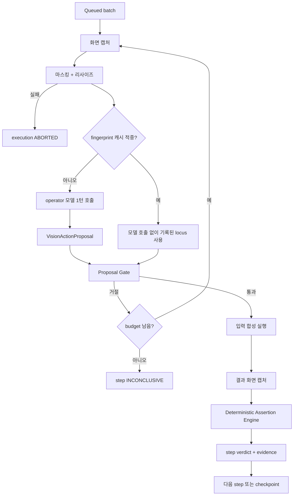

# 비전 기반 시나리오 수행 설계 (04·05 고도화)

- 작성일: 2026-09-07
- 상태: 설계 초안, 구현 전
- 상위 계약: [`04-test-execution-harness-design.md`](04-test-execution-harness-design.md)
- 대체 대상: [`05-multi-target-execution-adapter-design.md`](05-multi-target-execution-adapter-design.md)의 adapter 우선순위 결정
- 검토 입력: [`../CUA_방식_검토_및_수행계층_설계_v1.0.md`](../CUA_방식_검토_및_수행계층_설계_v1.0.md)

## 1. 결정

수행 계층의 기본 실행 방식을 **비전 기반 computer-use 루프**로 한다. 대상 화면을 캡처하고, 시나리오 케이스가 지시하는 다음 행동을 화면에서 찾아 조작하고, 결과 화면을 다시 관측하는 반복이 기본 경로다.

- 실행 모델은 ScenarioForge 생성 트랙과 같은 GPT 계열을 사용하고, 기존 `azure-openai-chat-completions` binding을 재사용한다.
- DOM, 접근성 트리, 네이티브 automation tree는 **기본 제어면이 아니다.** 사용 가능한 경우 grounding 보조와 사후 검증에만 쓴다.
- 04 문서의 신뢰 경계는 그대로 유지한다. 즉 명시적 사용자 명령, immutable batch, backend queue commit, deterministic verdict, evidence fail-closed는 바뀌지 않는다.

### 1.1 05 문서 대비 변경

| 항목 | 05의 결정 | 본 문서의 결정 | 이유 |
| --- | --- | --- | --- |
| adapter 우선순위 | semantic-first, vision은 fallback | **vision-first**, semantic은 grounding 보조 | 대상 시스템 침습 최소화와 실사용 환경 대표성을 우선한다 |
| `target_candidates` 역할 | 실행 selector | **시각 대상 서술의 근거와 사후 검증 기준** | 비전 루프는 selector로 조작하지 않는다 |
| `AdapterKind` 기본값 | `web.playwright` | `web.vision` / `desktop.cua` | 위와 동일 |
| Playwright 역할 | 웹 실행 주체 | **session 소유, 캡처, 입력 합성, 증적** | 브라우저 제어면을 판단 근거로 쓰지 않는다 |

변경하지 않는 것: `RunnerPlan` 불변성, `ExecutionSegment` 고정, fallback 사전 고정, 좌표 canonical 저장 금지, GUI 모델의 최종 판정 금지.

### 1.2 채택된 위험과 완화 장치

이 결정은 리포지토리가 이미 기록한 두 건의 반대 근거와 충돌한다. 근거를 삭제하지 않고 완화 장치를 설계에 넣는다.

| 기록된 위험 | 근거 | 본 설계의 완화 장치 |
| --- | --- | --- |
| 범용 VLM의 고밀도 화면 그라운딩 정확도가 낮다 (GPT-5 계열 ScreenSpot-Pro 6~18, GUI 특화 오픈웨이트 60~82) | CUA 검토 문서 1.2 | §5 grounding 검증 gate. 이 저장소의 실측(§2.1)에서는 AXSE·RA-DAR 화면 밀도에서 재현되지 않았다. ScreenSpot-Pro는 더 고밀도이므로 우려를 폐기하지 않고 gate를 유지한다 |
| 10스텝 초과 GUI-only 케이스의 성공률 붕괴 (90.41% → 35.56%) | CUA 검토 문서 0장, MCPWorld | §7 milestone checkpoint, drift 차단, 연속 불확실 상한 |
| 회차마다 전량 VLM 호출로 비용 곡선이 뒤집힌다 | CUA 검토 문서 2.3 | §8 fingerprint 일치 시 모델 호출 0회 replay fast path |

세 장치가 모두 실측으로 검증되기 전에는 이 경로를 제품 기본값이라고 부르지 않는다. §11의 증명 순서를 따른다.

---

## 2. 입력 계약

생성 트랙은 `ScenarioRecord`와 그것이 참조하는 FACT 레코드를 보장한다. 수행 트랙은 원본 소스를 읽지 않는다.

| 생성 트랙 필드 | 수행 트랙에서의 역할 | 금지 |
| --- | --- | --- |
| `steps[].action_ref.edge` | segment 경계와 기대 화면 전이 판별 | 전이 자체를 모델이 재정의 |
| `steps[].action_ref.element` | FACT element로 해석해 `VisualTargetDescriptor` 생성 | element ID 발명 |
| FACT `element.label`, `interaction.action_kind` | 화면에서 찾을 대상의 서술과 허용 action 종류 | 라벨을 selector 문자열로 사용 |
| FACT `element.interaction.target_candidates` | grounding 검증 기준, 미해결 판별 | 비전 실행 경로에서 조작 selector로 사용 |
| `steps[].assertion_refs` | 관측 기대치 | 모델이 assertion을 추가·완화 |
| `steps[].action`, `expected` | 화면 표시, 보고서, 증적 캡션 | 실행 지시로 파싱 |
| `preconditions[].data_binding_keys` | 입력 값 참조 키 | 원문 값을 plan·이벤트·증적에 기록 |

`VisualTargetDescriptor`는 컴파일러가 만들며 plan에 고정된다.

```ts
type VisualTargetDescriptor = {
  descriptorId: string;
  elementRef: string;                // FACT element ID
  visibleLabel: string;              // 필수. 화면에 실제로 보이는 텍스트
  controlKind: string;               // button, textbox, link, upload, table-row ...
  surfaceHint: string;               // 어느 화면·영역에서 기대되는가
  verificationCandidates: SemanticCandidate[]; // 사후 대조용, 조작용 아님
  labelUniqueOnSurface: boolean;     // 같은 화면에서 이 라벨이 유일한가
  ambiguityRisk: "low" | "medium" | "high";
};
```

`visibleLabel`은 선택 필드가 아니다. PROBE-20260907-02에서 `aria-label`만 있고 화면에 글자가 없는 아이콘 버튼은 모델이 전부 `not-found`로 답했다. 읽을 수 없는 라벨로는 대상을 지목할 수 없으므로, 라벨이 없는 step은 `NO_VISUAL_TARGET_EVIDENCE`로 확정한다. `verificationCandidates`는 사후 대조용이며 대상을 찾는 근거가 아니다.

`labelUniqueOnSurface`가 `false`면 라벨 일치는 대상을 특정하지 못한다. 대조할 후보도 없으면 컴파일러가 `AMBIGUOUS_VISUAL_TARGET`으로 사람 확인에 넘긴다. 모델에게 "알아서 찾아라"로 넘기지 않는다.

---

## 2.1 좌표계 계약

실측(`docs/validation/vision-execution-grounding/PROBE-20260907-01`)에서 확인된 필수 계약이다. 모델은 원본 스크린샷 좌표계가 아니라 **자신의 전처리 이미지 좌표계**로 답한다. AXSE 39개 대상의 오차는 전부 선형이었고, `predicted_y = 0.8532 * truth_y`의 평균 절대 잔차가 0.5px이었다. 배율 0.8533은 `768 / 900`이다.

따라서 Runner는 다음을 고정한다.

```ts
type FrameCoordinateSpace = {
  captureSize: { width: number; height: number };   // 원본 CSS 픽셀
  modelSize: { width: number; height: number };     // 모델에 보낸 이미지 크기
  shortSide: number;                                 // 정규화 기준. 현재 768
};
```

- 전송 전에 스크린샷의 짧은 변을 `shortSide`로 리사이즈하고, 그 크기를 프롬프트에 명시한다.
- 모델이 돌려준 좌표는 `modelSize` 공간의 값으로 해석하고, 입력 합성 직전에 `captureSize` 공간으로 환산한다.
- 환산 배율은 프레임마다 계산해 `FrameFingerprint`와 함께 증적에 기록한다. 상수로 하드코딩하지 않는다.
- 이 정규화를 생략하면 좌표가 정확한 모델도 hit rate가 0.07~0.21로 보인다. 즉 좌표계 불일치는 모델 성능 문제로 오진되기 쉽다.

## 3. Bounded Vision Step

비전 실행에서도 모델은 계획을 만들지 않는다. 모델이 결정할 수 있는 것은 **이번 프레임에서 대상이 화면 어디에 있는가** 하나뿐이다.

```ts
type VisionActionKind =
  | "click" | "doubleClick" | "rightClick"
  | "type" | "clear" | "selectOption"
  | "scroll" | "drag" | "keyChord"
  | "wait" | "observe";

type VisionStepEnvelope = {
  stepId: string;
  actionRef: string;
  assertionRefs: string[];
  intent: ActionIntent;              // 고정
  allowedActions: VisionActionKind[]; // 고정 화이트리스트, 보통 1~2개
  target: VisualTargetDescriptor;    // 고정
  valueRef?: string;                 // data binding key만
  budget: {
    maxModelCalls: number;
    maxScreenshots: number;
    timeoutMs: number;
  };
  riskClass: "read" | "reversible-write" | "destructive";
};
```

모델의 1턴 출력은 제안일 뿐이다.

```ts
type VisionActionProposal = {
  stepId: string;
  action: VisionActionKind;
  locus: { x: number; y: number } | { region: [number, number, number, number] };
  observedLabel?: string;            // 모델이 화면에서 읽은 텍스트
  confidence: number;
  alternatives: Array<{ locus: unknown; confidence: number }>;
};
```

`locus`는 해당 프레임 한정 observation이다. 증적에는 프레임 fingerprint와 함께 남기고, canonical locator로 저장하지 않는다.

---

## 4. 실행 루프



한 step은 모델 왕복 예산 안에서만 반복한다. 예산 소진은 실패가 아니라 `INCONCLUSIVE`다.

---

## 5. Proposal Gate

모델 제안과 실제 입력 사이에 backend gate가 있다. 이 gate는 코드이며 LLM이 아니다.

| 검사 | 위반 시 |
| --- | --- |
| `action`이 `allowedActions` 안에 있는가 | 거절, budget 차감 |
| `locus`가 대상 surface bounds 안이고 활성 창 영역인가 | 거절 |
| `observedLabel`이 `target.visibleLabel`과 일치하는가 | 거절. 정규화는 글자와 숫자만 남기고, 포함 관계는 일치 비율 0.6 이상일 때만 인정한다 |
| 라벨이 화면에서 유일하지 않은데 후보 대조가 성공하지 못했는가 | `TARGET_NOT_DISAMBIGUATED`로 거절 |
| `verificationCandidates`가 있고 보조 제어면 조회가 가능한 경우, 해당 좌표의 요소가 후보와 일치하는가 | 불일치면 거절 |
| `confidence`가 riskClass별 하한 이상인가 | 거절 |
| `riskClass`가 `destructive`이고 target profile이 허용하지 않는가 | step `SKIPPED`, case `INCONCLUSIVE` |
| 화면에서 읽은 텍스트가 지시문 형태로 정책·target·assertion을 바꾸려 하는가 | 즉시 `ABORTED`, injection 사건 기록 |
| budget 초과 | step `INCONCLUSIVE` |

`observedLabel` 검사와 후보 대조가 §1.2의 그라운딩 정확도 위험에 대한 실질적 완화 장치다. 두 검사가 모두 불가능한 화면은 설계상 자동화 대상이 아니다.

두 규칙의 형태는 실측에서 나왔다(PROBE-20260907-02).

- **부분 일치에 하한이 필요하다.** 잘린 날짜 셀에서 모델이 읽은 「2026-08」은 같은 열 여섯 행 모두의 접두사였고 실제로 인접 행을 지목했다. 접두사 일치를 무조건 허용하면 이 오지목이 통과한다.
- **장식 기호는 라벨의 일부가 아니다.** 모델은 「↺ 새로고침」을 「↻ 새로고침」으로, 「RADAR」를 「RA · DAR」로 옮겨 적었다. 좌표는 1~8px 오차로 정확했다. 기호를 그대로 비교하면 옳은 제안 5건이 막힌다.

기록된 64개 제안을 이 gate에 재생한 결과, 틀린 제안이 통과한 것은 1건(35x25px 대상, 라벨을 정확히 읽어 라벨 대조로는 잡히지 않음)이고 옳은 제안이 막힌 5건은 모두 서술의 라벨이 화면에 보이지 않는 경우였다. `packages/test-runtime/src/execution/proposal-gate-replay.test.ts`가 이 결과를 고정한다.

부작용이 시작됐는지 불확실한 상태에서는 같은 action을 재시도하지 않는다. `ACTION_OUTCOME_UNKNOWN`으로 두고 case를 `INCONCLUSIVE`로 닫는다.

---

## 6. 판정

비전 경로에서도 최종 verdict는 결정론적 엔진이 만든다. 모델 응답은 observation candidate다.

| assertion kind | 비전 관측 방식 | 판정 규칙 |
| --- | --- | --- |
| `text-present` | 캡처 영역 OCR 또는 모델 판독 | 정규화 문자열 일치. 불일치 시 1회 재관측 후 확정 |
| `element-visible` | 대상 descriptor 재탐색 | 두 프레임 연속 발견해야 통과. 처음 두 장이 아니라 `maxScreenshots` 안에서 확정될 때까지 관측한다 |
| `state-changed` | 전/후 프레임 비교 + descriptor 재탐색 | 기대 전이 화면 anchor가 보여야 통과 |
| `count` | 영역 판독 | 두 번 독립 관측이 같은 값일 때만 통과. 다르면 `INCONCLUSIVE` |
| `absent` | 대상 미발견 | 스크롤 범위 확인 후에만 통과 |

규칙 세 가지를 고정한다.

PROBE-20260907-04에서 이 규칙의 적용 범위를 고쳤다. 데이터를 늦게 채우는 화면은 정상적으로 부재 -> 존재로 전이하므로, 조작 직후 두 장만 보면 로딩을 「불안정」으로 오판해 `INCONCLUSIVE`가 된다. 관측은 `maxScreenshots` 안에서 판정이 확정될 때까지 반복하고, 확정된 `PASSED`/`FAILED`는 즉시 멈춘다. 부재 -> 존재 -> 존재는 통과, 부재 -> 존재 -> 부재는 여전히 판정 불가다.

같은 실측에서 observer 신뢰도도 확인했다. settle된 프레임 한 장에 대해 앵커 후보 6개를 각 3회 물었을 때 18/18이 DOM 사실과 일치했고, 화면에 없는 문구를 지어내지 않았다. 다만 앵커가 본문 문단에 묻혀 있으면 실행 중 판독이 흔들린 사례가 한 번 있었고 원인을 확정하지 못했다. 앵커는 화면에서 시각적으로 두드러진 문자열로 고른다.

1. 모델이 "성공했다"고 서술해도 verdict가 되지 않는다. assertion 평가 결과만 verdict가 된다.
2. 관측이 불확실하면 `PASSED`가 아니라 `INCONCLUSIVE`다.
3. assertion 불일치에는 fallback이나 재시도를 하지 않는다. 그것은 환경 문제가 아니라 테스트 결과일 수 있다.

---

## 7. 긴 여정 붕괴 대응

AXSE 정상 여정은 13 milestone이며, GUI-only 방식이 붕괴한다고 기록된 구간에 들어간다. 다음 장치로 누적 드리프트를 차단한다.

- **Milestone checkpoint:** `ExecutionSegment`를 journey milestone 단위로 자른다. 각 segment 진입 시 `entryPreconditions`의 화면 anchor를 확인하고, 실패하면 이후 step을 실행하지 않고 segment를 `INCONCLUSIVE`로 닫는다.
- **Anchor 재확인:** step 실행 후 기대 화면 anchor가 사라졌으면 다음 step으로 진행하지 않는다.
- **연속 불확실 상한:** 한 case 안에서 gate 거절 또는 `INCONCLUSIVE` step이 연속 N회면 case를 중단한다. 기본값 2로 시작하고 실측으로 조정한다.
- **부분 결과 보존:** 중단된 case도 도달한 마지막 milestone과 증적을 기록한다. 케이스 전체를 실패로 뭉개지 않는다.

이 방식은 케이스 완주율 대신 **milestone 도달률**을 1차 지표로 삼는다. 완주율만 보면 개선 지점을 찾을 수 없다.

---

## 8. Replay fast path

비용 곡선을 되돌리기 위해 성공한 step의 관측을 조건부로 재사용한다.

```ts
type FrameFingerprint = {
  targetProfileHash: string;
  surfaceId: string;          // 화면·창 식별
  viewport: [number, number];
  devicePixelRatio: number;
  scaling: number;
  layoutHash: string;         // 캡처 다운스케일 후 구조 해시
};
```

- fingerprint가 전부 일치할 때만 기록된 `locus`를 모델 호출 없이 재사용한다.
- 재사용해도 §5 gate는 그대로 통과해야 한다. 특히 `observedLabel` 대조는 생략하지 않는다.
- 한 번이라도 gate가 거절하면 해당 캐시 항목을 폐기하고 모델 경로로 되돌린다.
- 캐시는 execution 결과가 아니라 별도 저장소에 둔다. 캐시 적중률은 지표로 기록하되 verdict에 영향을 주지 않는다.

---

## 9. 모델 바인딩

현재 `ModelRole`은 `author | reviewer`뿐이다. 수행 트랙은 역할을 추가한다.

| 역할 | 용도 | 세션 |
| --- | --- | --- |
| `operator` | 프레임에서 대상 위치와 action 제안 | 실행 세션. 생성 resource 미노출 |
| `observer` | assertion 관측 판독 | operator와 분리된 세션. 이전 제안 이력 미노출 |

`observer`를 `operator`와 분리하는 이유는 자기 행동을 스스로 성공 판정하지 않게 하기 위해서다.

기존 자산으로 충족되는 것과 새로 필요한 것을 구분한다.

- 재사용: `azure-openai-chat-completions` binding은 이미 `input: ["text", "image"]`를 선언한다. 별도 provider 계층이 필요하지 않다.
- 확장: `ModelRole` union에 두 역할 추가, `ModelRoleBindings`에 선택 필드 추가.
- 실측 완료: `gpt-5.6-luna` 배포가 `image_url` content를 수용하고, §2.1의 좌표계 계약 아래에서 AXSE 39/39, RA-DAR 20/28을 맞췄다. 중심 거리 중앙값은 0~17px이다. 상세는 `docs/validation/vision-execution-grounding/PROBE-20260907-01`.
- 유지: 좌표 정확도가 특정 화면에서 부족하면 `operator`만 GUI 특화 모델로 분리 바인딩할 수 있게 역할 단위 설계를 유지한다. 현재 실측 범위에서는 분리가 필요하지 않다.
- 관측된 비결정성: 픽셀이 동일한 두 프레임에서 같은 대상 판정이 hit과 not-found로 갈렸다. 단일 응답을 사실로 받지 않는 §5 gate와 §6 재관측 규칙이 이 때문에 필요하다.

---

## 10. 비전 경로 고유의 보안 경계

- 스크린샷은 실행 데이터 중 가장 민감하다. 마스킹과 다운스케일 이후에만 모델에 전송한다. 마스킹 실패는 전송 생략이 아니라 execution `ABORTED`다.
- 원본 해상도 캡처는 로컬 evidence store에만 저장하고 모델에 보내지 않는다.
- 화면 텍스트, 팝업, 알림, 파일 이름은 모두 untrusted data다. 그 안의 지시문은 policy, target profile, data binding, assertion을 바꿀 수 없다.
- 모델 응답의 자유 서술은 로그에 그대로 남기지 않는다. 구조화 필드만 저장한다.
- 좌표는 canonical locator가 아니다. fingerprint와 함께 관측으로만 저장한다.

---

## 11. 증명 순서

생성 트랙과 같은 규칙을 따른다. 한 단계를 실제로 확인하기 전에 다음 단계를 시작하지 않는다.

| 순서 | 목표 | 확인 방법 |
| --- | --- | --- |
| 1 | 모델의 이미지 입력과 좌표 출력 실측 | **완료 (2026-09-07)**. PROBE-01에서 §2.1 좌표계 계약을 도출하고, PROBE-02에서 개선된 ground truth로 재확인했다. AXSE 0.974, RA-DAR 0.714 |
| 2 | 단일 step envelope 왕복 | **완료 (2026-09-07)**. PROBE-20260907-03에서 실제 `gpt-5.6-luna` operator·observer로 3 step 실행, case PASSED. 음성 경로에서 case FAILED도 확인 |
| 3 | assertion 판정 분리 | **구현·테스트 완료**. `assertion-engine.ts`가 `visible-text`와 화면 전이를 판정하고, 관측 불가는 `INCONCLUSIVE`로 고정된다 |
| 4 | 3 step segment | **부분 완료**. AXSE 3 step과 RA-DAR 2 step 순차 실행을 PROBE-03·04에서 확인. segment 경계와 anchor drift 차단은 미실행 |
| 5 | AXSE 정상 여정 전체 | milestone 도달률과 모델 호출 수 기록. 미실행 |
| 6 | replay fast path | 2회차 실행의 모델 호출 감소율 |

1단계는 통과했고 역할 단위 모델 분리는 필요하지 않았다. 다음은 2단계다. 다만 두 가지가 열려 있다.

- 재측정은 PROBE-20260907-02에서 완료했다. 768 좌표계 실패 9건 중 그라운딩 정확도 문제는 1건이고 나머지는 대상 서술의 품질 문제였다.
- 실측은 stub 백엔드로 띄운 화면을 사용했다. 실제 데이터 밀도에서의 재확인은 2단계와 함께 수행한다.

2단계의 결정론적 구성 요소는 구현되어 있고 51개 테스트가 분기를 고정한다. `packages/test-runtime`이 `compileVisionSteps`(§2 · §3), `createFrameCoordinateSpace`/`toCaptureSpace`(§2.1), `evaluateProposal`(§5), `evaluateAssertions`(§6), `runStep`(§4)을 제공한다. 실제 화면과 모델은 port 로 주입하므로 루프의 모든 분기가 fake 로 검사된다.

PROBE-20260907-03에서 이 루프가 실제 AXSE 앱을 조작했다. 마스크를 덮은 프레임을 캡처하고, `sendInputEvent`와 `insertText`로 입력을 합성하고, 로그인 전이를 연속 두 관측으로 확인해 case `PASSED`를 냈다. 실제 모델로 돌린 왕복에서 세 step 모두 첫 제안이 gate를 통과했고 환산 좌표는 ground truth와 1px 안에서 일치했다.

판정이 의미를 갖는지도 확인했다. observer는 화면에 없는 문구를 물으면 빈 배열을 반환한다(다음 화면 앵커와 지어낸 문구 모두 거부). 도착 화면만 나타나지 않는 화면으로 바꾸면 같은 조작·같은 gate 통과에도 case가 `FAILED`가 된다. 「동작 성공」이 「업무 결과 성공」으로 오판되지 않는다.

실제 모델로 재현하지 않은 것은 `INCONCLUSIVE` 경로다. 예산 소진, 대상 미발견, 조작 결과 불명은 fake port 로만 검사했다.

---

## 12. 생성 트랙에 요청할 계약 항목

수행 트랙이 필요로 하지만 현재 `packages/contracts/src/generation.ts`에 없는 것들이다. 수행 트랙에서 임의로 추가하지 않고 계약 요청으로 올린다.

| 필요 항목 | 이유 | 없을 때의 동작 |
| --- | --- | --- |
| `ScenarioRecord`의 실행 가능성 상태 | UI가 `READY`/`NON_AUTOMATABLE`을 표시해야 한다 | 전부 후보로 두고 컴파일 시점에 판별. UI 사전 필터 불가 |
| step 단위 `data_binding_keys` | 현재는 `preconditions`에만 있어 어느 입력 step에 어떤 값이 들어가는지 불명확 | 컴파일러가 매핑 불가하면 해당 step `NON_AUTOMATABLE` |
| FACT element label의 화면 가시성 표시 | 비전 대상 서술은 화면에 실제로 보이는 텍스트만 쓸 수 있다. PROBE-02의 실패 8건이 전부 이 필드가 없어서 생겼다: 화면에 없는 라벨 3건, 잘려 렌더링되는 라벨 5건 | 해당 step을 `NO_VISUAL_TARGET_EVIDENCE`로 확정하거나 gate가 거부한다 |
| assertion의 관측 가능성 kind | 어떤 assertion이 화면만으로 판정 가능한지 구분해야 한다 | 판정 불가로 보고 `INCONCLUSIVE` |

네 항목 모두 추가 필드이며 기존 canonical ID 형식이나 기존 필드 의미를 바꾸지 않는다.

---

## 13. 완료 기준

1. 생성 완료가 실행을 시작시키지 않는다. 명시적 사용자 명령만 트리거다.
2. 컴파일러가 `ScenarioRecord`와 FACT 참조만으로 `VisionStepEnvelope`를 만들고, 만들 수 없는 step은 `NON_AUTOMATABLE`로 확정한다.
3. 모델은 어떤 경로로도 step, assertion, target descriptor, budget을 바꾸지 못한다.
4. 모든 실제 입력은 Proposal Gate를 통과한 것이다.
5. 모든 verdict가 assertion 평가 결과 또는 구조화 환경 오류에 연결된다. 모델 서술이 verdict가 된 경로가 없다.
6. 마스킹 실패 시 모델 전송이 일어나지 않고 execution이 `ABORTED`된다.
7. 좌표가 canonical locator로 저장된 곳이 없다.
8. 긴 case에서 drift 차단이 동작하고, 중단된 case도 도달 milestone과 증적을 남긴다.
9. 2회차 실행에서 replay fast path가 모델 호출 수를 실제로 줄인다.
10. `operator`와 `observer` 세션이 분리되어 있고 생성 resource가 노출되지 않는다.
