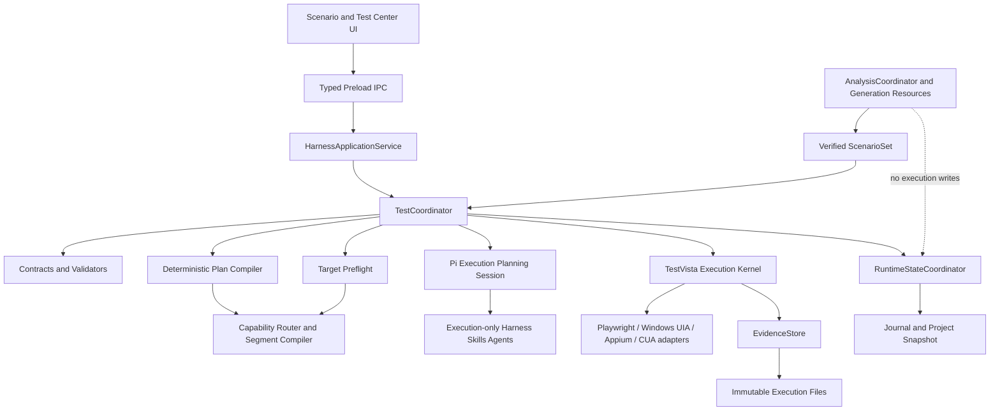
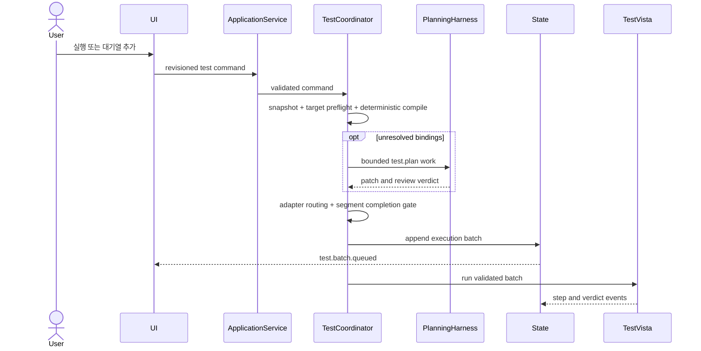
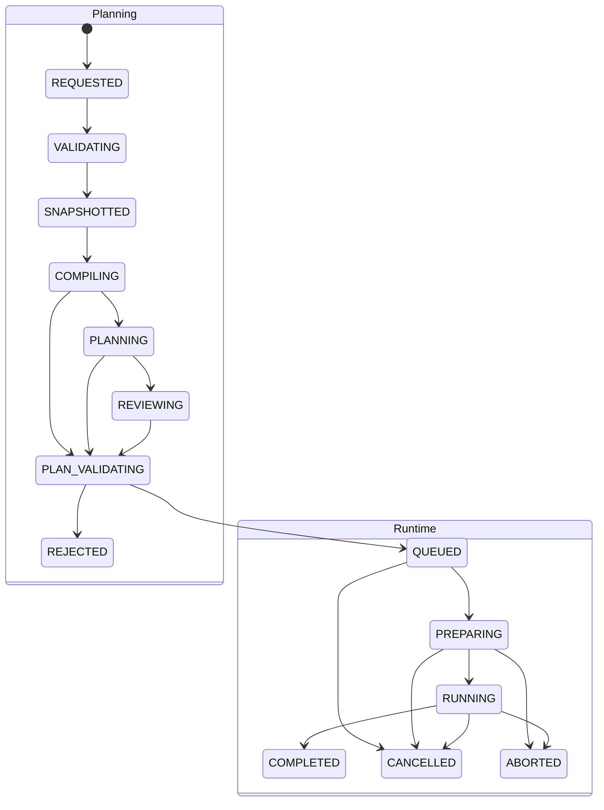

# Test Execution Harness Implementation Plan

## Summary

검증된 시나리오를 명시적 사용자 트리거로만 받아 immutable `ExecutionBatch`로 계획하고, 제한된 Pi planning harness와 플랫폼 중립 TestVista Execution Kernel을 통해 순차 실행·증적으로 연결한다. 생성과 수행의 package, resource, session, state, tool 권한을 분리하면서 Playwright·Windows UIA·mobile·CUA adapter를 Electron Main의 단일 application façade에서 통합한다.

---

## Problem Frame

현재 솔루션은 시나리오 선택, 대상 URL·테스트 데이터 입력, 테스트 센터, 증적 화면까지 웹 중심 UI fixture가 구성되어 있다. 생성 영역은 FACT/WIKI/SCENARIO 하네스·skill·agent와 backend completion gate가 상세화되어 있지만, 수행 영역은 `ScenarioSnapshot → RunnerPlan → TestVista` handoff만 존재하며 비웹 target 계약과 adapter 선택은 없다.

이 상태로 구현을 시작하면 실행 중 시나리오 추가가 기존 immutable plan을 수정하거나, test planning agent가 Runner를 직접 제어하거나, 생성 resource가 수행 영역까지 확장될 위험이 있다. 사용자 명령, batch 불변성, planning resource, queue commit, Runner·evidence lifecycle을 구현 단위로 고정해야 한다.

---

## Requirements

**Domain separation**

- R1. 시나리오 생성은 verified `ScenarioSet`과 실행 가능성 메타데이터에서 끝나며 execution, queue, evidence를 생성하지 않는다.
- R2. 테스트 수행은 `test.createExecution`, `test.enqueueScenarios`, `test.retryCases` 중 하나의 명시적 사용자 명령으로만 계획을 시작한다.
- R3. generation, scenario-query, execution-planning은 서로 다른 session, resource subtree, read/write policy를 사용한다.
- R4. 실제 target action은 agent가 아니라 검증된 plan을 소비하는 TestVista 수행 어댑터만 실행한다.

**Planning and immutability**

- R5. 선택 시나리오와 upstream hash는 batch별 immutable `ScenarioSnapshot`으로 보존한다.
- R6. deterministic compiler가 우선 계획하고 unresolved binding이 있을 때만 bounded `test.plan` Pi work를 시작한다.
- R7. planner와 reviewer는 scenario 의미, path, action/assertion ID를 변경할 수 없고 Runner·queue·evidence 쓰기 권한을 갖지 않는다.
- R8. enqueue는 기존 snapshot/plan을 수정하지 않고 같은 target hash를 사용하는 새 immutable batch를 append한다.
- R9. snapshot·target·binding·plan validator와 durable commit이 끝나기 전에는 batch를 Runner queue에 노출하지 않는다.

**Execution and evidence**

- R10. 프로젝트별 active Runner는 하나이며 case와 step을 snapshot 순서대로 실행한다.
- R11. assertion 불일치, 환경 미판정, 사용자 중단, 치명적 시스템 오류를 서로 다른 상태로 저장한다.
- R12. masking·evidence 저장·Runner process 무결성 실패는 fail-closed로 execution을 중단한다.
- R13. cancel, retry, recovery는 완료된 artifact와 evidence를 덮어쓰지 않는다.

**User and application integration**

- R14. 활성 execution이 없으면 UI는 새 실행 CTA를, 있으면 같은 target에 추가하는 enqueue CTA를 제공한다.
- R15. Renderer는 ID 생성, plan 변환, queue 상태 확정을 하지 않고 typed IPC와 revisioned domain event만 사용한다.
- R16. route 이동과 앱 재시작 후에도 execution/batch/case/step 상태를 snapshot hydration과 event replay로 복구한다.

**Multi-target execution**

- R17. target은 URL 단일 값이 아니라 웹·Windows·Android·iOS·원격 surface의 discriminated union으로 표현한다.
- R18. semantic adapter를 우선하고 visual/CUA는 plan에 허용된 fallback으로만 사용한다.
- R19. GUI 모델은 observation candidate만 만들며 AssertionEngine의 최종 verdict를 대체하지 않는다.

---

## Key Technical Decisions

- KTD-1. **ExecutionBatch를 불변성 단위로 사용:** 실행 중 enqueue를 지원하면서 기존 snapshot과 plan을 보존하기 위해 execution manifest는 immutable batch reference를 append-only로 관리한다.
- KTD-2. **최상위 Pi harness는 router로 제한:** 공통 work lifecycle과 domain resource 선택만 정의하고 세부 생성·수행 지침은 별도 child harness에 둔다.
- KTD-3. **compiler-first planning:** LLM latency와 비결정성을 줄이기 위해 정적 action/assertion/target binding을 먼저 컴파일하고 미해결 항목만 agent에게 전달한다.
- KTD-4. **Preflight와 Discovery Probe 분리:** 환경 capability 확인은 업무 상태를 변경하지 않고, target attach·entry 접근이 필요한 probe는 target policy가 허용할 때만 redacted candidate snapshot을 생성한다.
- KTD-5. **backend-only completion and queue commit:** reviewer pass나 Pi lifecycle event는 batch 완료가 아니며 TestCoordinator validator와 RuntimeStateCoordinator commit만 queue 진입을 확정한다.
- KTD-6. **planning과 running 상태 분리:** plan 거절을 테스트 실패로 오인하지 않도록 batch planning state와 execution runtime state를 별도 state machine으로 둔다.
- KTD-7. **별도 harness-server package를 만들지 않음:** Electron Main application façade를 composition root로 쓰고 재사용 계약과 로직은 `packages/*`로 분리한다.
- KTD-8. **semantic-first adapter routing:** 웹은 Playwright, Windows native는 UIA/FlaUI sidecar, Android/iOS는 Appium semantic driver를 우선하고 Midscene vision/CUA는 opaque surface fallback으로 제한한다.
- KTD-9. **검증된 segment 전환:** 하나의 case가 웹과 native dialog를 오갈 수 있지만 target transition과 adapter fallback은 immutable `ExecutionSegment`에 미리 고정한다.

---

## High-Level Technical Design

### Component topology

### Create and enqueue sequence

### State separation

---

## Implementation Units

### U1. Execution contracts and domain split

- **Goal:** command, event, snapshot, plan, batch, state, verdict 계약을 generation 계약과 구분된 namespace로 확정한다.
- **Files:**
  - Create `packages/contracts/src/test/commands.ts`
  - Create `packages/contracts/src/test/events.ts`
  - Create `packages/contracts/src/test/scenario-snapshot.ts`
  - Create `packages/contracts/src/test/execution-target.ts`
  - Create `packages/contracts/src/test/adapter-contract.ts`
  - Create `packages/contracts/src/test/observation.ts`
  - Create `packages/contracts/src/test/runner-plan.ts`
  - Create `packages/contracts/src/test/execution-batch.ts`
  - Create `packages/contracts/src/test/execution-state.ts`
  - Create `packages/contracts/src/test/contracts.test.ts`
  - Modify `packages/contracts/src/index.ts`
- **Depends on:** workspace migration and base event envelope.
- **Approach:** discriminated union으로 generation work, scenario query, execution planning work를 구분한다. `ExecutionTargetProfile`은 web/windows-desktop/android/ios/remote-desktop surface와 transition policy를 표현한다. `test.plan`만 Pi work이고 snapshot, compile, validate, queue, execute는 deterministic operation으로 모델링한다. planning state와 runtime lifecycle, case/step result를 별도 enum으로 두고 현재 결합형 `TestExecution.status`는 UI projection adapter로만 호환한다.
- **Test scenarios:** 빈 scenario 선택, 중복 ID, stale revision, 완료 execution enqueue, target hash 불일치, target kind별 필수 값, 미허용 surface transition, 금지 상태 전이, event의 민감정보 field 거절.
- **Verification:** `npm test --workspace @scenarioforge/contracts && npm run typecheck --workspace @scenarioforge/contracts`.

### U2. Trigger facade and immutable batch lifecycle

- **Goal:** 사용자 명령을 멱등하게 받아 새 execution 또는 새 batch를 만들고 planning gate 전에는 queue에 노출하지 않는다.
- **Files:**
  - Create `packages/test-runtime/src/coordinator/test-command-handler.ts`
  - Create `packages/test-runtime/src/coordinator/test-command-handler.test.ts`
  - Create `packages/test-runtime/src/coordinator/execution-batch-service.ts`
  - Create `packages/test-runtime/src/coordinator/execution-batch-service.test.ts`
  - Create `packages/test-runtime/src/coordinator/test-coordinator.ts`
  - Create `apps/desktop/src/main/ipc/test-ipc.ts`
  - Modify `apps/desktop/src/main/app/application-orchestrator.ts`
- **Depends on:** U1, `RuntimeStateCoordinator` compare-and-set API.
- **Approach:** `{projectId, operationId}` 멱등 기록과 `expectedRevision` 검증을 먼저 수행한다. create/retry는 새 execution과 first batch를, enqueue는 same-target 새 batch를 만든다. batch artifact commit과 queue append를 한 state transaction으로 처리한다.
- **Test scenarios:** 같은 operation 재전송, payload가 다른 operation ID 재사용, planning 중 cancel, queue commit 직전 crash, enqueue planning 실패 시 기존 queue 불변, retry relation 보존.
- **Verification:** `npm test --workspace @scenarioforge/test-runtime -- test-command-handler execution-batch-service`.

### U3. Snapshot, target, preflight, data binding, and probe contracts

- **Goal:** 실행 입력을 immutable·redacted artifact로 고정하고 side-effect 없는 environment preflight와 정책이 허용한 discovery probe를 분리한다.
- **Files:**
  - Create `packages/test-runtime/src/planning/create-scenario-snapshot.ts`
  - Create `packages/test-runtime/src/planning/create-scenario-snapshot.test.ts`
  - Create `packages/test-runtime/src/targets/normalize/execution-target-profile.ts`
  - Create `packages/test-runtime/src/targets/preflight/environment-preflight.ts`
  - Create `packages/test-runtime/src/targets/preflight/environment-preflight.test.ts`
  - Create `packages/test-runtime/src/planning/data-binding-set.ts`
  - Create `packages/test-runtime/src/targets/probe/discovery-probe.ts`
  - Create `packages/test-runtime/src/targets/probe/discovery-probe.test.ts`
  - Create `packages/test-runtime/src/runner/testvista-probe-port.ts`
- **Depends on:** U1, ArtifactQueryService, project path/network policy.
- **Approach:** scenario artifact와 referenced FACT/WIKI/source hash를 snapshot에 포함한다. secret value는 runtime secret handle로 바꾸고 binding manifest에는 key·classification·presence만 기록한다. preflight는 driver/device/sidecar/capability/resource만 확인한다. probe는 `disabled | attach-only | resettable-navigation` policy와 redacted target candidate 수집만 허용한다.
- **Test scenarios:** source artifact hash 불일치, non-automatable scenario, 누락 binding key, credential 직렬화 탐지, cross-origin/process/device transition, reset 없는 navigation probe, probe가 click/fill을 요청하는 경우 차단.
- **Verification:** `npm test --workspace @scenarioforge/test-runtime -- scenario-snapshot environment-preflight discovery-probe`와 생성된 fixture에서 secret 원문 `rg` 검색 결과 0건.

### U4. Execution-only Pi resource bundle

- **Goal:** 생성 resource와 분리된 수행 planning harness, skills, agents를 manifest와 policy hash로 배포한다.
- **Files:**
  - Modify `packages/project-runtime/runtime-template/SYSTEM.md`
  - Modify `packages/project-runtime/runtime-template/AGENTS.md`
  - Create `packages/project-runtime/runtime-template/harnesses/scenario-generation.md`
  - Create `packages/project-runtime/runtime-template/harnesses/test-execution-planning.md`
  - Move generation resources under `packages/project-runtime/runtime-template/skills/generation/`
  - Create `packages/project-runtime/runtime-template/skills/execution/test-plan-binding/SKILL.md`
  - Create `packages/project-runtime/runtime-template/skills/execution/test-plan-review/SKILL.md`
  - Create `packages/project-runtime/runtime-template/agents/execution/test-planner.md`
  - Create `packages/project-runtime/runtime-template/agents/execution/test-plan-reviewer.md`
  - Create `packages/test-runtime/src/planning/test-plan-work-policy.ts`
  - Modify `packages/pi-runtime/src/resources/resource-loader.ts`
  - Modify `packages/pi-runtime/src/resources/resource-loader.test.ts`
- **Depends on:** U1, Pi host resource manifest loader.
- **Approach:** `HarnessDomain`별 resource subtree allowlist를 manifest에 기록한다. execution planning session에는 source read, generation write, runner, queue, evidence tool을 등록하지 않는다. planner와 reviewer는 같은 `test.plan` work의 독립 role로 실행한다.
- **Test scenarios:** generation session에 execution skill이 노출되는 bundle 거절, planner tool escalation 거절, reviewer plan mutation 거절, protocol/policy/resource hash mismatch 거절, reviewer 미설정 시 `single-model` assurance.
- **Verification:** `npm test --workspace @scenarioforge/pi-runtime && npm test --workspace @scenarioforge/project-runtime && npm test --workspace @scenarioforge/test-runtime -- test-plan-work-policy`.

### U5. Compiler-first planning, capability routing, and completion gate

- **Goal:** LLM 없는 base plan 컴파일, 대상 capability routing, 검증된 segment/fallback 생성, 선택적 Pi patch/review, 최종 RunnerPlan validation을 연결한다.
- **Files:**
  - Create `packages/test-runtime/src/planning/compile-runner-plan.ts`
  - Create `packages/test-runtime/src/planning/compile-runner-plan.test.ts`
  - Create `packages/test-runtime/src/planning/test-plan-workflow.ts`
  - Create `packages/test-runtime/src/planning/test-plan-workflow.test.ts`
  - Create `packages/test-runtime/src/planning/merge-runner-plan-patch.ts`
  - Create `packages/test-runtime/src/routing/capability-registry.ts`
  - Create `packages/test-runtime/src/routing/adapter-router.ts`
  - Create `packages/test-runtime/src/routing/adapter-router.test.ts`
  - Create `packages/test-runtime/src/routing/segment-compiler.ts`
  - Create `packages/test-runtime/src/routing/segment-compiler.test.ts`
  - Create `packages/test-runtime/src/planning/runner-plan-validator.ts`
  - Create `packages/test-runtime/src/planning/runner-plan-validator.test.ts`
  - Create `packages/test-runtime/src/planning/plan-completion-gate.ts`
- **Depends on:** U3, U4, Pi session host.
- **Approach:** compiler는 unresolved binding ID를 명시적으로 반환한다. Pi에는 snapshot/probe의 배정 slice만 전달한다. patch merge는 원본 action/assertion ID 보존을 확인한다. router는 semantic adapter를 우선하고 visual/CUA fallback의 사유·budget을 plan에 고정한다. backend gate가 hash, action/capability, matcher compatibility, target transition, timeout, ordering, binding presence를 다시 검증한다.
- **Test scenarios:** 완전 결정적인 계획에서 Pi 미호출, semantic 가능 step의 CUA 선택 거절, 임의 selector·좌표 patch 거절, assertion ID 변경 거절, 미허용 surface transition, uncertain side effect fallback 거절, child binding 중복 거절, `agent_end`와 reviewer pass만으로 queue commit되지 않음.
- **Verification:** `npm test --workspace @scenarioforge/test-runtime -- compile-runner-plan test-plan-workflow runner-plan-validator`.

### U6. TestVista kernel, baseline adapters, evidence, cancel, and recovery

- **Goal:** validated batch만 순차 실행하는 adapter-neutral kernel을 만들고 Playwright와 Windows UIA 기준선을 verdict·evidence·cancel·process recovery에 연결한다.
- **Files:**
  - Create `packages/test-runtime/src/queue/project-runner-queue.ts`
  - Create `packages/test-runtime/src/queue/project-runner-queue.test.ts`
  - Create `packages/test-runtime/src/queue/resource-lease-manager.ts`
  - Create `packages/test-runtime/src/runner/testvista-kernel.ts`
  - Create `packages/test-runtime/src/runner/adapter-registry.ts`
  - Create `packages/test-runtime/src/runner/testvista-process-host.ts`
  - Create `packages/test-runtime/src/adapters/web/playwright-adapter.ts`
  - Create `packages/test-runtime/src/adapters/web/playwright-adapter.test.ts`
  - Create `packages/test-runtime/src/adapters/windows/uia-client.ts`
  - Create `packages/test-runtime/src/adapters/fake/fake-adapter.ts`
  - Create `packages/test-runtime/src/assertions/assertion-engine.ts`
  - Create `packages/test-runtime/src/assertions/assertion-engine.test.ts`
  - Create `native/testvista-windows-uia/TestVista.WindowsUia.csproj`
  - Create `native/testvista-windows-uia/Protocol/`
  - Create `native/testvista-windows-uia/Automation/`
  - Create `packages/test-runtime/src/verdict/classify-verdict.ts`
  - Create `packages/test-runtime/src/recovery/recover-execution.ts`
  - Create `packages/test-runtime/src/recovery/recover-execution.test.ts`
  - Create `packages/evidence-store/src/writer/evidence-writer.ts`
  - Create `packages/evidence-store/src/masking/mask-sensitive-fields.ts`
  - Create `packages/evidence-store/src/integrity/evidence-hash.ts`
  - Create `packages/evidence-store/src/writer/evidence-writer.test.ts`
- **Depends on:** U2, U5, RuntimeStateCoordinator journal.
- **Approach:** 프로젝트별 single active runner ordering과 target isolation unit별 resource lease를 사용한다. adapter는 action/observation만 반환하고 AssertionEngine이 verdict를 만든다. case 실패 후 남은 step을 `SKIPPED`로 닫고 다음 case를 계속한다. cancel은 현재 action의 안전 중단 acknowledgement 후 적용한다. masking, evidence write, Runner death, desktop state 불명확은 `ABORTED` fail-closed로 처리한다.
- **Test scenarios:** 동일 plan의 Playwright/UIA fixture 실행, 모델 응답의 pass 판정 차단, case 실패 후 다음 case 실행, 성공/실패 capture 수, masking failure 즉시 중단, Runner crash 중복 실행 방지, final manifest overwrite 거절, queued batch recovery ordering.
- **Verification:** `npm test --workspace @scenarioforge/test-runtime && npm test --workspace @scenarioforge/evidence-store`.

### U6a. Vision/CUA fallback pilot and safety gate

- **Goal:** semantic tree가 없는 web/Windows fixture에만 visual/CUA fallback을 적용하고 desktop input 소유권과 GUI 모델 경계를 검증한다.
- **Files:**
  - Create `packages/test-runtime/src/adapters/web/midscene-vision-adapter.ts`
  - Create `packages/test-runtime/src/adapters/desktop/midscene-cua-adapter.ts`
  - Create `packages/test-runtime/src/adapters/desktop/desktop-focus-guard.ts`
  - Create `packages/test-runtime/src/adapters/desktop/surface-fingerprint.ts`
  - Create `packages/test-runtime/src/security/gui-grounder-policy.ts`
  - Create `packages/test-runtime/src/security/desktop-action-policy.ts`
  - Create `tests/fixtures/execution-targets/opaque-canvas/`
- **Depends on:** U5, U6, `guiGrounder` benchmark 결과.
- **Approach:** `web.vision`은 Playwright session/capture/input을 유지하고 Midscene은 grounding만 담당한다. `desktop.cua`는 전용 desktop lease, process/window allowlist, foreground 재검증, DPI fingerprint, emergency stop이 있을 때만 시작한다. 모델은 target candidate와 confidence만 반환한다.
- **Test scenarios:** semantic 가능 step의 vision 진입 차단, unplanned CUA 진입 차단, focus 탈취 감지, DPI 변경 후 좌표 재사용 차단, destructive action confirmation 누락, screenshot data boundary 위반, low-confidence observation의 `INCONCLUSIVE`.
- **Verification:** opaque canvas와 Windows custom control fixture를 실행하고 semantic 경로의 GUI model 호출 0건, CUA 경로의 desktop session당 동시 실행 1건을 확인한다.

### U7. Renderer command and event integration

- **Goal:** 현재 fixture 기반 실행 UI를 command acknowledgement와 domain event 기반 사용자 흐름으로 교체한다.
- **Files:**
  - Modify `apps/desktop/src/preload/index.ts`
  - Create `apps/desktop/src/renderer/src/stores/test-execution-store.ts`
  - Create `apps/desktop/src/renderer/src/stores/test-execution-store.test.ts`
  - Modify `apps/desktop/src/renderer/src/components/ScenarioSheet.tsx`
  - Create `apps/desktop/src/renderer/src/components/ExecutionTargetForm.tsx`
  - Create `apps/desktop/src/renderer/src/components/EnvironmentPreflightStatus.tsx`
  - Modify `apps/desktop/src/renderer/src/components/TestExecutionPanel.tsx`
  - Modify `apps/desktop/src/renderer/src/components/TestCenter.tsx`
  - Modify `apps/desktop/src/renderer/src/App.tsx`
- **Depends on:** U1, U2, U6 IPC/event contracts.
- **Approach:** active execution 여부에 따라 create/enqueue CTA를 전환한다. URL 단일 입력을 target kind별 schema-driven form으로 바꾸고 adapter·fallback·device/desktop lease preflight를 표시한다. target profile은 enqueue 동안 잠근다. request acknowledgement, planning, rejected, queued, running을 별도 UI state로 표시한다. Renderer의 execution ID 생성과 timer 기반 step 전이를 제거한다.
- **Test scenarios:** target kind별 필수 입력, unavailable adapter/device 표시, CUA 안전 경고, CTA 분기, 입력 오류 시 선택 유지, planning reject 표시, route 이동 중 execution 진행, event gap replay, duplicate event 무시, cancel confirm, retry가 새 execution route로 이동.
- **Verification:** `npm test --workspace @scenarioforge/desktop && npm run typecheck --workspace @scenarioforge/desktop` 및 create/enqueue/cancel/retry 사용자 흐름 browser test.

### U8. Integrated recovery and security E2E

- **Goal:** 생성 artifact에서 실제 수행·증적까지의 경계를 fixture 프로젝트와 process failure 조건에서 검증한다.
- **Files:**
  - Create `tests/fixtures/execution-project/`
  - Create `tests/fixtures/execution-targets/{web,windows-uia,opaque-canvas}/`
  - Create `tests/e2e/test-execution-harness.e2e.test.ts`
  - Create `tests/e2e/test-execution-recovery.e2e.test.ts`
  - Create `tests/e2e/test-execution-security.e2e.test.ts`
  - Modify `docs/architecture/03-integrated-harness-server-design.md`
  - Modify `docs/architecture/04-test-execution-harness-design.md`
  - Modify `docs/architecture/05-multi-target-execution-adapter-design.md`
  - Modify `docs/screens/04-scenario-results.md`
  - Modify `README.md`
- **Depends on:** U1-U7.
- **Approach:** fake provider와 controllable TestVista adapters로 정상·미해결 planning·실패·중단·crash를 재현한다. Playwright와 Windows UIA fixture는 semantic 기준선을, opaque canvas fixture는 제한된 CUA fallback을 검증한다. 최종 smoke에서 실제 Pi SDK planning session을 한 번 연결하되 deterministic-only 경로도 별도로 유지한다.
- **Test scenarios:** 생성 완료 후 자동 실행 없음, explicit create 성공, active enqueue batch 불변성, retry lineage, 웹→native dialog transition, semantic-first routing, 앱/Pi/Runner 강제 종료 복구, prompt injection 문자열, path escape, cross-origin/process, secret·screenshot leakage 검사.
- **Verification:** root `npm test`, `npm run typecheck`, `npm run build`, execution E2E suite, `git diff --check`.

---

## System-Wide Impact

- **State:** project revision에는 planning event와 runtime event가 함께 기록되지만 각 reducer namespace는 분리된다.
- **Storage:** execution root 단일 plan 구조에서 `batches/{batchId}` 구조로 바뀐다. 기존 fixture loader에는 schema migration 또는 read adapter가 필요하다.
- **Security:** source trust boundary 외에 target DOM·accessibility/UIA tree·화면과 테스트 데이터가 새로운 untrusted input이 된다. desktop CUA는 전용 session lease와 foreground guard가 필요하다.
- **Performance:** compiler-only 요청은 Pi와 GUI 모델을 호출하지 않는다. discovery probe와 planning session은 unresolved binding이 있는 batch에만, vision call은 semantic binding이 없는 step에만 비용이 든다.
- **Operations:** Pi crash와 Runner crash의 복구 경로, 로그 범주, 사용자 메시지를 별도로 유지해야 한다.
- **UI:** 테스트 화면의 상태 원본이 local timer에서 revisioned backend event로 전환된다.

---

## Risks and Dependencies

| 위험 또는 의존성 | 영향 | 완화 |
| --- | --- | --- |
| TestVista 실제 driver 계약 미확정 | U3/U6 구현 지연 | probe/action/evidence port를 interface로 먼저 고정하고 fake driver로 개발 |
| 대상 surface가 분석 시점과 다름 | target binding 거절 증가 | ordered candidate와 정책이 허용한 discovery probe, 명시적 `INCONCLUSIVE` |
| Windows custom control이 UIA에 노출되지 않음 | semantic binding 실패 | UIA preflight 후 해당 step만 CUA fallback, custom fixture benchmark |
| GUI 모델의 한국어·사내 UI 정확도 미확인 | false action·완주율 저하 | `guiGrounder` 역할 분리, 제품 fixture benchmark gate 후 모델 pin |
| desktop input과 사용자 작업 충돌 | 오조작·정보 노출 | 전용 desktop/VM lease, focus guard, emergency stop, 초기 동시 1건 |
| Appium mobile 환경 복잡도 | 초기 범위 팽창 | 계약만 먼저 고정하고 실제 지원 target 확정 뒤 driver 구현 |
| 실행 중 enqueue와 cancel 경쟁 | 중복·유실 queue | single-writer revision, batch append transaction, cancel precedence test |
| 테스트 데이터 유출 | 보안 사고 | memory-only secret handle, serialization denylist, evidence fail-closed masking |
| 기존 PoC 경로와 목표 workspace 차이 | 중복 구현 | backend는 `packages/*`, Renderer migration 전에는 얇은 adapter만 사용 |
| reviewer 모델 미설정 | 독립 검토 부재 | backend gate 유지, assurance를 `single-model`로 명시 |

---

## Acceptance Examples

- AE1. 새 실행
  - **Covers:** R1, R2, R5, R9, R15
  - **Given:** 검증된 실행 가능 시나리오 두 개와 활성 execution 없음
  - **When:** 사용자가 대상과 테스트 데이터를 입력하고 실행 CTA를 누름
  - **Then:** 새 execution/batch가 생성되고 validated plan commit 후에만 Runner가 시작됨

- AE2. 실행 중 추가
  - **Covers:** R8, R10, R14
  - **Given:** 같은 target에서 batch-001이 실행 중
  - **When:** 사용자가 다른 시나리오를 선택해 enqueue CTA를 누름
  - **Then:** batch-002의 snapshot/plan이 별도로 생성되고 gate 통과 후 기존 queue 뒤에 추가되며 batch-001 hash는 변하지 않음

- AE3. 계획 거절
  - **Covers:** R6, R7, R9
  - **Given:** semantic·visual candidate와 허용된 probe로도 유일한 target을 확정할 수 없음
  - **When:** planner가 임의 CSS selector를 제출함
  - **Then:** validator가 batch를 `REJECTED`로 닫고 Runner를 시작하지 않으며 기존 active execution은 계속됨

- AE4. 실패 후 계속 실행
  - **Covers:** R10, R11, R13
  - **Given:** 첫 case의 두 번째 assertion이 실제 결과와 다르고 다음 case가 대기 중
  - **When:** Runner가 실패 증적을 확정함
  - **Then:** 첫 case의 남은 step은 `SKIPPED`, case는 `FAILED`, 다음 case는 정상 실행됨

- AE5. 치명적 증적 오류
  - **Covers:** R12, R13
  - **Given:** evidence masking이 실패함
  - **When:** Runner가 step result 저장을 요청함
  - **Then:** execution은 `ABORTED`, 남은 case는 실행되지 않고 이미 쓴 artifact는 보존됨

- AE6. 생성과 수행 격리
  - **Covers:** R1, R3, R4
  - **Given:** SCENARIO stage가 READY로 완료됨
  - **When:** 사용자가 아무 실행 명령도 보내지 않음
  - **Then:** test planning session, execution directory, Runner process가 생성되지 않음

- AE7. semantic-first 다중 대상 실행
  - **Covers:** R17, R18, R19
  - **Given:** 같은 업무 step에 Windows UIA candidate와 visual fallback이 있고 UIA preflight가 성공함
  - **When:** RunnerPlan을 컴파일하고 실행함
  - **Then:** `windows.uia`가 primary로 고정되고 GUI 모델은 호출되지 않으며, adapter observation을 AssertionEngine이 판정함

---

## Scope Boundaries

이번 구현의 기준 범위에 포함한다.

- desktop 로컬 단일 project Runner
- 플랫폼 중립 target·adapter·observation 계약
- Playwright web semantic adapter
- Windows UIA/FlaUI sidecar semantic adapter
- opaque web/Windows fixture에 한한 Midscene vision/CUA pilot
- create, enqueue, cancel, retry
- redacted discovery probe, planning agent, deterministic AssertionEngine
- screenshot, trace, masked log, immutable result

이번 구현에서 제품 기능 활성화를 제외한다.

- 분산·원격 Runner farm
- 자연어를 실행 중 자율적으로 재계획하는 target agent
- LLM 기반 최종 pass/fail 판정
- 생성 시나리오를 사용자 승인 없이 자동 실행
- Android/iOS 실제 device 지원, macOS native, 원격 desktop farm, API load test executor
- 완료 execution의 in-place plan/result 수정

---

## Sources

- `docs/architecture/04-test-execution-harness-design.md` — 수행 트리거, batch, 하네스·skill·agent 상세 계약
- `docs/architecture/05-multi-target-execution-adapter-design.md` — 대상별 기술 선택, adapter routing, CUA 안전 경계
- `docs/architecture/03-integrated-harness-server-design.md` — 생성→수행 handoff와 application façade
- `docs/pi-coding-agent 하네스 설계.md` — 생성 영역의 종료점과 실행용 reference 계약
- `docs/superpowers/specs/2026-08-25-scenarioforge-pi-runtime-test-execution-design.md` — 상태·권한·저장 원본과 전체 제품 흐름
- `docs/screens/04-scenario-results.md` — 시나리오 선택과 테스트 설정 UI 흐름
