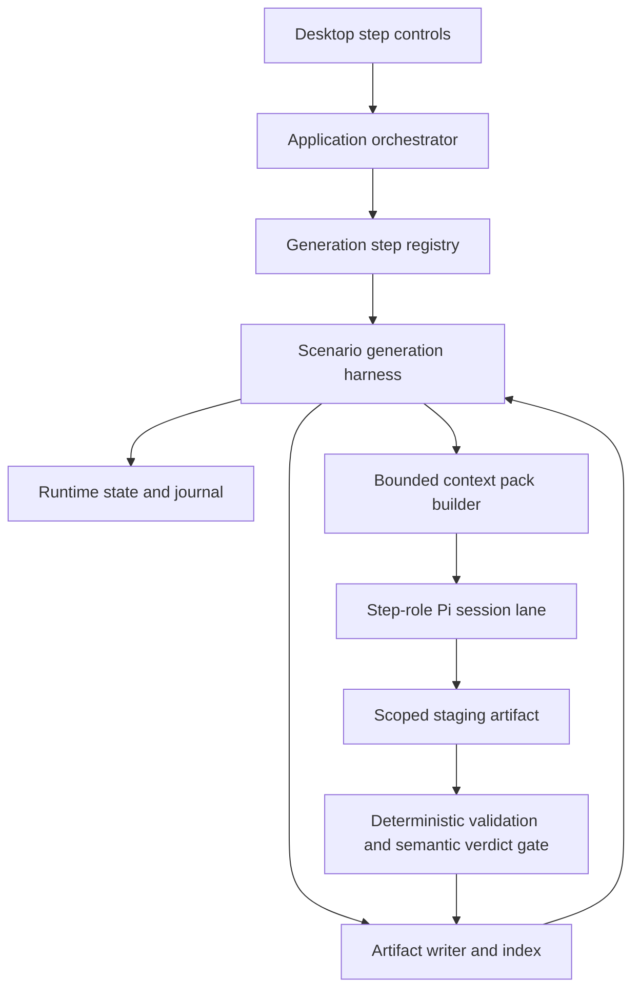
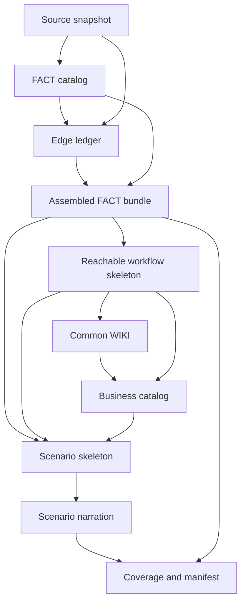
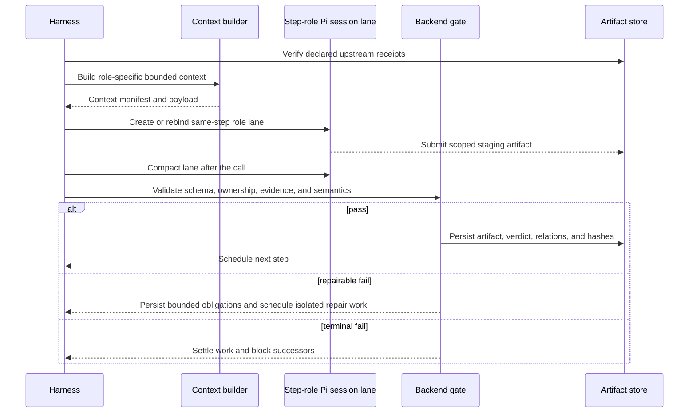
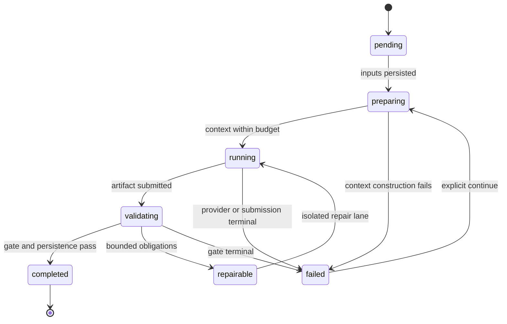

# refactor: Isolate scenario-generation steps and Pi contexts

## Summary

Refactor scenario generation into a fixed, resumable chain of first-class work steps. Each LLM step uses isolated author, reviewer, and repair session lanes with purpose-built bounded context packs and verified upstream artifact receipts; deterministic compilers and fail-closed gates own structure, reachability, and coverage.

---

## Problem Frame

The current harness persists and advances the four major stages `SRC → FACT → WIKI → SCENARIO`. Earlier revisions either created a session per invocation or rebound one shared session across author, reviewer, and repair calls. Both policies were wrong for the current partitioned design: per-invocation sessions discard useful same-role continuity, while a shared session lets role memories bleed across trust boundaries. Each step now requires separate author, reviewer, and repair lanes that may compact and rebind only within the same step and role, then dispose when the step ends.

The downstream boundaries are also too coarse for the required verification flow. The reachable workflow skeleton is compiled in memory inside the WIKI stage rather than persisted as an independently gated artifact. Business classification is implicit in workflow goals instead of being a separately reviewable contract. Scenario structure and narration are separated internally, but the intermediate skeleton is not exposed as a durable handoff. This makes it difficult to prove that each derivation is correct before the next context starts.

---

## Requirements

### Step orchestration and session isolation

- R1. The backend must execute the fixed generation order `source scan → FACT catalog → edge ledger → assembled FACT → reachable workflow skeleton → common WIKI → business catalog → scenario skeleton → scenario narration → coverage and manifest`.
- R2. Every step must be represented by an independently resumable work descriptor with explicit input artifact IDs, one output contract, a persisted artifact receipt, and a completion gate.
- R3. Deterministic steps must not invoke an LLM. Each LLM step must use distinct author, reviewer, and repair Pi session lanes. A lane may compact and rebind only within the same step and role, and every lane must be disposed when the step ends.
- R4. No Pi conversation, executor-held draft, rejected patch, or reviewer history may become implicit input to another step. A downstream step may consume only backend-built context derived from persisted upstream artifacts and declared evidence grants.
- R5. A failed step must settle fail-closed without starting a downstream step. Continuing a recoverable run must restart only the failed or pending step and preserve all previously verified receipts.

### Prompt, skill, and context contracts

- R6. Each LLM-owned work kind must declare its role, prompt builder, skills and agents, allowed tools, input artifact types, writable artifact type, context budget, evidence policy, review policy, and retry policy in one backend-owned registry.
- R7. Context packs must be purpose-specific views rather than full upstream bundles. Their serialized byte and estimated-token budgets must be checked before creating a Pi session.
- R8. Repair context must contain the rejected semantic patch plus exact validation obligations and only the referenced screens, elements, APIs, edges, predicates, behaviors, and evidence slices. An empty scope match must fail with a classified context-construction error rather than silently falling back to full-project input.
- R9. Prompt text and runtime-template skills must describe the same ownership boundary. Backend-owned IDs, evidence, paths, structure, hashes, lifecycle, and coverage must remain immutable to LLM output.

### Artifact derivation and business semantics

- R10. FACT catalog generation must finish and validate screens, elements, APIs, feedback, displays, and the semantic predicate vocabulary before edge linking starts.
- R11. The edge ledger must be independently validated against scanner inventory, source behavior, guards, effects, normal and exception outcomes, self-loop outcomes, and asynchronous stable outcomes before the assembled FACT is persisted.
- R12. The reachable workflow skeleton must be backend-compiled from the verified FACT and edge ledger, persisted independently, acyclic, terminal-valid, and collectively cover every verified edge.
- R13. The common WIKI must be a reusable knowledge artifact distinct from workflow classification. Backend-owned pages and relations describe verified screens, actions, predicates, data effects, exceptions, and terminals; the WIKI LLM may add only evidence-grounded human-readable explanations to those entries.
- R14. Business classification must be a separate artifact derived from the verified common WIKI and skeleton. Every classification must reference existing workflow and edge groups and expose stable classification IDs for scenario grouping.
- R15. Scenario skeletons must be backend-compiled from verified FACT, workflow skeleton, WIKI, and business catalog artifacts. The scenario LLM may write only human-readable precondition, action, and expected-result narration.
- R16. Coverage must be computed deterministically from persisted FACT edges and persisted scenario paths. Completion requires 100% all-transitions coverage with no unknown, duplicated, or uncovered edge references.

### UI, observability, and lifecycle

- R17. The desktop UI must show the current fine-grained step, its author/reviewer/repair role, verification status, artifact summary, and whether the run can continue. One user invocation must advance at most one gated generation step.
- R18. Progress and errors must come from canonical backend events. Logs and UI state must expose stage, step, work ID, artifact ID, classified error code, context-size metrics, and retry metadata without exposing credentials, endpoints, raw prompts, or source payloads.
- R19. ScenarioForge must provide a backend-owned history reset operation that refuses active analyses, removes old run/session/staging/log data, recreates canonical state and indexes without dangling references, preserves runtime configuration and credentials, and records what was removed.
- R20. Durable `docs/solutions` learnings must be preserved. Session handoffs, historical run audits, editor-history copies, and superseded implementation plans may be deleted once the new plan and replacement architecture documentation exist.

### Verification

- R21. The implementation must be developed with characterization coverage for current four-stage behavior and test-first coverage for each new work/artifact boundary.
- R22. The axse-agents target must be rerun against the actual Azure model one step at a time. Each persisted artifact must pass its focused inspector before the following step is invoked.
- R23. The final run must prove login through CSV and Excel download and logout, correct business-classified scenarios, and 100% all-transitions coverage before full repository verification and documentation updates.
- R24. When one logical step exceeds its context budget, the backend must partition it by canonical screen, workflow, or business-classification ownership into independent child works, validate each child artifact, and merge them deterministically before the parent gate. LLMs may not choose batch membership or merge precedence.

---

## Scope Boundaries

### In scope

- Scenario-generation orchestration, contracts, state, prompt and skill resources, context construction, artifact persistence, validation, recovery, desktop progress, history reset, and axse-agents live generation verification.
- Migration from implicit in-memory handoffs to persisted, hash-verified artifact dependencies.
- Removal of obsolete generation-session documents and disposable execution history after a supported reset path exists.

### Out of scope

- Implementing browser test execution, execution planning, target adapters, or fixture-backed claims that tests were run.
- Allowing an LLM to choose the next stage, create canonical IDs, compute coverage, or mutate canonical state.
- Modifying `test_project_source/axse-agents` to make analysis pass.
- Changing model credentials or exposing cached secrets during verification.

---

## Key Technical Decisions

- KTD1. **Keep four compatibility stage groups and add first-class generation steps.** `src`, `fact`, `wiki`, and `scenario` remain stable for current API and UI consumers, while canonical step state carries the finer artifact and session boundaries. Progress is derived from completed steps rather than hard-coded 25% increments.
- KTD2. **Use an immutable artifact dependency graph.** Every work descriptor names persisted input artifact IDs; every output receipt records content hash, schema version, related IDs, producing work, and context-manifest hash. The orchestrator schedules a successor only after the receipt and gate are committed.
- KTD3. **Centralize step policy in a registry.** Work kind, executor role, resource profile, prompt builder, input and output types, budgets, and retry behavior must not drift across contracts, resource declarations, executor branches, and documentation.
- KTD4. **Make session isolation structural.** Author, reviewer, and repair use separate step-scoped Pi session lanes. Only calls in the same step and role may compact and rebind; step completion or failure disposes every lane. Shared executor fields such as the last FACT draft, slices, patch, or reviewer decisions are replaced by persisted artifacts or explicitly bounded context manifests.
- KTD5. **Fail context construction instead of widening it.** Context pack builders must return an exact relevant closure or a classified error. Full-input fallback is prohibited for repairs and reviewers because it hides broken reference mapping and recreates TPM failures.
- KTD6. **Split semantic generation from deterministic structure.** LLMs provide bounded semantic patches and narration. The backend assembles FACT, builds graph skeletons, assigns dependencies and IDs, compiles scenario paths, and calculates coverage.
- KTD7. **Represent business classification explicitly.** The common WIKI remains shared knowledge; a separate backend-grounded business catalog maps stable business categories to verified workflow IDs before scenarios are compiled.
- KTD8. **Reset history through a service, not direct filesystem edits.** The cleanup operation owns state/index recreation and prevents removal while analysis is active. Manual deletion of canonical `.scenarioforge/state` remains forbidden.
- KTD9. **Version and migrate state and artifact contracts explicitly.** Fine-grained step state and new intermediate artifacts use a new schema version. Initialization migrates an old four-stage checkpoint to a compatible step checkpoint before scheduling work, records the migration revision, and refuses ambiguous partial states instead of guessing.
- KTD10. **Use canonical fan-out and deterministic merge for large semantic steps.** The backend partitions FACT catalog work by screen/source ownership, edges by journey-action ownership, WIKI by knowledge-page ownership, and scenario narration by business classification. Each child gets a fresh bounded context in its role lane; canonical IDs and stable ordering make merge conflicts fail instead of applying last-writer-wins behavior.

---

## High-Level Technical Design

### Component and artifact topology

### Fixed artifact data flow

### One LLM-owned step lifecycle

### Step state machine

---

## Implementation Units

### U1. Add fine-grained generation-step contracts and canonical state

- **Goal:** Represent the fixed step chain, work roles, input/output artifact types, progress, and recovery independently from the four compatibility stage groups.
- **Requirements:** R1-R5, R17-R18, R21
- **Dependencies:** None
- **Files:**
  - `packages/contracts/src/state.ts`
  - `packages/contracts/src/work.ts`
  - `packages/contracts/src/artifacts.ts`
  - `packages/contracts/src/events.ts`
  - `packages/contracts/src/validators.ts`
  - `packages/contracts/src/validators.test.ts`
  - `packages/runtime-state/src/reducer.ts`
  - `packages/runtime-state/src/recovery.ts`
  - `packages/runtime-state/src/work-state-markdown.ts`
  - `packages/runtime-state/src/runtime-state.test.ts`
- **Approach:** Introduce stable generation-step identifiers and per-step status without breaking existing `AnalysisStage` consumers. Extend work descriptors with the producing role and declared output artifact type. Make state validation enforce ordered predecessors, one active step, and persisted inputs. Derive stage group status and total progress from step state.
- **Execution note:** Characterize current four-stage state transitions first, then add the new step invariants test-first.
- **Patterns to follow:** Existing compare-and-set reducer commands, immutable work descriptors, journal recovery, and current stage completion invariants.
- **Test scenarios:**
  1. A new run creates only the source step as runnable and keeps all successors pending.
  2. Completing a step without a persisted receipt is rejected.
  3. A work whose declared input belongs to another run or has a mismatched hash is rejected.
  4. A failed step blocks every successor while preserving earlier completed steps.
  5. Recovery chooses the latest active work for the current run, session, step, and role rather than an older running work.
  6. Four-stage summaries remain compatible while progress reflects fine-grained completion.
- **Verification:** Runtime state can round-trip through journal recovery at every step state, and invalid transition tests prove fail-closed behavior.

### U2. Introduce the generation-step registry and artifact dependency scheduler

- **Goal:** Make the backend the single source of truth for step order, executor role, resources, artifact dependencies, budgets, and completion policy.
- **Requirements:** R1-R9, R18, R21, R24
- **Dependencies:** U1
- **Files:**
  - `packages/scenario-pipeline/src/orchestration/scenario-generation-harness.ts`
  - `packages/scenario-pipeline/src/orchestration/generation-step-registry.ts`
  - `packages/scenario-pipeline/src/workflows/generation-work-policies.ts`
  - `packages/scenario-pipeline/src/workflows/work-descriptor.ts`
  - `packages/scenario-pipeline/src/validators/stage-completion-gate.ts`
  - `packages/scenario-pipeline/src/validators/stage-completion-gate.test.ts`
  - `packages/scenario-pipeline/src/artifacts/artifact-writer.ts`
  - `tests/e2e/scenario-generation-harness.test.ts`
- **Approach:** Replace the stage-specific branch and nested repair loops with registry-driven scheduling. Each invocation advances one root or child work. The registry declares canonical partition keys and merge policy for large steps; the parent persists only after all child receipts validate and merge without overlapping ownership. Persist context manifests, semantic verdicts, and deterministic validation reports as related artifacts. Resume by reading receipts rather than rebuilding prior in-memory values.
- **Patterns to follow:** `generationWorkPolicies`, `createGenerationWorkDescriptor`, `StageCompletionGate`, artifact path/hash verification, and one-stage-per-invocation E2E coverage.
- **Test scenarios:**
  1. The scheduler produces the exact fixed step order and never invokes a downstream work early.
  2. Deterministic steps never request a model executor.
  3. Author completion schedules a separate reviewer work with only the author artifact receipt as semantic input.
  4. A repairable verdict schedules a new repair work and preserves the rejected artifact and obligations.
  5. Restarting the process resumes from persisted step receipts without executor memory.
  6. Artifact path, scope, relation, or hash mismatch settles the current step as failed.
  7. Child artifacts with duplicate or missing canonical ownership fail the parent merge, while arrival order does not affect a valid merged artifact.
- **Verification:** An in-memory executor can advance the complete artifact graph one step per invocation and recover at every boundary.

### U3. Split FACT catalog, edge ledger, assembly, and validation

- **Goal:** Validate source-derived facts and every transition independently before producing the downstream FACT bundle.
- **Requirements:** R8-R12, R21-R22, R24
- **Dependencies:** U1, U2
- **Files:**
  - `packages/contracts/src/generation.ts`
  - `packages/scenario-pipeline/src/facts/fact-draft-compiler.ts`
  - `packages/scenario-pipeline/src/facts/edge-ledger-compiler.ts`
  - `packages/scenario-pipeline/src/validators/generation-artifact-validators.ts`
  - `packages/scenario-pipeline/src/generation-core.test.ts`
  - `apps/desktop/src/main/application/fact-source-behavior.ts`
  - `apps/desktop/src/main/application/fact-source-behavior.test.ts`
  - `tests/e2e/axse-generation-stage-inspection.test.ts`
- **Approach:** Define separate semantic patch and artifact contracts for the FACT catalog and edge ledger. Partition catalog enrichment by scanner-owned screen/source group and edge linking by canonical journey-action group so every child context stays bounded. Backend assembly assigns canonical edge and predicate IDs only after child receipts merge and both parent inputs pass their gates. Produce an edge-audit report with one row per scanner-owned journey action and explicit normal, exception, guard, effect, and evidence status.
- **Execution note:** Preserve the existing validator behavior with characterization tests, then move one invariant at a time to the new artifact boundary.
- **Patterns to follow:** Opaque author refs, scanner-owned IDs, source-behavior validation, deterministic ID generation, and existing edge coverage validators.
- **Test scenarios:**
  1. A valid catalog with no edge data completes independently.
  2. An edge may reference only catalog elements, screens, APIs, and declared predicate keys.
  3. Every backend-derived journey action is either represented by the correct edge outcomes or explicitly classified as excluded with a supported reason.
  4. Normal and exception branches of one asynchronous trigger collapse internal request states into stable outcomes.
  5. Reversible toggles, same-screen outcomes, input rejection, network failure, and logout are represented and audited correctly.
  6. FACT assembly is byte-deterministic for identical catalog and edge receipts.
  7. Every edge audit row can be inspected independently, while batch order changes produce the same assembled ledger.
- **Verification:** The axse inspector can report and validate every FACT catalog entry and edge independently before workflow compilation.

### U4. Build bounded context packs and one-purpose Pi resources

- **Goal:** Ensure every LLM role has an isolated step-scoped session lane and every call receives only the prompt, skills, tools, artifacts, and evidence needed for one output contract.
- **Requirements:** R3-R9, R18, R21-R22, R24
- **Dependencies:** U1-U3
- **Files:**
  - `apps/desktop/src/main/application/pi-generation-executor.ts`
  - `apps/desktop/src/main/application/pi-generation-executor.test.ts`
  - `apps/desktop/src/main/application/generation-context-pack.ts`
  - `apps/desktop/src/main/application/generation-context-pack.test.ts`
  - `packages/pi-runtime/src/host/pi-runtime-host.ts`
  - `packages/pi-runtime/src/pi-runtime.test.ts`
  - `packages/project-runtime/runtime-template/resource-declaration.json`
  - `packages/project-runtime/runtime-template/harnesses/scenario-generation.md`
  - `packages/project-runtime/runtime-template/agents/generation/`
  - `packages/project-runtime/runtime-template/skills/generation/`
  - `apps/desktop/src/main/runtime-template-bundle.test.ts`
- **Approach:** Replace `lastFact*`, `lastWiki`, and cross-call reviewer memory with receipt-driven context builders. Give FACT catalog, edge linker, WIKI writer, business classifier, scenario narrator, and each reviewer distinct resources and output contracts. Initialize every child context from its canonical partition receipt and immutable upstream views, never from its sibling's chat. Record safe context metrics and a context-manifest hash. Prohibit repair and review full-input fallback.
- **Execution note:** Start with failing tests for code-only validation issues whose canonical references exist only in validation messages, reproducing the latest TPM-triggering scope miss.
- **Patterns to follow:** `PiRuntimeHost.create`/`dispose`, role-specific resource loading, bounded artifact views, evidence grants, server-scoped artifact receipts, and sanitized retry events.
- **Test scenarios:**
  1. Author, reviewer, and repair use different Pi session IDs; only the same step-role lane may be rebound, and all lanes are disposed once at step end.
  2. A validation message referencing one element produces a context pack containing only its screen, behavior closure, related predicates, and evidence.
  3. An unmappable issue fails before provider invocation and never widens to the full project.
  4. Context byte and token budgets reject oversized packs with sanitized metrics.
  5. A stage cannot load another stage's skill, agent, or artifact tool surface.
  6. Provider retries reuse the immutable payload, discard a failed lane before retry, and remain owned by one retry layer.
  7. Two child works in the same parent cannot read each other's staging output or Pi messages.
- **Verification:** Focused tests prove session and resource isolation, and live session usage remains within configured budgets without prompt or credential disclosure.

### U5. Persist reachable skeleton, common WIKI, and business catalog

- **Goal:** Make graph reachability, common knowledge, and business grouping independently inspectable handoffs.
- **Requirements:** R12-R14, R21-R22, R24
- **Dependencies:** U1-U4
- **Files:**
  - `packages/contracts/src/generation.ts`
  - `packages/scenario-pipeline/src/graph/graph-tools.ts`
  - `packages/scenario-pipeline/src/validators/generation-artifact-validators.ts`
  - `packages/scenario-pipeline/src/generation-core.test.ts`
  - `apps/desktop/src/main/application/pi-generation-executor.ts`
  - `apps/desktop/src/main/application/pi-generation-executor.test.ts`
  - `packages/project-runtime/runtime-template/resource-declaration.json`
  - `packages/project-runtime/runtime-template/agents/generation/wiki-writer.md`
  - `packages/project-runtime/runtime-template/skills/generation/wiki-compose/SKILL.md`
  - `packages/project-runtime/runtime-template/agents/generation/business-classifier.md`
  - `packages/project-runtime/runtime-template/skills/generation/business-classification/SKILL.md`
  - `tests/e2e/axse-generation-stage-inspection.test.ts`
- **Approach:** Persist the deterministic workflow skeleton before invoking the WIKI author. Compile a backend-owned common knowledge skeleton whose entries reference verified screens, actions, state predicates, effects, exceptions, and terminals, then apply independently bounded explanation-only WIKI page patches and merge them by page ID. Generate a separate semantic business-classification patch whose refs are constrained to workflow candidate groups, then compile the canonical business catalog. Validate WIKI relation grounding, cycles, terminals, dependencies, workflow edge coverage, and classification membership at their own gates.
- **Patterns to follow:** `compileReachableWorkflowSkeleton`, `applyWikiSemanticPatch`, deterministic dependency ordering, and WIKI reviewer ownership restrictions.
- **Test scenarios:**
  1. The skeleton is deterministic, acyclic, terminal-valid, and covers all FACT edges.
  2. WIKI pages cover the verified knowledge inventory and output can alter only allowed human-readable fields and never workflow membership.
  3. A business classification cannot cite an unknown workflow or edge or leave a workflow unclassified.
  4. Normal, exception, reverse-navigation, login, export, and logout workflows retain distinct business meaning where the graph requires it.
  5. Repair changes only rejected WIKI or classification semantics and preserves structural bytes.
- **Verification:** Persisted skeleton, WIKI, and business catalog artifacts can each be validated without executing their successor.

### U6. Separate scenario skeleton, narration, and deterministic coverage

- **Goal:** Produce business-classified scenario cases without allowing narration to modify executable paths or coverage.
- **Requirements:** R15-R16, R21-R24
- **Dependencies:** U1-U5
- **Files:**
  - `packages/contracts/src/generation.ts`
  - `packages/scenario-pipeline/src/graph/graph-tools.ts`
  - `packages/scenario-pipeline/src/validators/generation-artifact-validators.ts`
  - `packages/scenario-pipeline/src/generation-core.test.ts`
  - `apps/desktop/src/main/application/pi-generation-executor.ts`
  - `apps/desktop/src/main/application/pi-generation-executor.test.ts`
  - `packages/project-runtime/runtime-template/agents/generation/scenario-designer.md`
  - `packages/project-runtime/runtime-template/skills/generation/scenario-compose/SKILL.md`
  - `tests/e2e/scenario-generation-harness.test.ts`
  - `tests/e2e/axse-generation-stage-inspection.test.ts`
- **Approach:** Persist backend-owned scenario skeletons grouped by business classification before narration. Build one compact narration context per classification from those skeletons and common WIKI entries. Validate and merge narration patches by scenario ID, then calculate coverage from immutable paths and produce the final manifest.
- **Patterns to follow:** `compileScenarioSet`, narration-only patching, deterministic-field equality validation, and `calculateCoverage`.
- **Test scenarios:**
  1. Every scenario references exactly one business classification and one verified workflow.
  2. Login prerequisites precede protected business actions, and logout remains reachable after completed work.
  3. CSV and Excel export scenarios include the prerequisite workflow path and distinct observable outcomes.
  4. Exception scenarios preserve the executable guard and failure-specific terminal.
  5. Narration changes cannot alter scenario IDs, paths, refs, classification, ordering, or variation.
  6. Missing, duplicate, or unknown edge coverage blocks final completion.
- **Verification:** The persisted scenario skeleton already has 100% deterministic coverage, and narration preserves it byte-for-byte outside allowed text fields.

### U7. Expose fine-grained control and inspection in the desktop flow

- **Goal:** Let users advance, inspect, stop, continue, and diagnose one verified generation step at a time.
- **Requirements:** R5, R17-R18, R22-R23
- **Dependencies:** U1-U6
- **Files:**
  - `apps/desktop/src/shared/desktop-api.ts`
  - `apps/desktop/src/preload/index.ts`
  - `apps/desktop/src/main/index.ts`
  - `apps/desktop/src/main/application/application-orchestrator.ts`
  - `apps/desktop/src/main/application/application-orchestrator.test.ts`
  - `apps/desktop/src/renderer/src/desktop.ts`
  - `apps/desktop/src/renderer/src/desktop.test.ts`
  - `apps/desktop/src/renderer/src/App.tsx`
  - `apps/desktop/src/renderer/src/analysis-error.test.ts`
  - `apps/desktop/src/renderer/src/components/AnalysisProgress.tsx`
  - `apps/desktop/src/renderer/src/components/AnalysisProgress.test.ts`
- **Approach:** Extend typed IPC summaries with current step and artifact inspection data while keeping orchestration decisions in main/backend. Preserve the existing explicit next-step interaction, now at fine-grained boundaries. Display classified provider, context, schema, and semantic failures separately.
- **Patterns to follow:** Allowlisted IPC, canonical checkpoint restoration, backend progress events, and sanitized renderer errors.
- **Test scenarios:**
  1. One click advances exactly one pending step and renders its persisted artifact summary.
  2. Reload restores current run, step, failure, and continue eligibility from canonical state.
  3. A failed reviewer or repair step does not appear as a completed parent stage.
  4. Starting a new run requires explicit intent and never reuses old current assignments.
  5. UI messages contain no raw provider response, prompt, endpoint secret, or source slice.
- **Verification:** Renderer tests and Electron integration tests prove stepwise control from SRC through final results without inferred state.

### U8. Add supported history reset and consolidate documentation

- **Goal:** Remove disposable legacy execution data without corrupting canonical state and replace session-specific documentation with durable architecture and solution records.
- **Requirements:** R19-R20, R22-R23
- **Dependencies:** U1, U2, U7
- **Files:**
  - `packages/project-runtime/src/history/project-history-reset.ts`
  - `packages/project-runtime/src/history/project-history-reset.test.ts`
  - `apps/desktop/src/shared/desktop-api.ts`
  - `apps/desktop/src/main/application/application-orchestrator.ts`
  - `apps/desktop/src/main/application/application-orchestrator.test.ts`
  - `docs/architecture/07-stage-isolated-generation-orchestration.md`
  - `docs/solutions/integration-issues/fact-repair-reference-and-payload-boundary.md`
  - `docs/handoffs/2026-08-28-axse-agents-scenario-generation-handoff.md`
  - `docs/architecture/06-axse-agents-e2e-flow-coverage-audit.md`
  - `docs/superpowers/plans/2026-08-27-fact-boundary-hardening.md`
- **Approach:** Implement a backend reset service that refuses active analyses, closes the index, removes disposable run/session/staging/log data, recreates initial state/journal/index atomically, and reports counts. Preserve project runtime configuration and `docs/solutions`. Once replacement architecture and live verification records exist, delete the listed session-specific handoff, run audit, superseded hardening plan, and editor-history copies.
- **Execution note:** Test interruption and partial-cleanup recovery before running the reset against axse-agents.
- **Patterns to follow:** Project path policy, bootstrap idempotency, journal recovery, single-writer coordination, and sanitized lifecycle reporting.
- **Test scenarios:**
  1. Reset is refused while an analysis is active.
  2. Reset removes runs, sessions, staging, logs, state history, and index rows while preserving runtime resources and project configuration.
  3. A failure during reset leaves either the old valid state or a complete new initial state, never a partial mixture.
  4. Bootstrap after reset produces a ready project with no dangling artifact references.
  5. Durable solution records and the new active plan remain present after documentation cleanup.
- **Verification:** The axse-agents target reopens as a clean ready project and begins a new SRC step without stale work, artifact, session, or index references.

### U9. Verify the real Azure stage chain and full user journey

- **Goal:** Prove the refactored boundaries with real model calls and the final business-classified outputs.
- **Requirements:** R21-R23
- **Dependencies:** U1-U8
- **Files:**
  - `tests/e2e/axse-generation-stage-inspection.test.ts`
  - `docs/architecture/07-stage-isolated-generation-orchestration.md`
  - `docs/solutions/integration-issues/fact-repair-reference-and-payload-boundary.md`
- **Approach:** Start from a supported clean history reset. Run one generation step per UI invocation. After each step, verify project state, journal event, work settlement, artifact receipt, hash, schema, semantic verdict, and step-specific invariants before advancing. Inspect FACT catalog entries and every edge against source, then skeleton reachability, WIKI grounding, business classification, scenario structure, narration, and coverage. Finish by exercising login, generated results, CSV and Excel downloads, and logout in the desktop user flow.
- **Patterns to follow:** Existing axse stage inspector, fail-closed live-stage protocol, cached credential handling, and full repository verification gates.
- **Test scenarios:**
  1. Every live LLM session remains within its declared context budget and submits exactly one contract artifact or verdict.
  2. FACT catalog and edge ledger agree with axse source behavior entry by entry.
  3. The workflow skeleton is acyclic and covers every verified edge.
  4. Common WIKI and business catalog introduce no unsupported workflow or terminal.
  5. Scenarios are grouped by business classification and achieve 100% all-transitions coverage.
  6. The UI journey succeeds from login through CSV and Excel download to logout.
- **Verification:** Record the successful run ID, work and artifact counts, context metrics, workflow and scenario counts, download evidence, and coverage result in durable architecture and solution documentation, followed by all repository quality gates.

---

## Acceptance Examples

- AE1. Given persisted SRC and no FACT catalog, when the user advances analysis, then exactly one fresh FACT-catalog author session runs and the UI stops at its verified artifact.
- AE2. Given a FACT validation issue that cites one login element, when repair is scheduled, then the fresh repair context contains only that element's screen, behavior, predicates, and evidence and never the full FACT draft.
- AE3. Given verified FACT catalog and edge ledger receipts, when the workflow step runs, then the backend persists an acyclic skeleton covering every edge without invoking an LLM.
- AE4. Given a verified common WIKI, when business classification runs, then every workflow belongs to a stable, source-grounded business category before scenario compilation starts.
- AE5. Given a narration artifact that tries to change a scenario path, when the gate validates it, then the step fails and coverage is not written.
- AE6. Given a failed edge-review step and a restarted desktop process, when the user continues, then earlier artifacts are reused by receipt and only the failed review work is recreated.
- AE7. Given an active analysis, when history reset is requested, then reset is refused and no runtime file changes.
- AE8. Given a clean completed axse run, when results are used through the desktop UI, then login, both download formats, and logout are represented by verified scenarios and all FACT transitions remain covered.

---

## System-Wide Impact

- **Contracts and persistence:** Runtime state and artifact schemas gain a fine-grained step dimension. Recovery and validation must support a controlled migration from existing four-stage states.
- **LLM cost and reliability:** More sessions are created, but each is shorter and purpose-specific. Hard budgets and the absence of full-context fallback should reduce TPM failures and make retries cheaper and diagnosable.
- **Runtime resources:** Resource declarations grow from broad stage roles to specific work kinds. Bundle validation must prevent missing or cross-loaded skills.
- **Desktop behavior:** The current one-major-stage button becomes one-generation-step control, increasing visible checkpoints while preserving explicit user advancement.
- **Operational data:** History reset becomes a supported lifecycle operation instead of direct `.scenarioforge` manipulation.

---

## Migration and Operational Notes

- Introduce the fine-grained state and artifact schema behind a versioned reader. Existing four-stage states are read-only inputs to a one-time migration; new writes use only the new schema.
- Derive migration results from persisted artifact receipts, not percentages or stale work rows. A completed major stage maps to its verified internal steps only when every required receipt and relation is present.
- If an old state is inconsistent, initialization must enter a classified recoverable migration failure and leave the original journal untouched. The user can then start a new run or invoke the supported history reset.
- Keep the current desktop summary fields during the compatibility window. Remove legacy stage-only fields only after renderer, IPC, recovery, and exported manifests consume fine-grained step summaries.
- History reset is introduced only after migration and recovery tests pass. The reset must publish a sanitized removal report and must not delete model credentials, project source, runtime-template originals, or durable `docs/solutions` records.

---

## Risks and Mitigations

- **State migration risk:** Existing projects contain four-stage states and many historical works. Add a versioned migration that derives the first pending fine-grained step from persisted artifacts, and retain fixtures for old states.
- **Artifact proliferation:** Additional intermediate artifacts and verdicts increase disk use. Keep compact views and context manifests separate from source evidence, and let the supported history reset remove disposable runs.
- **Over-fragmentation:** Too many LLM calls can increase latency. Keep deterministic steps model-free and combine semantic fields only when they share one ownership and evidence boundary.
- **Cross-contract drift:** Contracts, resource declarations, prompts, skills, and executor routing can diverge. Generate or validate them against the single step registry in bundle and policy tests.
- **False context narrowing:** A narrow repair may omit required dependent evidence. Build closure from canonical relationships and fail explicitly when the budget cannot contain the complete required closure.
- **Destructive reset:** Direct deletion can corrupt state or lose useful diagnostics. Require an idle project, use atomic replacement, report counts, and preserve `docs/solutions` and configuration.

---

## Phased Delivery

1. Establish fine-grained contracts, state migration, registry scheduling, and artifact receipts while preserving current outputs.
2. Split FACT catalog and edge ledger, then replace mutable executor context with bounded receipt-driven packs.
3. Persist skeleton, WIKI, business catalog, scenario skeleton, narration, and coverage boundaries.
4. Expose fine-grained desktop control and add the supported history reset.
5. Clean obsolete documentation and history, then run and audit the real Azure axse-agents chain one step at a time.

---

## Success Metrics

- Every LLM invocation maps to exactly one work role, one isolated step-role session lane, one output contract, and one bounded context manifest.
- No repair or reviewer path contains a full-input fallback.
- Every downstream artifact references only persisted upstream receipts whose hashes and relations pass validation.
- The real axse-agents run advances through all fine-grained boundaries without TPM, context, schema, ownership, or coverage failure.
- Final scenario coverage is 100%, with login, CSV download, Excel download, and logout paths directly verified.
- History reset leaves no stale work, run, session, staging, log, journal, or index references and preserves runtime configuration and durable learnings.

---

## Sources and Research

- `packages/scenario-pipeline/src/orchestration/scenario-generation-harness.ts` — current one-major-stage advancement, nested FACT repair, in-memory skeleton compilation, and completion gates.
- `apps/desktop/src/main/application/pi-generation-executor.ts` — step-role session lanes, bounded cross-call inputs, prompt payload construction, artifact handoff, and retry ownership.
- `packages/scenario-pipeline/src/workflows/generation-work-policies.ts` and `packages/project-runtime/runtime-template/resource-declaration.json` — existing policy and role-resource patterns to consolidate.
- `packages/runtime-state/src/reducer.ts` and `packages/runtime-state/src/work-state-markdown.ts` — canonical state transitions and current-assignment selection.
- `tests/e2e/scenario-generation-harness.test.ts` and `tests/e2e/axse-generation-stage-inspection.test.ts` — existing one-stage invocation and persisted-boundary inspection patterns.
- `docs/solutions/integration-issues/fact-patch-canonical-id-reference-drift.md` — prior evidence that oversized reviewer context and duplicated retry ownership produce TPM failures.
- `docs/solutions/integration-issues/fact-semantic-review-bounded-repair-loop.md` — current bounded repair and fail-closed semantics.
- `docs/solutions/integration-issues/wiki-reviewer-source-evidence-scope-mismatch.md` — stage-specific semantic ownership and upstream evidence boundaries.
- `docs/solutions/integration-issues/fact-workflow-scenario-edge-coverage-not-gated.md` — complete edge coverage as a backend-owned completion requirement.
