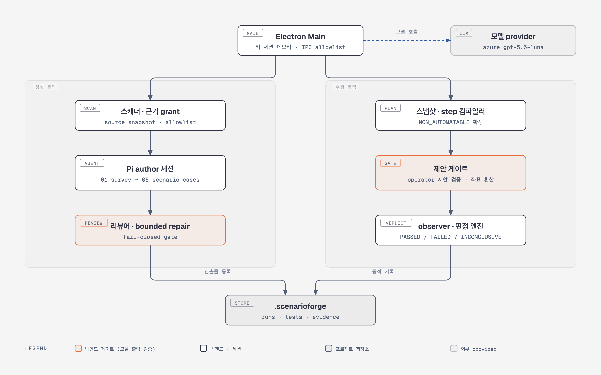
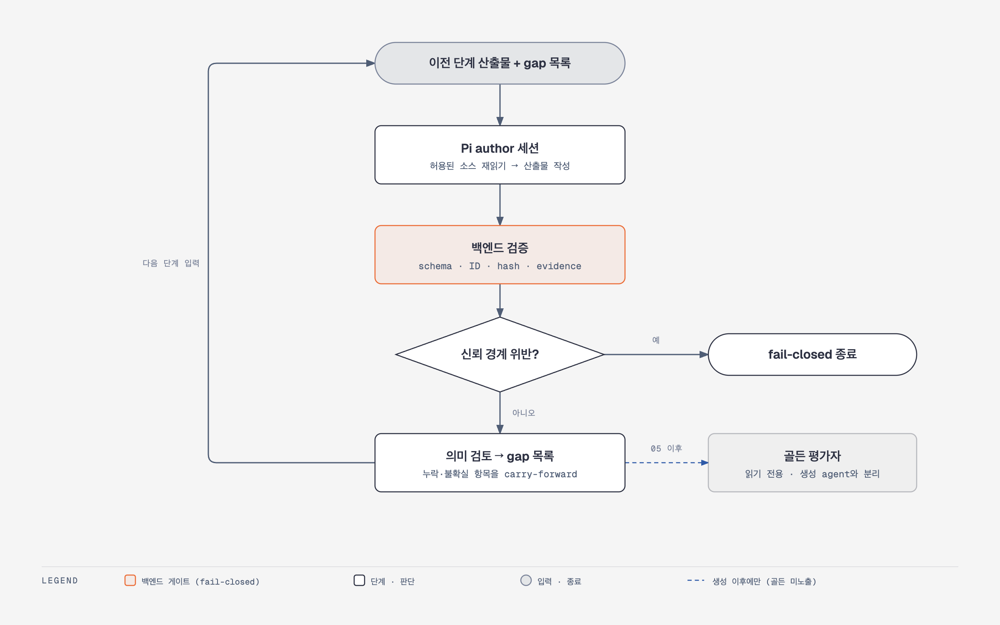
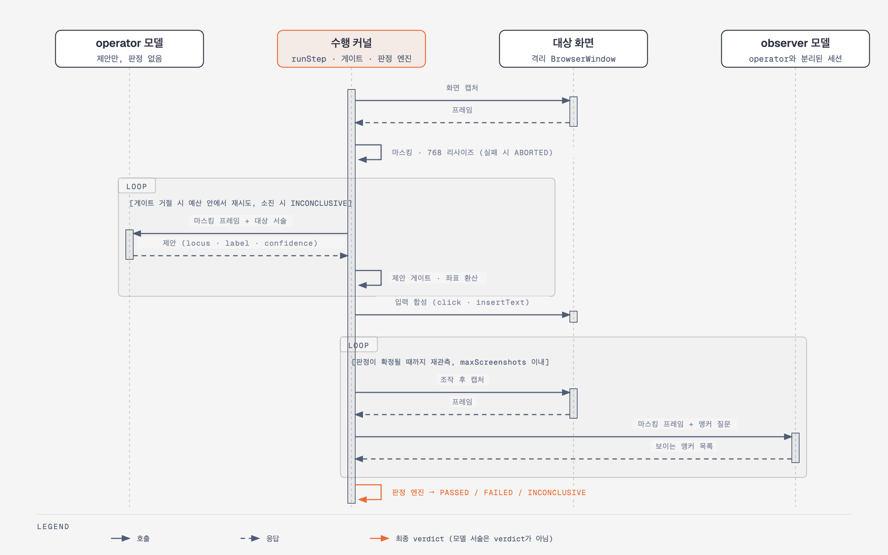
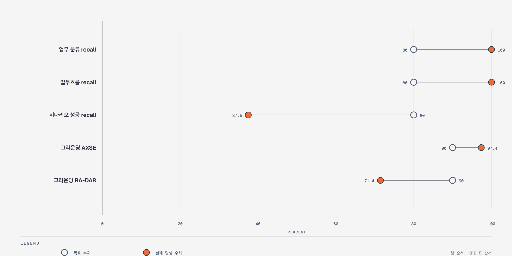

# 최종 아키텍처 요약 및 KPI 달성도

작성일 2026-09-16. 완성 구조, 목표 대비 달성도, 창출 가치, 운영과 보안, 고도화 계획을 정리한다. 각 절은 비개발자를 위한 요약 문단으로 시작하고, 표와 그림은 개발자 검토용 상세를 담는다.

> 2026-09-18 갱신: 아래 "분기 시나리오 성공 recall" 항목의 고도화 1단계(전이 원장·경로 컴파일러 연결)는 완료됐고 완결 사용자 여정 2/2를 생성했다. 경과와 잔여 과제는 [2026-09-18 완결 여정 달성 기록](2026-09-18-complete-journey-milestone.md)을 함께 본다. 골든 recall 재측정은 아직 실행하지 않아 이 문서의 37.5% 수치는 갱신되지 않았다.

ScenarioForge를 한 줄로 설명하면 다음과 같다. 소스코드만 분석해 로그인부터 업무 결과까지 이어지는 사용자 여정 테스트 시나리오를 만들고, 그 시나리오를 실제 화면에서 자동 실행해 판정과 증적까지 남기는 통합 시나리오 테스트 자동화 플랫폼이다.

## 1. 최종 아키텍처 요약

비개발자용 요약: 이 제품은 두 개의 엔진으로 되어 있다. 첫 번째 엔진은 프로그램의 소스코드를 읽어 "사용자가 이 시스템에서 무엇을 어떤 순서로 하는가"를 시나리오로 정리한다. 두 번째 엔진은 그 시나리오를 실제 화면에서 사람처럼 클릭하고 입력해 보고, 기대한 결과가 나왔는지 판정해 화면 증거를 남긴다. AI는 두 엔진 안에서 "이 화면은 무슨 뜻인가", "이 버튼은 어디 있는가" 같은 판단만 맡고, 번호 붙이기·기록·합격 판정처럼 틀리면 안 되는 일은 전부 프로그램 코드가 맡는다.

- 완성된 아키텍처 핵심: 소스 분석으로 시나리오를 만드는 Pi coding-agent 단계형 생성 하네스와, 시나리오를 화면 캡처 기반으로 실행하는 비전 수행 커널을 하나의 경계 계약으로 연결. 두 트랙 모두 백엔드가 ID, hash, 근거, 완료를 소유하고 모델은 제한된 의미 공백만 채운다.
- 최종 산출물 형태: Electron 설치형 데스크톱 애플리케이션. 분석 결과, 실행 이력, 증적은 대상 프로젝트 안에 보관.
- Agent 구조:

| 구성 요소 | 역할 |
| --- | --- |
| Renderer / Preload | 허용된 IPC 채널로만 통신, Node.js와 파일 시스템 권한 없음 |
| 생성 하네스 | 스캐너가 소스 범위를 정하고 Pi author가 한 번에 한 단계씩 수행. 리뷰어와 제한된 수정 루프가 검토 |
| 수행 커널 | 시나리오를 불변 스냅샷으로 고정. 캡처, 마스킹, 제안, 게이트, 입력 합성 후 별도 observer 관측을 판정 엔진이 판정 |
| 외부 연동 | 모델 provider만 연동. 검증은 Azure gpt-5.6-luna로 수행 |

기술 스택과 패키지 구조는 다음과 같다.

| 구분 | 내용 |
| --- | --- |
| 데스크톱 | Electron 44, React, TypeScript. main / preload / renderer 분리 |
| 에이전트 런타임 | Pi coding agent SDK 0.84. 세션은 메모리 내 실행, 도구는 서버 정의 스키마만 노출 |
| 모델 | OpenAI 호환, Azure OpenAI, Anthropic, 사용자 지정 endpoint 지원. 검증은 Azure gpt-5.6-luna |
| 상태 저장 | hash 체인 저널, 작업 상태 문서, SQLite 관계 투영, run·실행 manifest |
| 테스트 | vitest, 테스트 파일 88개, 수행 루프 51건, 전체 생성 파이프라인 e2e |
| 패키지 | contracts(공통 계약), runtime-state(reducer·저널·복구), project-runtime(경로 정책·runtime 템플릿), pi-runtime(Pi 호스트·모델 바인딩·도구 격리), scenario-pipeline(스캐너·정본 ID·근거·리뷰어 게이트), test-runtime(step 컴파일러·좌표계·제안 게이트·실행 조정) |

소유권 경계는 두 트랙에 같은 원칙으로 적용된다. 모델은 아래 표의 오른쪽 열만 채운다.

| 백엔드가 소유 (모델이 만들지 못함) | 모델이 채움 (의미 공백) |
| --- | --- |
| 소스 inventory, 스냅샷, 근거 grant, 정본 ID(화면·요소·API·edge), hash, revision, 멱등성 키 | 동작·화면의 의미 주석, 업무 분류와 업무흐름 설명, 사용자 여정 서술, 케이스의 사람이 읽는 step·기대 결과 |
| 실행 대상 후보, 시나리오 스냅샷, step 봉투, 허용 action, 예산, assertion | operator의 "대상이 프레임 어디에 있는가" 제안, observer의 "화면에 어떤 앵커 문구가 보이는가" 관측 후보 |
| 최종 verdict, 완료 판정, 산출물 등록 | 없음 |

생성 트랙의 각 단계는 다음 흐름을 반복한다. 의미 누락은 gap 목록으로 다음 단계에 넘기고, 신뢰 경계 위반만 즉시 종료한다.

수행 트랙의 한 step은 다음 순서로 실행된다. 모델은 두 곳(operator 제안, observer 관측)에서만 호출되고 verdict는 코드가 정한다.

### 1-1. 설계 결정과 대안

| 결정 | 대안 | 선택 근거 |
| --- | --- | --- |
| 순수 CUA(매 step 화면 판단·행동을 모델에 위임) 대신 컴파일된 step 봉투 + 제안 게이트 | 순수 CUA, 구조화 어댑터 우선 | 공개 실측에서 GUI 전용 방식은 10 step 초과 태스크 성공률이 35%로 붕괴하고, 회차마다 전량 VLM 호출이라 비용이 누적됨. 모델에는 "고정된 대상이 어디 있는가"만 묻고 계획·판정은 코드가 가짐 |
| 골든을 생성에 쓰지 않고 사후 평가에만 사용 | 골든을 few-shot 예시로 제공 | 골든이 생성 입력에 들어가면 recall이 소스 분석 능력이 아니라 골든 재현 능력을 측정하게 됨. 생성 에이전트와 평가 세션을 분리하고 골든 식별자·문구·수량을 차단 |
| 정본 ID·근거·hash를 백엔드가 소유하고 모델은 의미 patch만 제출 | 모델이 전체 산출물 JSON을 작성 | 모델이 긴 ID를 옮겨 적으며 변형해 참조 검증에서 실패하는 사고가 반복됨. 실행 한정 opaque 참조로 바꾼 뒤 재발 없음 |
| 좌표를 정본 locator로 저장하지 않음 | 첫 실행 좌표를 캐시해 재사용 | 해상도·창 크기·배율에 따라 좌표계가 달라지며, 실측에서 좌표계 불일치만으로 적중률이 0.205로 떨어짐. 대상은 보이는 라벨로 서술하고 좌표는 실행 시점에 게이트가 환산 |
| operator와 observer 세션 분리 | 한 모델이 행동과 확인을 함께 수행 | 모델이 자기 행동 결과를 판정하면 "성공했다"는 서술이 verdict가 됨. observer 음성 대조 4/4, 앵커 신뢰도 18/18로 분리 판독의 신뢰성 확인 |
| 의미 누락은 carry-forward, 신뢰 경계 위반만 fail-closed | 모든 검증 실패를 terminal error로 처리 | 의미 누락을 전부 종료로 다루면 매 run이 다른 위치에서 실패해 수렴하지 않음. 다음 단계가 소스를 다시 읽어 고칠 수 있는 항목과 고칠 수 없는 항목(ID·hash·범위·secret)을 구분 |

## 2. KPI 달성도 (Plan vs Actual)

목표는 골든 검증 설계의 합격 기준과 CUA 검토 문서의 G1에서 가져왔다. 합격선은 아래와 같이 정했다.

| 합격선 | 값 | 출처 | 쉬운 설명과 선정 근거 |
| --- | --- | --- | --- |
| 업무 분류·업무흐름·시나리오 recall | 80% 이상 | 골든 여정 생성 검증 설계(2026-09-03), 골든 평가 스크립트 상수 | 정답지에 있는 항목 10개 중 8개를 찾으면 합격이다. 나머지 2개는 사람이 검토하면서 보태는 수준으로 봤다. 이 도구는 빠진 항목을 gap 목록으로 만들어 다음 단계에서 채우는 방식이라 20% 정도의 빈칸은 정상 동작 범위이고, 그보다 많이 빠지면 소스를 제대로 읽지 못한 것으로 보고 불합격 처리한다. 업무 분류 6개 기준으로 80%는 1개까지만 놓치는 선이며, 2개를 놓치면 67%가 되어 업무 영역의 3분의 1이 빠지므로 다시 분석해야 하는 수준이다. 20%라는 비율은 팀이 정한 값이다 |
| 의미 일치 판정 | 유사도 0.7 이상 | 골든 평가 스크립트 상수, 평가자 채점 규칙 | 생성된 시나리오와 정답 시나리오는 문장이 다르다. 그래서 평가 모델이 같은 상황, 같은 조건, 같은 결과, 같은 복구 동작을 다루는지를 0~1점으로 매기고 0.7 이상이면 같은 시나리오로 인정했다. 0.7은 핵심 내용이 대부분 같고 표현만 다른 수준이고, 0.5 근처는 겹치는 부분은 있지만 다른 상황을 다루는 수준이다. 기준을 0.6으로 낮추면 성공 recall이 46.9%, 0.8로 올리면 15.6%로 크게 움직이므로 유리한 기준을 고른 것이 아님을 보이기 위해 이 수치를 함께 공개한다. 업무 분류·업무흐름·여정은 모두 0.75 이상이어서 기준을 어디에 두든 결과가 같다 |
| 필수 사용자 여정 | 2/2 (100%) | 골든 여정 생성 검증 설계, 개발 규칙의 완결 사용자 여정 불변조건 | 로그인부터 결과를 내고 로그아웃할 때까지 한 번에 이어지는 흐름이 정상 1개, 오류 복구 1개 있어야 한다. 이것이 없으면 나머지 항목이 아무리 맞아도 사용자가 실제로 따라 할 수 있는 테스트가 없는 것이므로 무조건 있어야 한다 |
| 복원(예외·복구) 시나리오 recall | 참고용, 합격선 없음 | 골든 평가 스크립트 | 정상 경로를 먼저 맞추는 것이 우선이므로 예외·복구 케이스는 합격 판정에 넣지 않고 무엇이 빠졌는지 목록으로만 쓴다 |
| G1 step 그라운딩 성공률 | 90% | 사업 기획서의 G1 게이트(저장소 외부 문서), CUA 검토 문서에서 인용 | 화면에서 "로그인 버튼"을 찾으라고 했을 때 10번 중 9번은 정확한 위치를 짚어야 한다는 기준이다. 사업 기획 단계에서 정한 목표치다. CUA 검토 문서는 이 수치만으로 케이스 완주율을 예측할 수 없으므로 케이스 단위 완주율을 따로 측정하도록 권고했고, 이번 PoC는 두 수치를 분리해 기록했다 |

### 2-1. 달성 현황 (현재 / 목표 / 경로)

비개발자용 요약: 7개 지표 중 5개를 달성했다. 소스만 읽고 업무 구조와 사용자 여정을 찾아내는 능력, 화면에서 버튼을 정확히 찾는 능력, 실제 앱을 끝까지 실행하는 능력은 목표를 넘겼다. 아직 못 미친 것은 "세부 분기 시나리오를 얼마나 넓게 만드는가"와 "두 번째 대상 앱에서의 버튼 찾기 정확도"이며, 둘 다 원인이 특정되어 있고 고도화 1·2단계에 해결 경로가 잡혀 있다.

| 평가 지표 | 현재 (PoC 실측) | 목표 | 상태 | 목표까지의 경로 |
| --- | --- | --- | --- | --- |
| 업무 분류 recall | **100% (6/6)** | 80% 이상 | **달성** | 유지. RA-DAR 등 두 번째 프로젝트에서 재확인 |
| 업무흐름 recall | **100% (10/10)** | 80% 이상 | **달성** | 유지 |
| 필수 사용자 여정 | **2/2, 유사도 0.98** | 2/2 | **달성** | 유지. 기준선(기존 방식)은 완주 여정 0개였음 |
| G1 step 그라운딩 (AXSE) | **97.4% (38/39)** | 90% | **달성** | 유지. 좌표계 계약을 필수 계약으로 고정 완료 |
| G1 케이스 완주 | **AXSE 3 step, RA-DAR 3 step 전부 통과** | 실제 앱 왕복 성공 | **달성** | 고도화 2단계에서 정상 여정 전체(로그인 → CSV/Excel → 로그아웃)로 확장 |
| 분기 시나리오 성공 recall | 37.5% (12/32) | 80% 이상 | 미달 | 고도화 1단계: 백엔드가 소스 전이 경로를 열거하고 시나리오는 그 경로를 서술만 하도록 전환 (상세 2-2) |
| G1 step 그라운딩 (RA-DAR) | 71.4% (20/28) | 90% | 미달 | 고도화 1단계: 생성 트랙이 "화면에 보이는 라벨" 정보를 내보내면 실패 8건이 계획 단계에서 걸러짐 (상세 2-2) |
| 제안 게이트 오통과 | 64건 중 1건 | 0건 | 근접 | 고도화 1단계: 대상 크기 검사 추가 (상세 2-2) |

빈 원은 목표, 채운 원은 실제 달성 수치다.

달성 항목에서 특히 강조할 점은 다음 세 가지다.

- **골든 문서 없이 소스만으로 업무 구조와 완결 여정을 100% 재현했다.** 기존 방식은 전이 coverage 100%를 기록하고도 로그인에서 로그아웃까지 이어지는 여정이 하나도 없었다. 즉 "많이 만든다"에서 "사용자가 실제로 따라 할 수 있는 것을 만든다"로 바뀌었다.
- **그라운딩 적중률을 20.5%에서 97.4%로 끌어올렸고, 원인은 모델이 아니라 좌표계였다.** 이 발견을 필수 계약으로 고정했으므로 모델을 바꿔도 같은 함정에 빠지지 않는다.
- **실제 앱 두 개에서 모델 왕복 실행이 전부 통과했고, 실패해야 하는 경우는 정확히 실패로 판정했다.** 동작 성공을 업무 성공으로 오판하지 않는다는 것이 실측으로 확인됐다.

### 2-2. 미달성 항목 분석

비개발자용 요약: 못 미친 두 지표는 AI 성능의 한계가 아니라 "AI에게 무엇을 시키는가"의 설계 문제로 확인됐다. 시나리오 폭은 AI가 넓은 빈칸을 스스로 채우게 한 것이 원인이고, 두 번째 앱의 버튼 찾기는 화면에 글자가 없는 아이콘 버튼과 잘려 보이는 날짜 칸 때문이었다. 둘 다 코드가 먼저 정리해 주면 AI가 잘하는 일만 남는다.

| 지표 | 현재 → 목표 | 미달 이유 (실측 근거) | 향후 과제 | 개선 방향 |
| --- | --- | --- | --- | --- |
| 분기 시나리오 성공 recall | 37.5% → 80% | 시나리오 케이스가 4건에서 8건으로만 늘어 골든 44개 family 대비 상한 18.2%. 보정 계획이 넓은 gap을 소수 대상(종류당 1건)으로만 변환해 소스에 있는 독립 분기가 별도 케이스로 분리되지 않음. 전이 33개가 한 케이스의 6개 step에 몰려 coverage를 측정할 수 없었음 | ① 소스에서 확인된 전이 원장과 guard 기반 경로 컴파일러를 업무 분류와 사용자 여정 단계 사이의 정본 산출물로 연결 ② 여정 단계는 백엔드가 열거한 경로를 묶고, 시나리오 단계는 구조를 바꾸지 않는 서술만 작성 ③ 소스 조사 단계에 inventory 항목별 반영·제외·미해결 판정을 추가 | 시나리오의 폭을 모델 판단이 아니라 백엔드가 열거한 경로 수로 결정. 모델은 각 경로의 사람이 읽는 설명만 채움. 이미 검증된 방식(ID·근거를 백엔드가 소유)을 시나리오 폭에도 적용 |
| G1 step 그라운딩 (RA-DAR) | 71.4% → 90% | 실패 8건 전부 대상 서술 문제. 글자 없는 아이콘 버튼 3건(모델이 추측하지 않고 못 찾았다고 답함), 잘려 렌더링된 날짜 셀 4건, 접미사만 다른 반복 컨트롤 1건. 순수 그라운딩 오차는 AXSE 소형 버튼 1건뿐 | ① 생성 트랙 계약 요청: FACT 요소 라벨의 화면 가시성 표시, step 단위 데이터 바인딩 키, assertion 관측 가능성 종류 ② 컴파일러가 라벨이 안 보이거나 중복인 대상을 실행 전에 NON_AUTOMATABLE 또는 사람 확인으로 분류 | 비전으로 찾을 수 없는 대상을 실행 전에 걸러내면 나머지 대상의 적중률은 AXSE와 같은 수준(97.4%)이 기대됨. 실패 8건 중 8건이 이 필드 부재에서 발생했으므로 계획 단계 필터만으로 해소 가능 |
| 제안 게이트 오통과 | 1건 → 0건 | 35x25px 소형 버튼에서 30px 어긋난 제안이 통과. 라벨은 정확히 읽었으므로 라벨 대조로는 잡히지 않음 | 대상 크기와 제안 좌표의 거리 검사 추가, 보조 제어면(DOM)이 있을 때 후보 대조 강제 | 라벨 일치 외에 기하 검사를 한 단계 더 두어 소형 대상 오통과 차단 |

## 3. 창출된 핵심 가치

비개발자용 요약: 테스트 담당자가 화면을 하나하나 보며 시나리오를 쓰고, 다시 손으로 실행하며 캡처하던 일을 소스코드 한 번 분석으로 대체한다. 시나리오와 실행 결과와 화면 증거가 한 곳에 연결되어 "이 테스트가 왜 실패했는가"를 누구나 다시 확인할 수 있다.

### 3-1. 비즈니스 가치

- 골든 문서 없이 소스만으로 로그인부터 업무 결과와 로그아웃까지의 완결 여정을 재현. 기존 방식은 coverage 100%에도 완주 여정이 없었다.
- 시나리오가 실제 화면 조작, 판정, 증적까지 한 흐름으로 연결되어 문서와 실행이 분리되지 않는다.
- 증적에 모델 전송 프레임과 좌표계 3값을 남겨 판정 근거를 사후 재현할 수 있다.

### 3-2. 기술적 가치

- 백엔드 소유 정본 구조에 모델의 의미 patch만 더하는 방식으로 환각을 소유권 경계에서 차단.
- 좌표계 불일치가 정확한 모델을 20% 이하로 보이게 한다는 사실을 실측으로 찾아 계약화.
- 결정론적 제안 게이트와 판정 엔진으로 모델이 verdict를 정하는 경로를 제거하고 operator와 observer를 분리.
- 실패 이력 26건을 회귀 테스트와 함께 기록, 수행 루프 분기를 51개 테스트로 고정.

## 4. 운영 및 보안 고려 사항

비개발자용 요약: 고객 소스코드와 비밀번호가 밖으로 새지 않도록 세 겹으로 막는다. AI에게 보내는 소스는 허가된 범위만, 비밀번호 같은 값은 화면에서 가린 뒤에만, 기록에는 값 대신 참조만 남긴다. 가리기에 실패하면 보내지 않고 멈춘다.

| 항목 | 내용 |
| --- | --- |
| 인증 방식 | 모델 API 키는 세션 메모리에만 유지, 디스크나 브라우저 저장소에 미기록 |
| 권한 통제 | 사용자가 승인한 경로만 분석. 모델 전송 소스는 스냅샷, 작업 범위, 근거 grant로 제한하고 테스트, 픽스처, 목 데이터, 골든 유사 경로 제외 |
| Injection 대응 | secret 패턴 사전 차단, 화면 텍스트 지시 패턴 탐지 시 중단. 모델은 step, assertion, 대상 서술, 예산을 변경 불가 |
| 데이터 보호 | 마스킹 실패 시 프레임 전송 전 중단. 증적에는 바인딩 키와 secret 참조만 기록, 원문 값과 좌표 locator 미저장 |
| 장애 대응 | 429는 실행기 단독 backoff. 부분 성공한 보정은 재적용 계약으로 보존. 결과는 실패, 판정 불가, 중단으로 구분하고 불확실한 관측은 통과로 승격하지 않음 |
| PoC 범위와 제외 | 범위: 웹 대상, AXSE 생성 5단계 중 4단계 로컬 검증, AXSE·RA-DAR 짧은 여정 실제 왕복. 제외: Windows·Android·iOS 어댑터, 제품 backend 등록, installer·code signing·자동 업데이트, 대규모 동시 실행 |

## 5. 고도화 계획

비개발자용 요약: PoC는 "이 방식이 동작한다"를 증명하는 단계였고, 고도화는 그 방식을 넓히는 단계다. 1단계는 미달 지표 두 개를 목표에 올리고, 2단계는 긴 여정 전체와 두 번째 프로젝트로 범위를 넓히며, 3단계는 웹 외 대상과 설치 배포를 다룬다.

| 단계 | 목표 | 작업 | 완료 기준 |
| --- | --- | --- | --- |
| 1단계: 정확도 | 분기 시나리오 성공 recall 80%, RA-DAR 그라운딩 90%, 게이트 오통과 0건 | 전이 원장·경로 컴파일러 연결, 생성 트랙 계약 4건 반영, 대상 크기 검사, inventory 항목별 판정 | AXSE 시나리오 단계 골든 평가 통과, RA-DAR 그라운딩 재측정 |
| 2단계: 범위 | 정상 여정 전체 실행, 두 번째 프로젝트 일반화 | AXSE 로그인 → CSV/Excel → 로그아웃 전체 실행과 milestone 도달률 측정, RA-DAR 생성 트랙 적용, 제품 backend 등록 경로 연결 | 두 프로젝트 모두 생성 5단계 backend 등록, 전체 여정 케이스 통과 |
| 3단계: 확장 | 웹 외 대상과 배포 | Windows·Android·iOS 어댑터, installer·code signing·자동 업데이트, 동시 실행 | 대상 유형별 실제 왕복 1건 이상, 설치본 배포 |

PoC에서 확인된 한계는 다음과 같고, 각각 위 단계에 배정되어 있다.

- 시나리오 케이스 8/44, 전이 coverage 측정 불가 → 1단계
- RA-DAR 그라운딩 71.4%, 소형 버튼 오통과 1건 → 1단계
- stub 백엔드·화면당 최대 6개 대상·1회 측정으로 표본이 작음 → 2단계에서 실제 백엔드와 전체 여정으로 재측정
- 단계형 산출물이 로컬 검증만 거친 미등록 probe, RA-DAR 생성 일반화 미검증 → 2단계
- 웹 어댑터만 구현 → 3단계
