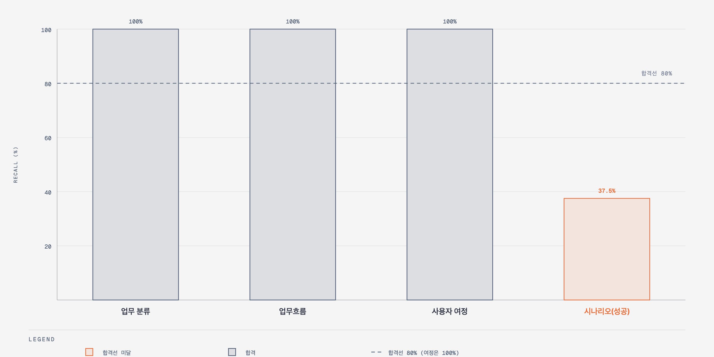
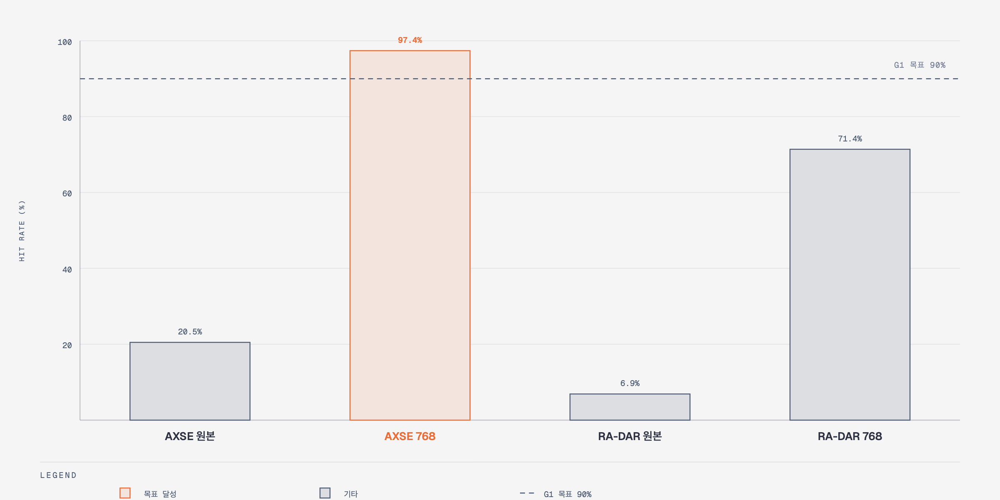

# 주요 문제 해결 및 기술 리서치 (테스트 단계)

작성일 2026-09-16. AXSE, RA-DAR 두 대상 앱과 Azure OpenAI 모델로 테스트하며 발견한 문제와 해결을 정리한다. 수치는 보존된 실행 기록에서 인용했다.

## 이슈 요약

| 이슈 구분 | 문제 상황 및 원인 | 리서치 및 해결 과정 | 재발 방지 검증 |
| --- | --- | --- | --- |
| 품질/환각 | 모델이 백엔드 정본 ID와 근거 좌표를 변형하고, 핸들러 없는 버튼을 동작으로 생성. 조건부 전이 guard 누락이 실행마다 다른 위치에서 재발 | 리서치: 생성 단위가 크면 응답 길이 한계와 회귀 발생. 모델이 정본 구조를 소유하면 스키마로 환각을 막을 수 없음. 적용: 백엔드가 결정론적 FACT 골격 생성, 모델은 의미 patch만 제출. 정본 ID는 실행 한정 참조로 대체. 리뷰어 issue를 같은 작업 안에서 수정하는 bounded repair loop 추가 | 변형된 참조 거부 테스트, ID 비노출 테스트, repair loop 상한 테스트. 이후 AXSE 실행에서 참조 오류 재발 없음 |
| 속도/지연 | 429 발생 시 Pi 4회 재시도 × 실행기 3회 시도로 최대 12회 호출 증폭. 프롬프트 중복과 전체 상태 반환으로 요청당 약 104K 토큰 | 리서치: 재시도 소유권 중첩 분석. 순수 CUA는 회차마다 전량 VLM 호출로 비용 불리. 적용: 실행기 단독 60초·120초 backoff, 프롬프트 중복 제거, 작업 응답을 소형 영수증으로 축약, 소스 전송 상한 120,000바이트 | 재시도 정책·실행기 메타데이터 테스트, 검토 payload 축약 테스트. 같은 입력 재실행에서 rate limit 없이 완료 |
| 보안/가드레일 | 모델이 모든 도구에 같은 멱등성 키를 넣어 산출물 미등록. 정상 부분 읽기가 소스 범위 위반으로 오분류. 화면 텍스트 명령 주입과 마스킹 실패 프레임 전송 위험 | 리서치: 멱등성 키 생성을 모델에 맡긴 것이 신뢰 경계 오류. 적용: provider tool call ID로 서버가 키 생성. 허용 목록 검사와 예산 계산 분리. 제안 게이트의 지시 패턴 탐지 시 중단, 마스킹 실패 시 전송 전 중단, secret 패턴 사전 차단 | 멱등성 키 충돌 테스트, closure 예산 보정 테스트(23건), 제안 게이트 주입 중단·마스킹 실패 중단 테스트, 근거 보안 테스트 13건 |

## 1. LLM 답변 품질 평가 및 개선

### 평가 설계

| 항목 | 내용 |
| --- | --- |
| 골든 데이터셋 구축 | AXSE 프런트엔드·백엔드 소스를 사람이 직접 읽어 수작업으로 작성. 실행 동작·guard·API·출력이 소스에서 확인되는 항목만 `확정`, 업무명이나 데이터 범주만 명명한 항목은 `추론`으로 표시. 실제 자격증명 값은 정의하지 않음. 구성은 업무 분류 6, 업무흐름 10, 사용자 여정 2(정상·복구), 분기 시나리오 44, 전이 90 |
| 판정 단위 우선순위 | 사용자 여정이 최상위. 전이 coverage가 100%여도 로그인에서 업무 결과와 로그아웃까지 이어지는 여정이 없으면 불합격. 개별 시나리오는 그 여정의 분기를 검증하는 구성 요소 |
| 평가 주체 | LLM-as-judge. 생성에 쓴 것과 같은 모델(gpt-5.6-luna)이지만 생성 세션과 분리된 읽기 전용 세션. 생성 에이전트에는 골든 식별자·문구·기대 수·전이 매핑을 노출하지 않음 |
| 채점 규칙 | 골든 항목마다 정확히 한 행을 반환. 문구·ID·개수가 아니라 의도, 전제조건, 분기·guard, 관측 결과, 복구 동작의 의미 동등성을 판정. 유사도 0.7 이상만 일치로 인정. 좁은 후보 여러 개가 합쳐져 넓은 골든 하나를 덮는 것은 허용하되, 넓은 후보 하나로 서로 다른 골든 여러 개를 증명하는 것은 금지 |
| 시나리오 3관점 채점 | 골든 시나리오마다 전체·성공 경로·복원(경계·예외·복구) 경로를 따로 채점. 합격 판정은 성공 경로 recall 80%로 하고 복원 recall은 참고용 |
| 수치가 달라진 이유 | 1차 단일 판정은 23/44(52.3%). 성공 우선 정책으로 같은 후보 53건을 재평가하자 성공 12/32(37.5%), 가중치 없는 기준 14/44(31.8%). 후보는 동일하고 채점이 엄격해진 결과이며, 보고서는 엄격한 값을 사용 |
| 평가 산출물 | 평가 입력, 판정 행, 결과를 실행 기록 디렉터리에 hash와 함께 보존. 제품 backend 등록은 시도하지 않은 로컬 검증 |

### 생성 트랙

| 항목 | 내용 |
| --- | --- |
| 평가 대상 기능 | 골든 문서 없이 소스만으로 업무 분류, 업무흐름, 완결 사용자 여정, 분기 시나리오 생성 |
| 평가 방식 | AXSE 골든(분류 6, 업무흐름 10, 여정 2, 시나리오 44)을 생성 이후에만 독립 평가자로 사용. recall 합격선 80%, 필수 여정 100% |
| 기준선 | 기존 방식은 edge coverage 100%였으나 로그인부터 로그아웃까지 완주한 시나리오 0개 |
| 평가 결과 | 분류 6/6, 업무흐름 10/10, 여정 2/2(유사도 0.98). 시나리오 성공 recall 12/32(37.5%)로 불합격 |
| 개선 조치 | 다섯 단계 분리와 단계별 소스 재읽기, UI 근거 1:1 보존, 검증된 분류 고정, 대상별 patch 제출과 부분 병합, 여정별 허용 분류 그룹 전달 |
| 개선 후 결과 | 소스 조사, gap 보정, 업무 분류, 사용자 여정까지 로컬 검증 통과. 시나리오 케이스는 4건에서 8건으로만 증가해 골든 대비 상한 18.2%로 미통과 |

막대는 실제 recall, 점선은 합격선이다. 사용자 여정의 합격선은 100%다. 합격선의 출처와 근거는 최종 아키텍처 요약 문서의 KPI 절에 정리했다.

### 수행 트랙

| 항목 | 내용 |
| --- | --- |
| 평가 대상 기능 | 화면 캡처와 보이는 라벨만으로 클릭 좌표를 반환하는 operator 정확도, 화면 문구 존재를 답하는 observer 신뢰도 |
| 평가 방식 | 두 앱을 실제 dev 서버로 띄우고 백엔드는 stub으로 대체. 화면당 최대 6개 컨트롤의 DOM 사각형을 정답으로 추출하고, 모델에는 좌표 없이 보이는 라벨과 컨트롤 종류만 줘서 반환 좌표가 사각형 안이면 적중. AXSE 8화면 39대상, RA-DAR 6화면 29대상, 1회 측정. 기록된 제안 64건을 실제 게이트 코드에 재생해 오통과·과차단 집계. observer는 화면에 없는 문구를 물어 되뇌는지 음성 대조 |
| 평가 결과 | 원본 좌표계에서 AXSE 0.205, RA-DAR 0.069. 오차가 선형이었고 모델은 짧은 변 768 좌표계로 답하고 있었음 |
| 개선 조치 | 768 리사이즈와 좌표 환산을 필수 계약으로 고정. 보이는 라벨 필수화. 게이트에 부분 일치 하한 0.6과 기호 정규화 추가 |
| 개선 후 결과 | AXSE 0.974, RA-DAR 0.714. 남은 실패 9건 중 그라운딩 문제 1건, 나머지는 대상 서술 품질 문제. 게이트 오통과 1건 |
| 판정 신뢰도 | observer 음성 대조 4/4, 앵커 신뢰도 18/18. 실제 모델 왕복에서 AXSE 3 step, RA-DAR 3 step 모두 통과. 음성 경로에서 실패 도달 확인 |

막대는 적중률, 점선은 G1 목표 90%다.

## 2. 성능 및 비용 최적화

| 항목 | 내용 |
| --- | --- |
| 기존 병목 | 429 재시도 최대 12회 증폭. 요청당 약 104K 토큰. 보정이 rate limit으로 4회 종료. 34/35 성공한 보정을 메모리에만 두어 프로세스 종료 후 전부 재실행. 늦게 채워지는 화면을 불안정으로 오판 |
| 개선 전략 | 재시도 소유권 단일화, payload 축소, 소스 전송 상한, 부분 결과 보존과 재개, 판정 확정 시 즉시 종료 |
| 적용 기술 | 실행기 단독 backoff, 프롬프트 중복 제거와 소형 영수증, 전송 상한 120,000바이트, 거부된 patch를 백엔드가 재적용하는 재개 계약, 판정 불가일 때만 예산 안에서 재관측 |
| 개선 결과 | 429 증폭 제거 후 같은 입력이 rate limit 없이 완료. 실패 대상 1건만 재시도해 revision 3 완료. RA-DAR 첫 step이 판정 불가에서 통과로 전환. AXSE 3 step 모델 호출 9회 |

## 3. 예외 처리 및 가드레일

| 항목 | 내용 |
| --- | --- |
| 차단 대상 | secret 유출, 소스 범위·경로 이탈, 정본 ID 변조, 오래된 근거 참조, 멱등성 키 재사용, 골든 데이터 노출, 화면 텍스트 명령 주입, 마스킹 실패 프레임 전송, 원문 값의 증적 기록 |
| 탐지 방식 | 서버 소유 허용 목록, secret 정규식 분류기, 근거 grant와 hash 검증, 제안 게이트 지시 패턴 탐지, 마스킹 결과 검사, 심볼릭 링크 거부 |
| 대응 로직 | 모두 fail-closed. 의미 누락은 다음 단계로 넘기고 위 항목은 즉시 종료. 수행 결과는 실패, 판정 불가, 중단으로 구분 |
| 테스트 결과 | 제안 게이트 14건, 수행 루프 10건, 제안 재생 4건, 근거 보안 13건, Pi 런타임 24건 통과. 실제 실행의 범위 위반, 참조 오류, hash 불일치가 모두 산출물 등록 전에 종료 |

## 4. 기타 문제 해결 사례

| 문제 | 해결 |
| --- | --- |
| 정규식 JSX 스캔으로 checkbox가 텍스트 입력으로 분류 | TypeScript AST 순회로 교체. POST가 GET으로 잡히던 문제도 함께 수정 |
| URL 경로 없는 화면 컴포넌트가 한 화면으로 합쳐짐 | Page 컴포넌트 단위 가상 화면 등록 |
| 리뷰어가 author에게 없는 소스 근거를 요구 | 리뷰 입력을 검증된 FACT로 제한 |
| 이전 버전 검토 이력과 비교해 허위 충돌 발생 | 검토 결정에 산출물 지문 저장 |
| 앱 재시작 후 디렉터리 승인 소실 | 사용자 선택 경로 저장과 재시작 시 재검증 |
| 전이 참조가 한 케이스에 몰렸는데 누락 0으로 보고 | milestone 연결과 실행 coverage를 분리해 측정 불가로 표기 |
| 원인 미확정 관측 1건 | 잘못된 통과를 만들지 않은 점만 확인하고 열린 항목으로 유지 |
